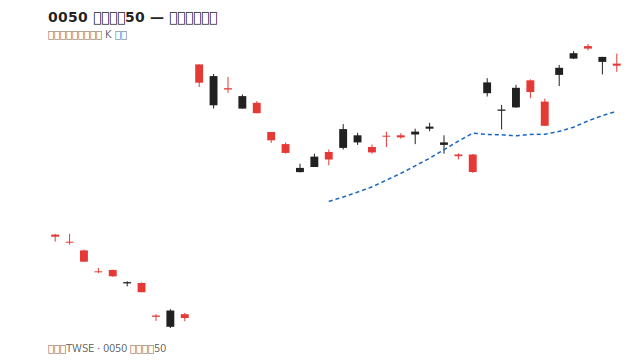
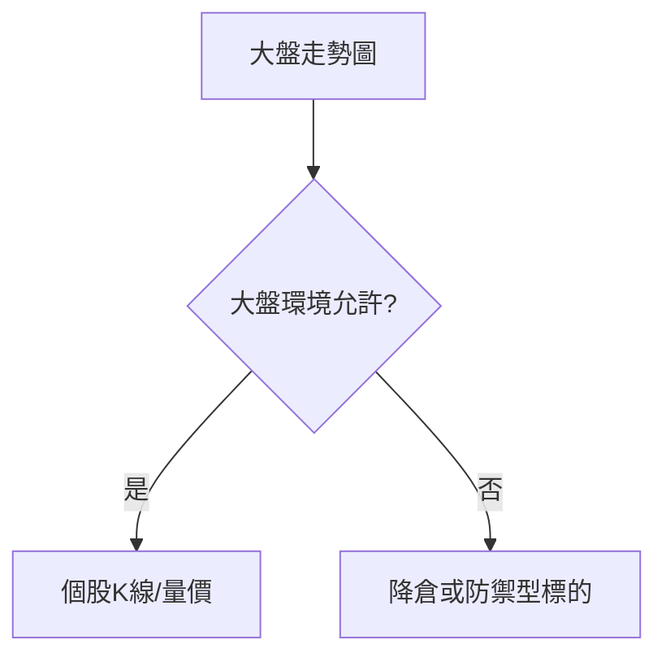

# 大盤與類股圖

## 本篇你會學到

- 加權指數、櫃買指數圖怎麼讀
- 類股漲跌熱力、產業對照圖
- 為什麼大盤圖要排在個股圖之前

[← 圖表總覽](index.md)

---

## 大盤指數圖

| 指數 | 代表 |
|------|------|
| **加權指數** | 上市整體概況 |
| **櫃買指數** | 上櫃整體概況 |
| **台指期** | 近月期貨，常領先或反映預期 |

| 讀法 | 意義 |
|------|------|
| 大盤多頭排列 | 個股做多勝率環境較佳（非保證） |
| 大盤破月線 | 系統性風險升高 |
| 大盤與個股背離 | 注意權值拉抬或類股輪動 |

相關：[多頭空頭](../02-glossary/market-terms.md#多頭空頭) · [跨市場](../05-analysis/cross-market.md)

0050 報價範例亦見 [報價畫面](../01-basics/quote-screen.md#實例圖0050-元大台灣50etf)。

---

## 類股漲跌圖

| 類型 | 用途 |
|------|------|
| **產業漲跌幅排行** | 今日資金在哪個 [類股](../02-glossary/trading-terms.md#類股) |
| **熱力圖（Heatmap）** | 一眼看大小股漲跌分布 |
| **國際股市對照** | 美股、亞股隔夜表現 |

[短線](../08-investing/swing-short.md) 選股前先看類股是否同步強勢。

---

## 大盤 vs 個股圖

!!! tip "順序"
    先看**海（大盤）**，再看**魚（個股）**。個股再強，大盤系統性下跌時仍難獨善其身。

---

## ETF 與大盤圖

[0050 等 ETF](../01-basics/etf-intro.md) 走勢常與加權高度相關，適合用 [線圖](line-charts.md) 看長期配置。見 [ETF 投資](../08-investing/etf-investing.md)。

---

## 重點回顧

- 大盤圖是**市場總覽類**，與個股 K 線不同層次。
- 類股圖幫你選**賽道**，再進個股。
- 延伸：[市場概覽](../01-basics/market-overview.md) · [圖表總覽](index.md)
