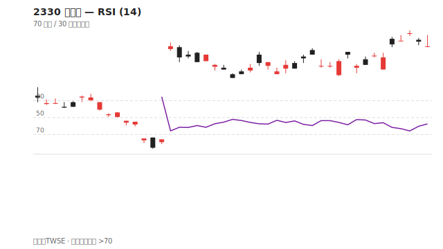
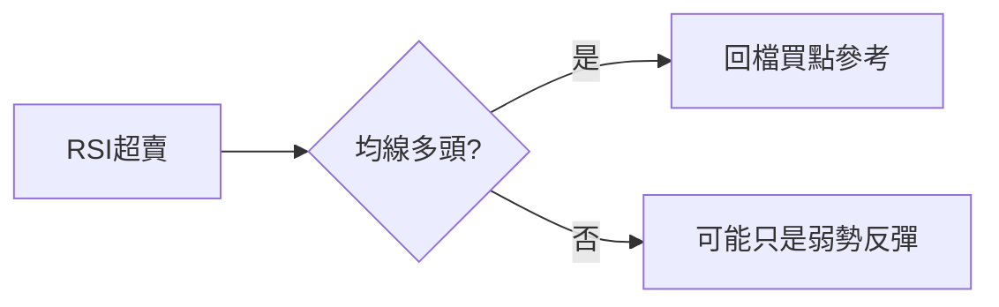

# RSI

## 本篇你會學到

- RSI 的計算概念與 70/30 區間
- 超買超賣在強勢股的差異

## 定義

**RSI（相對強弱指標）** 衡量近期漲跌幅度的力道，常見週期 **14 日**，數值 0–100。

| 區間 | 常見標籤 |
|------|----------|
| RSI ≥ 70 | 超買區 |
| RSI ≤ 30 | 超賣區 |
| 30–70 | 中性區 |

## 讀圖方式

| 情境 | 解讀 |
|------|------|
| RSI 由 30 以下回升 | 超賣反彈可能開始 |
| RSI 由 70 以上回落 | 超買修正可能開始 |
| RSI 長期 > 50 | 多方較強環境 |
| RSI 長期 < 50 | 空方較強環境 |

## 強勢股現象

!!! warning "常見誤區"
    強勢趨勢股 RSI 可長期停留在 70 以上；**超買不代表立刻下跌**。
    弱勢股 RSI 可長期在 30 以下，超賣不代表立刻反彈。

## 與趨勢搭配

## 讀圖三步驟

1. **區間**：RSI 在 70 上、30 下，還是中間？
2. **趨勢**：RSI 能否長期站在 50 以上（多方環境）？
3. **背離**：價格新高但 RSI 未新高 → 動能疑慮（類似 MACD 背離概念）

## 搭配確認

| 情境 | 解讀 |
|------|------|
| RSI 超賣 + 低檔鎚子 | 短線反彈參考 |
| RSI 超買 + 強勢股 | 可能續漲，勿機械放空 |
| RSI 超買 + 高檔量縮 | 修正風險增 |

## 重點回顧

- RSI 適合辨識**短期過熱/過冷**，不適合單獨定趨勢。
- 強勢與弱勢市場對 70/30 的反應不同。
- 速查：[指標速查表](indicator-quickref.md)

相關：[RSI 術語](../02-glossary/technical.md#rsi)
