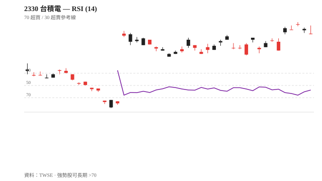
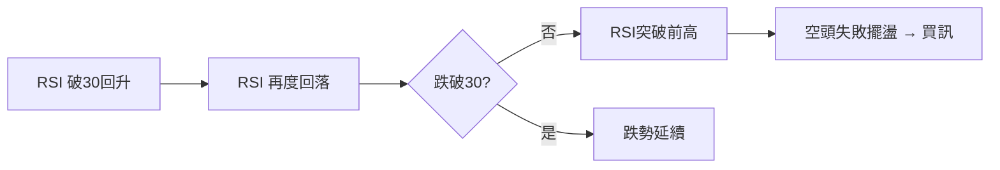

# RSI（相對強弱指標）

## 本篇你會學到

- RSI 的計算邏輯與 70/30 區間的**真正意義**
- 趨勢強弱修正：多頭市場與空頭市場的區間差異
- RSI **背離**的判讀與分級
- RSI **失敗擺盪**的進階應用
- 系統性信號強度評估

## 定義與計算概念

**RSI（Relative Strength Index）** 衡量近期漲跌力道的相對比例，數值 0–100。

### 計算邏輯（白話）

RSI(14) 的意思：過去 14 天裡，「漲的天數平均漲幅」佔「漲的平均 + 跌的平均」的比例。

$$RSI = 100 - \frac{100}{1 + RS}$$

$$RS = \frac{\text{N 日平均漲幅}}{\text{N 日平均跌幅}}$$

| RSI 值 | 白話意義 |
|--------|---------|
| RSI = 70 | 近期漲幅是跌幅的 2.33 倍 |
| RSI = 50 | 近期漲跌幅度相當 |
| RSI = 30 | 近期跌幅是漲幅的 2.33 倍 |

---

## 趨勢環境下的區間修正 {#區間修正}

傳統 70/30 是在**盤整市場**的基準，但在明確趨勢中需要修正：

| 市場環境 | 超買警戒 | 超賣觀察 | 中性軸 | 說明 |
|---------|---------|---------|--------|------|
| **強勢多頭** | RSI > 80 | RSI < 40 | 60 | 多頭市 RSI 常在 40–80 波動 |
| **一般市場** | RSI > 70 | RSI < 30 | 50 | 教科書標準 |
| **弱勢空頭** | RSI > 60 | RSI < 20 | 40 | 空頭市 RSI 常在 20–60 波動 |

!!! warning "核心觀念"
    **不要在多頭市場中，因為 RSI 70 就認為超買。** 強勢股 RSI 可長期在 70–90 之間，超買只代表「動能很強」，不代表即將下跌。

### 如何判斷該用哪組區間？

| 判斷方式 | 強勢環境特徵 | 弱勢環境特徵 |
|---------|------------|------------|
| [均線排列](ma.md#多均線排列) | 多頭排列 | 空頭排列 |
| RSI 回檔底部 | 40–50 即止住 | 20–30 才止住 |
| RSI 反彈頂部 | 可達 80–90 | 僅到 60–65 |

---

## RSI 背離 {#背離}

### 背離類型

| 類型 | 現象 | 意義 | 常見位置 |
|------|------|------|---------|
| **頂背離** | 股價新高，RSI 未新高 | 上漲動能衰竭 | 高檔（RSI 曾 > 70） |
| **底背離** | 股價新低，RSI 未新低 | 下跌動能衰竭 | 低檔（RSI 曾 < 30） |

### 背離強度分級

| 等級 | 條件 | 可信度 |
|------|------|--------|
| **強背離** | 連續兩次以上背離 + RSI 在極端區 | ★★★★★ |
| **中等背離** | 單次背離 + 位於高/低檔 | ★★★ |
| **弱背離** | 背離幅度小或位置不在極端區 | ★★ |

### 背離確認清單

- [ ] RSI 背離出現在**高檔（>65）或低檔（<35）**
- [ ] 股價高低點之間有**足夠間距**（至少 10 根 K 以上）
- [ ] K 線出現反轉型態配合（鎚子、倒鎚、吞噬）
- [ ] 成交量配合（頂背離 + 量縮、底背離 + 量增）

---

## 失敗擺盪（Failure Swing）{#失敗擺盪}

RSI 發明者 Wilder 認為「失敗擺盪」比背離更可靠：

### 多頭失敗擺盪（看跌）

1. RSI 升至 70 以上
2. RSI 回落跌破 70
3. RSI 再度回升但**未能再上 70**
4. RSI 跌破前一次回落的低點 → **賣出信號**

### 空頭失敗擺盪（看漲）

1. RSI 跌至 30 以下
2. RSI 回升突破 30
3. RSI 再度回落但**未跌破 30**
4. RSI 突破前一次回升的高點 → **買入信號**

```mermaid
flowchart LR
    A[RSI 破30回升] --> B[RSI 再度回落]
    B --> C{跌破30?}
    C -->|否| D[RSI突破前高]
    D --> E[空頭失敗擺盪 → 買訊]
    C -->|是| F[跌勢延續]
```

---

## RSI 信號強度綜合評估 {#信號評估}

| 評估項目 | 強看漲 (+2) | 偏看漲 (+1) | 中性 (0) | 偏看跌 (−1) | 強看跌 (−2) |
|---------|------------|------------|---------|------------|------------|
| RSI 位置 | <30 超賣 | 30–40 偏低 | 40–60 | 60–70 偏高 | >70 超買 |
| RSI 方向 | 由低回升 | 穩定向上 | 持平 | 穩定向下 | 由高回落 |
| 背離 | 底背離 | — | 無 | — | 頂背離 |
| 失敗擺盪 | 空頭失敗擺盪 | — | 無 | — | 多頭失敗擺盪 |
| 趨勢配合 | 均線多頭+RSI回檔 | — | 盤整 | — | 均線空頭+RSI反彈 |

| 總分 | 判定 | 操作參考 |
|------|------|---------|
| +6 以上 | 強看漲 | 短線反彈/買點機率高 |
| +3 ~ +5 | 偏看漲 | 留意買點，搭配 K 線確認 |
| −2 ~ +2 | 中性 | 觀望 |
| −5 ~ −3 | 偏看跌 | 短線修正風險增 |
| −6 以下 | 強看跌 | 追高風險極大 |

!!! note "重要提醒"
    上表在**多頭環境**中，RSI 70 超買的「看跌」需降級（因為強勢股可長期超買）。先判斷趨勢環境再套用區間修正。

---

## 搭配確認

| 情境 | RSI 信號 | 配合條件 | 綜合評估 |
|------|---------|---------|---------|
| RSI 超賣（<30）+ 低檔鎚子 + 放量 | 買訊 | 型態+量確認 | ★★★★ |
| RSI 超買（>70）+ 強勢多頭排列 | 非賣訊 | 趨勢優先 | 持續持有 |
| RSI 超買 + 高檔量縮 + 頂背離 | 賣訊 | 多重確認 | ★★★★★ |
| RSI 50 附近 + 盤整 | 無方向 | 等突破 | 觀望 |
| RSI 空頭失敗擺盪 + 站回 MA20 | 強買訊 | 趨勢轉折確認 | ★★★★★ |

---

## 常見誤用

| 誤用 | 正確認知 |
|------|----------|
| RSI > 70 就放空 | 強勢股可長期黏在 70–90，要看趨勢環境 |
| RSI < 30 就抄底 | 弱勢股可長期在 20–30，超賣可以更超賣 |
| 只看 RSI 不看趨勢 | RSI 是震盪指標，需搭配趨勢工具（MA/MACD） |
| 忽略背離出現位置 | 盤整區的背離意義不大，要在高/低檔才有效 |
| 用固定 70/30 不修正 | 依趨勢環境修正超買超賣區間 |

---

## 讀圖五步驟（評估流程）

1. **環境**：先看 [均線排列](ma.md#多均線排列) 判斷多頭/空頭/盤整 → 選對應 RSI 區間
2. **位置**：RSI 目前在超買/超賣/中性？
3. **方向**：RSI 正在上升還是下降？50 線以上還是以下？
4. **背離**：股價與 RSI 是否同步？有背離則分級
5. **擺盪**：是否出現失敗擺盪型態？→ 最強信號

---

## 自我檢查

??? question "1.（概念題）RSI 的計算邏輯，白話怎麼說？"
    參考答案：過去 N 天裡，「漲的平均幅度」佔「漲的平均 + 跌的平均」的比例 × 100。RSI=70 代表漲幅是跌幅的 2.33 倍。

??? question "2.（判斷題）RSI 進入 70 以上就該放空？"
    參考答案：不一定。**強勢多頭**環境中 RSI 常在 40–80 波動，70 只代表動能強，不代表即將下跌。要先判斷趨勢環境。

??? question "3.（情境題）RSI 超賣（25）+ 均線仍空頭排列，你怎麼評估？"
    參考答案：空頭環境中 RSI 超賣可以更超賣（跌到 20 甚至更低）。可能只是弱勢反彈，宜等 [均線](ma.md) 轉強或出現失敗擺盪再評估。

??? question "4.（進階題）什麼是 RSI 空頭失敗擺盪？為何比背離更可靠？"
    參考答案：RSI 跌破 30 回升 → 再回落**未破 30** → 突破前次高點。因為它不僅顯示動能衰竭（如背離），還顯示空方**兩次嘗試都無法打壓 RSI 到新低**，是更明確的趨勢轉折信號。

---

## 重點回顧

- RSI 是**震盪指標**，適合辨識短期過熱/過冷，不適合單獨定趨勢。
- 根據趨勢環境**修正超買超賣區間**，不可一律用 70/30。
- **背離**是警訊不是指令；**失敗擺盪**比背離更有確認效力。
- RSI 回檔的底部位置可以反推趨勢強弱（40 即止 = 多頭；跌到 20 = 空頭）。
- 速查：[指標速查表](indicator-quickref.md) · 搭配 [KD](kd.md)

相關：[RSI 術語](../02-glossary/technical.md#rsi) · [指標速查表](indicator-quickref.md) · [圖表綜合評估](chart-evaluation.md) · [接盤還是追高](catch-or-chase.md)
