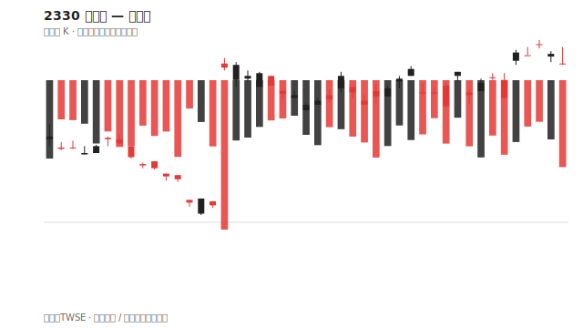
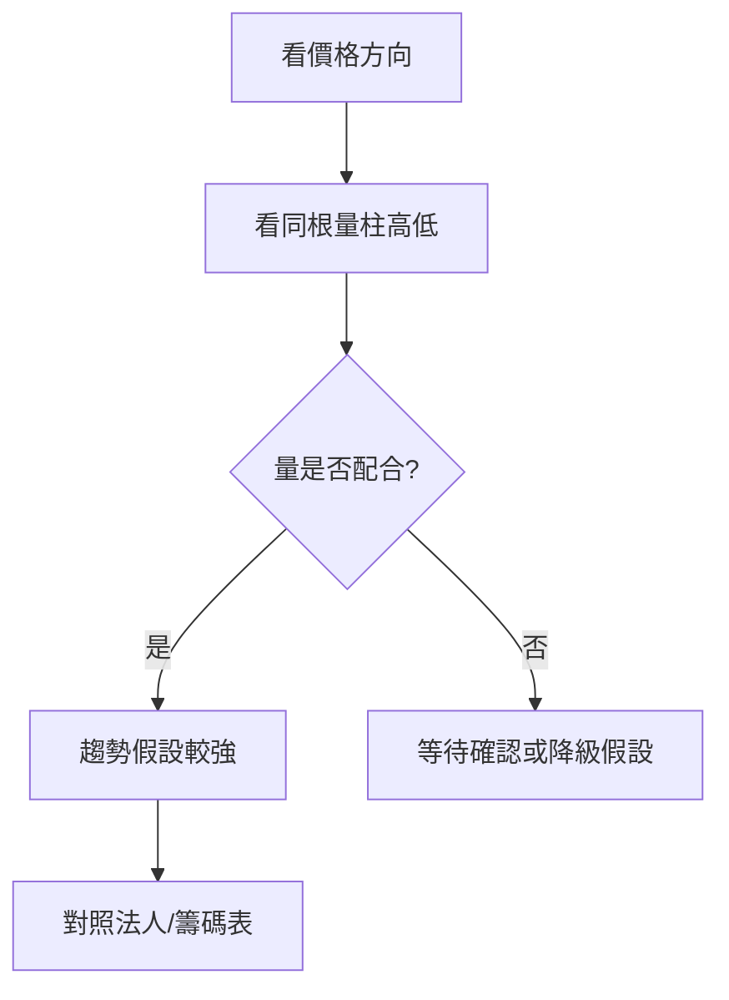

# 量價圖

## 本篇你會學到

- 成交量柱狀圖怎麼讀
- 量價配合的八種常見組合
- 量價與 K 線、分時圖的關係

[← 圖表總覽](index.md)

---

## 量價圖長什麼樣

通常由**上下兩區**組成：

| 區域 | 內容 |
|------|------|
| **上** | 價格（K 線或線圖） |
| **下** | 成交量柱狀圖（紅綠柱對應當根 K 漲跌） |

每一根量柱 = 該時段 [成交量](../02-glossary/quotes.md#成交量) 多寡。

2330 量柱特寫亦見 [報價畫面](../01-basics/quote-screen.md#實例圖2330-台積電個股)。

---

## 為什麼要看量

價格告訴你**結果**；成交量告訴你**多少人參與**。

| 量價組合 | 常見解讀（非保證） |
|----------|-------------------|
| 價漲量增 | 多方有力，趨勢延續機率較高 |
| 價漲量縮 | 動能可能不足，[量價背離](../02-glossary/market-terms.md#量價背離) |
| 價跌量增 | 賣壓大或恐慌 |
| 價跌量縮 | 跌勢可能趨緩 |
| 突破整理 + 量增 | 突破較可信 |
| 突破整理 + 量縮 | 警惕 [假突破](../07-cases/gap-breakout.md) |

---

## 均量線（MA Volume）

部分軟體在量區疊加 **5 日、20 日均量**：

| 觀察 | 意義 |
|------|------|
| 今日量 > 20 日均量 | 異常活躍 |
| 連續放量 | 事件或主力關注 |

---

## 分時量 vs 日量

| 圖表 | 量柱代表 |
|------|----------|
| 日 K 量價 | 一日總量 |
| 分 K 量價 | 該分鐘區間量 |
| [分時圖](intraday-charts.md) | 常見累積量曲線 |

[當沖](../08-investing/day-trade.md) 重視分 K 量；[中線](../08-investing/swing-mid.md) 重視日量與均量。

---

## 閱讀步驟

---

## 重點回顧

- 量價圖是**獨立分類**，常與 K 線上下搭配，不等於 K 線本身。
- 沒有量的突破要保守看待。
- 延伸：[K 線基礎](kline-basics.md) · [籌碼圖](chips-charts.md)
