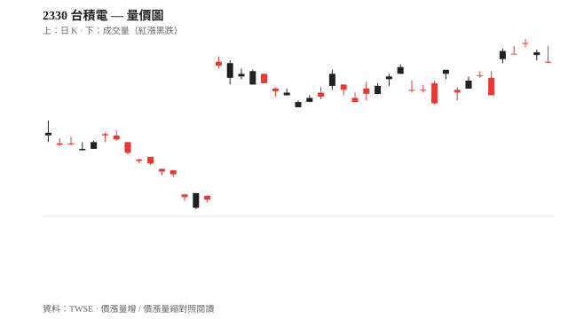
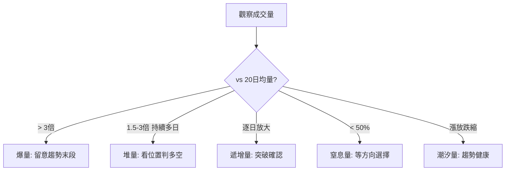
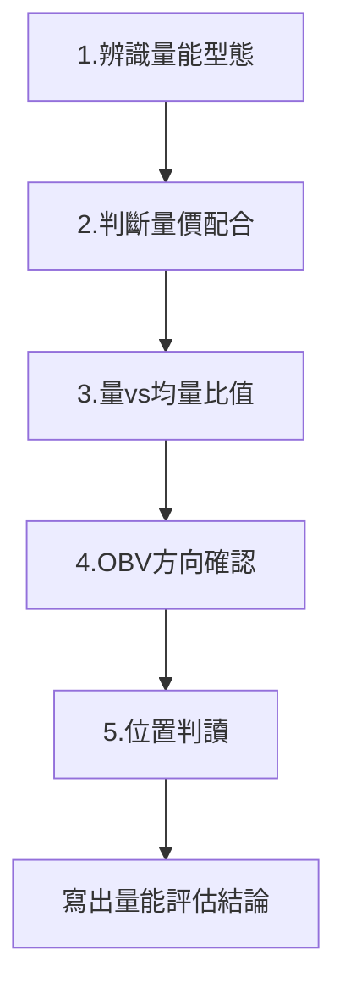

# 量價圖

## 本篇你會學到

- 成交量柱狀圖怎麼讀
- **量能型態分類**：爆量、堆量、窒息量、潮汐量的辨識
- 量價配合的**十種組合**與信號分級
- **OBV（能量潮）** 的輔助判讀
- 量能異常的系統性評估方法

[← 圖表總覽](index.md)

---

## 量價圖長什麼樣

通常由**上下兩區**組成：

| 區域 | 內容 |
|------|------|
| **上** | 價格（K 線或線圖） |
| **下** | 成交量柱狀圖（紅綠柱對應當根 K 漲跌） |

每一根量柱 = 該時段 [成交量](../02-glossary/quotes.md#成交量) 多寡。

2330 量柱特寫亦見 [報價畫面](../01-basics/quote-screen.md#實例圖2330-台積電個股)。

---

## 為什麼要看量

價格告訴你**結果**；成交量告訴你**多少人投票贊同這個結果**。

!!! tip "核心觀念"
    成交量是「市場共識的強度計」。量大 = 這個價位有很多人認同；量小 = 只有少數人在交易，結果代表性不足。

---

## 量能型態分類 {#量能型態}

### 五種量能型態

| 量能型態 | 特徵 | 意義 | 常見位置 |
|---------|------|------|---------|
| **爆量（Climactic Volume）** | 單日成交量 > 20 日均量 **3 倍以上** | 市場情緒極端（恐慌或亢奮） | 趨勢末段、重大事件日 |
| **堆量（Accumulation）** | 連續多日成交量穩定高於均量 | 持續有資金進駐或出貨 | 底部吸籌或頂部出貨 |
| **遞增量（Volume Expansion）** | 量柱逐日放大 | 市場關注度提升 | 突破起漲段 |
| **窒息量（Dry-up）** | 成交量極度萎縮（< 20 日均量 50%） | 市場缺乏參與，等待方向 | 盤整末段、洗盤末段 |
| **潮汐量（Tide Volume）** | 漲時放量、跌時縮量，形成規律 | 多方有控制力（或反之） | 健康多頭上漲 |

### 量能型態判讀表

| 量能型態 | 配合上漲 | 配合下跌 | 信號意義 |
|---------|---------|---------|---------|
| **爆量** | 可能加速頂（亢奮出貨） | 可能恐慌底 | 趨勢可能接近尾聲 |
| **堆量** | 底部堆量 → 吸籌 | 高檔堆量 → 出貨 | 位置決定多空解讀 |
| **遞增量** | 突破有效性增 | 跌勢加速 | 方向確認力度強 |
| **窒息量** | 高檔窒息 → 洗盤或見頂 | 低檔窒息 → 賣壓衰竭 | 等待突破方向 |
| **潮汐量** | 漲放量跌縮量 → 多頭健康 | 跌放量漲縮量 → 空頭主導 | 趨勢延續性判斷 |

```mermaid
flowchart TD
    A[觀察成交量] --> B{vs 20日均量?}
    B -->|> 3倍| C[爆量: 留意趨勢末段]
    B -->|1.5-3倍 持續多日| D[堆量: 看位置判多空]
    B -->|逐日放大| E[遞增量: 突破確認]
    B -->|< 50%| F[窒息量: 等方向選擇]
    B -->|漲放跌縮| G[潮汐量: 趨勢健康]
```

---

## 量價十種組合與信號分級 {#量價組合}

| # | 量價組合 | 信號意義 | 信號強度 |
|---|---------|---------|---------|
| 1 | **價漲 + 遞增量** | 多方有力，趨勢延續 | ★★★★★ |
| 2 | **價漲 + 潮汐量** | 健康多頭 | ★★★★ |
| 3 | **價漲 + 量持平** | 趨勢延續但動能中等 | ★★★ |
| 4 | **價漲 + 量縮** | 動能不足，[量價背離](../02-glossary/market-terms.md#量價背離) | ★★ ⚠️ |
| 5 | **價漲 + 爆量** | 可能加速頂（末段亢奮） | ★ ⚠️ 警戒 |
| 6 | **價跌 + 遞增量** | 空方加速，賣壓增加 | 危險 |
| 7 | **價跌 + 爆量** | 恐慌性賣出，可能接近底部 | 觀察止跌 |
| 8 | **價跌 + 量縮** | 賣壓趨緩，跌勢可能收斂 | 留意反轉 |
| 9 | **突破整理 + 量增** | 突破有效 | ★★★★★ |
| 10 | **突破整理 + 量縮** | 假突破嫌疑 | ★ ⚠️ |

### 關鍵觀念

- **突破必須有量**：沒有量的突破如同「投票率極低的選舉」，結果不代表多數意見。
- **頂部量 > 底部量**：出貨需要對手盤，所以頂部常有爆量；底部反而常是窒息量後緩步放量。

---

## OBV（能量潮）{#obv}

**OBV（On Balance Volume）** 是累積成交量指標：

- 今日漲 → OBV = 昨日 OBV + 今日成交量
- 今日跌 → OBV = 昨日 OBV − 今日成交量
- 今日平 → OBV 不變

### OBV 判讀

| OBV 現象 | 意義 |
|---------|------|
| OBV 創新高 + 股價創新高 | 量價同步，趨勢健康 |
| OBV 創新高 + 股價**未**新高 | 底部吸籌，可能即將突破 |
| OBV 未新高 + 股價創新高 | **量價背離**，上漲缺乏量能支持 |
| OBV 持續下降 | 持續有資金流出 |

### OBV 的評估價值

| 情境 | OBV 判讀 | 信號等級 |
|------|---------|---------|
| 盤整區 OBV 緩升 | 有人在低位吸籌 | ★★★★ 偏多前兆 |
| 上漲中 OBV 跟不上 | 量價背離，動能衰竭 | ★★★ 警戒 |
| 下跌中 OBV 企穩不再降 | 賣壓衰竭 | ★★★ 觀察止跌 |

---

## 量能異常信號：評估框架 {#量能評估}

當你注意到量能有異常時，用以下框架評估其意義：

| 評估項目 | 偏多 (+) | 中性 (0) | 偏空 (−) |
|---------|---------|---------|---------|
| 量vs均量 | 突破時量 > 1.5×均量 (+2) | 接近均量 (0) | 突破時量 < 均量 (−2) |
| 量價方向 | 漲放量跌縮量 (+2) | 無規律 (0) | 跌放量漲縮量 (−2) |
| 量能趨勢 | 底部逐步放量 (+1) | 持平 (0) | 高檔逐步放量 (−1) |
| OBV 方向 | OBV 趨勢向上 (+1) | 持平 (0) | OBV 趨勢向下 (−1) |
| 爆量位置 | 低檔爆量（恐慌見底） (+1) | — | 高檔爆量（亢奮見頂）(−1) |

| 總分 | 量能環境判定 | 操作建議 |
|------|------------|---------|
| +5 以上 | 量能強力支持上漲 | 進場信心高 |
| +2 ~ +4 | 量能偏多 | 可做多，注意確認 |
| −1 ~ +1 | 量能中性 | 無明確方向性 |
| −4 ~ −2 | 量能偏空 | 上漲可信度低 |
| −5 以下 | 量能強力支持下跌 | 不做多 |

---

## 均量線（MA Volume）

部分軟體在量區疊加 **5 日、20 日均量**：

| 觀察 | 意義 | 評估加分 |
|------|------|---------|
| 今日量 > 20 日均量 1.5 倍 | 異常活躍 | 突破信號可信度 +1 |
| 今日量 > 20 日均量 3 倍 | 爆量——看位置判斷 | 可能趨勢尾聲 |
| 連續 5 日 > 均量 | 堆量——持續有資金操作 | 底部堆量偏多 |
| 連續量縮至均量 50% 以下 | 窒息量——等待方向 | 突破前的蓄力 |

---

## 分時量 vs 日量

| 圖表 | 量柱代表 | 適用 |
|------|----------|------|
| 日 K 量價 | 一日總量 | 波段、中線 |
| 分 K 量價 | 該分鐘區間量 | 當沖、極短線 |
| [分時圖](intraday-charts.md) | 累積量曲線 | 盤中判斷 |

[當沖](../08-investing/day-trade.md) 重視分 K 量；[中線](../08-investing/swing-mid.md) 重視日量與均量。

---

## 讀圖五步驟（量價評估流程）

1. **量能型態**：當前是爆量/堆量/遞增/窒息/潮汐？→ 辨識型態
2. **量價配合**：價格方向與量能方向是否一致？→ 十種組合對照
3. **量vs均量**：相對 20 日均量是放大還是萎縮？倍數多少？
4. **OBV 趨勢**：累積量方向與股價方向是否同步？→ 有無背離
5. **位置**：量能異常出現在高檔還是低檔？→ 同一信號在不同位置意義相反

```mermaid
flowchart TD
    A[1.辨識量能型態] --> B[2.判斷量價配合]
    B --> C[3.量vs均量比值]
    C --> D[4.OBV方向確認]
    D --> E[5.位置判讀]
    E --> F[寫出量能評估結論]
```

---

## 常見誤區

| 誤區 | 正確認知 |
|------|----------|
| 價漲量縮一定反轉 | 可能是洗盤或惜售（低檔量縮回檔 = 健康） |
| 突破不看量 | 量縮突破警惕 [假突破](../07-cases/gap-breakout.md) |
| 分K量與日量混比 | 週期不同，不可直接比較絕對值 |
| 爆量一定是好事 | 高檔爆量可能是末升段亢奮出貨 |
| 量大就追 | 要看是起漲段放量（好）還是末段放量（危） |

---

## 自我檢查

??? question "1.（概念題）量價圖通常上下兩區各顯示什麼？五種量能型態是？"
    參考答案：**上**為價格（K線），**下**為成交量柱狀圖。五種型態：爆量、堆量、遞增量、窒息量、潮汐量。

??? question "2.（判斷題）價漲量增一定會續漲？高檔爆量代表什麼？"
    參考答案：價漲量增趨勢延續機率較高但非必然。高檔爆量可能是**末升段亢奮**（出貨），反而要警戒而非追高。

??? question "3.（情境題）整理區向上突破但量縮（< 均量），你會怎麼評估？"
    參考答案：量縮突破 = 假突破嫌疑（信號 ★）。保守看待，等待放量確認或縮小部位；見 [假突破案例](../07-cases/gap-breakout.md)。

??? question "4.（進階題）OBV 創新高但股價尚未創新高，代表什麼？"
    參考答案：有資金在低位持續**吸籌**，OBV 領先股價向上。可能即將突破——是偏多的前兆信號。

---

## 重點回顧

- 量價圖是**獨立分類**，與 K 線搭配使用。
- **量能型態**（爆量/堆量/窒息/潮汐）比單純「量大量小」更有判讀價值。
- 沒有量的突破要保守看待；爆量在不同位置意義相反。
- **OBV** 是量能的累積趨勢線，可輔助判斷吸籌或出貨。
- 延伸：[K 線基礎](kline-basics.md) · [籌碼圖](chips-charts.md) · [圖表綜合評估](chart-evaluation.md) · [接盤還是追高](catch-or-chase.md)
