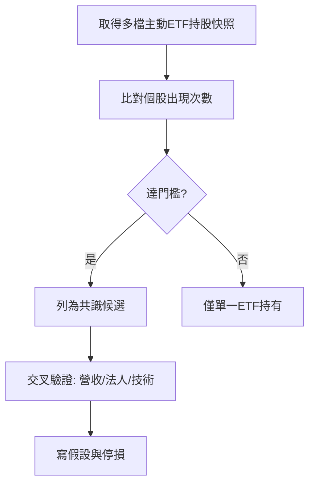

# 主動 ETF 與共識分析

## 本篇你會學到

- 主動式 ETF 與被動 ETF 的差異
- 如何用「多檔 ETF 持股」找共識標的
- 共識訊號的優點與侷限

!!! note "前置"
    請先讀 [ETF 入門](../01-basics/etf-intro.md) 與 [三大分析支柱](three-pillars.md)。

---

## 主動 vs 被動

| 類型 | 選股方式 | 學員該關注什麼 |
|------|----------|----------------|
| **被動 ETF** | 追蹤指數成分與權重 | 追蹤誤差、管理費、流動性 |
| **主動 ETF** | 投信團隊主動選股、調整權重 | **持股清單、調倉方向、多檔 ETF 是否同向** |

主動 ETF 的持股通常公布在投信官網（每月或每季）。若**多檔主動 ETF 同時持有或加碼同一檔個股**，市場有時解讀為「機構共識」——但這只是**籌碼與選股線索**，不是買進指令。

---

## 三種共識訊號（概念）

| 訊號類型 | 白話 | 教學上怎麼看 |
|----------|------|--------------|
| **共識持股** | 多檔 ETF 同時持有某股 | 關注「有幾檔 ETF、合計權重」 |
| **共識新建倉** | 多檔 ETF 同期**新**買進 | 可能代表新故事或產業輪動 |
| **共識加碼** | 多檔 ETF 同期**提高**權重 | 可能代表信心加強，需對照股價位置 |

---

## 閱讀持股表的欄位

| 欄位 | 意義 |
|------|------|
| **權重 %** | 該股佔 ETF 淨值比例；權重高代表影響大 |
| **張數 / 市值** | 絕對部位大小（不同 ETF 規模差異大，宜看權重） |
| **快照日期** | 持股資料有**落後**；調倉可能已發生但未公布 |
| **持有 ETF 列表** | 哪些基金同時持有 → 共識強度 |

對照教學：[個股深入分析分頁地圖](../03-tables/deep-dive-tabs.md) 中的「ETF 共識」KPI。

---

## 與其他支柱交叉驗證

| 支柱 | 問自己 |
|------|--------|
| **基本面** | 共識標的營收、毛利率是否支撐？ |
| **技術面** | 是否已大幅超漲？均線與量能是否過熱？ |
| **籌碼面** | 法人同期買賣超是否一致？融券是否過高？ |
| **法說 / 新聞** | 故事是否已被股價反映？ |

!!! warning "常見誤區"
    - 把「ETF 共識」當成唯一買點 → 可能買在調倉消息出盡後。
    - 忽略快照**日期落後** → 以為 ETF 仍持有，其實已減碼。
    - 只看 ETF 數、不看**權重** → 一檔 0.1% 與 5% 意義不同。

---

## 實務流程（學員版）

1. 選定關注的主動 ETF 清單（產業、地區、配息習慣）。
2. 定期下載或查閱**同一基準日**持股（或相鄰兩期比較）。
3. 篩出「多檔同時持有 / 新建倉 / 加碼」的個股。
4. 打開 [月營收表](../03-tables/revenue.md)、[法人表](../03-tables/institutional.md)、[K 線](../04-charts/kline-basics.md) 逐檔驗證。
5. 寫下進場假設、停損（例如跌破月線或共識邏輯被財報否定）。

---

## 與 Stock Bot 的對應（選用）

| 教學概念 | 儀表板區塊 |
|----------|------------|
| ETF 清單與持股快照 | 主動 ETF 追蹤 |
| 共識持股 / 新建倉 / 加碼 | ETF 共識跟單訊號 |
| 單檔共識細項 | 個股深入分析 → KPI「ETF 共識」 |

詳見 [工具對照表](../appendix/stock-tool-map.md)。

---

## 重點回顧

- 主動 ETF 持股是**機構選股公開線索**，不是保證獲利。
- **共識**須看多檔、看權重、看快照日期，並與基本面、技術面、法人同步驗證。
- 新建倉與加碼的意義不同；兩期快照才能比較變化。

相關：[ETF 入門](../01-basics/etf-intro.md) · [籌碼圖表](../04-charts/chips-charts.md) · [案例：法說與籌碼](../07-cases/conference-chips.md)
