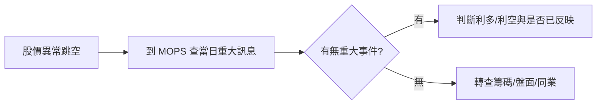
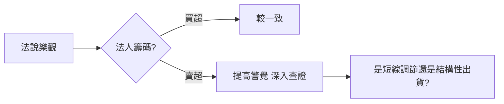

# 法說會與重大訊息

## 本篇你會學到

- 法說會在說什麼
- 如何抓重點、警惕話術與籌碼背離

## 法說會是什麼

**法人說明會**：上市公司向法人與分析師說明營運、財務與展望的會議，內容常公布於公開資訊觀測站（MOPS）。

| 類型 | 內容 |
|------|------|
| 業績說明 | 季報後最常見 |
| 產品/產能 | 擴產、新產品進度 |
| 展望 | 明年成長、毛利率指引 |

## 閱讀重點清單

1. **量化指引**：營收、毛利率、CapEx 是否具體？
2. **與前期差異**：展望上修還是下修？
3. **風險因子**：管理層主動提的逆風是什麼？
4. **Q&A**：分析師追問的尖銳問題與回答是否迴避？

## 重大訊息

上市櫃及興櫃公司一旦發生足以影響股東權益或股價之重大事件（併購、高層異動、財報自結大幅超預期、重大訴訟、天災等），須於第一時間在 MOPS 發布。

| 類型 | 範例 |
|------|------|
| 利好 | 接獲大單、擴產、配息 |
| 利空 | 下修展望、訴訟、停工 |
| 中性 | 人事、例行公告 |

**即時查詢**：[MOPS 重大訊息](https://mops.twse.com.tw/mops/web/t05sr01_1)，可輸入公司代號與年月。

### 事件驅動查證

市場的極端報酬常來自**未被預期的意外**。把重大訊息與技術線圖疊看，能還原股價跳空當下的真實資訊環境：

這是只看落後財報數字、或依賴合成資料所無法取代的查證習慣。建構 [深入分析](../03-tables/deep-dive-tabs.md) 或 [觀察清單](../03-tables/watchlist.md) 時尤其重要。

## 言行反查

| 現象 | 可能意義 |
|------|----------|
| 口頭看多 + 法人連賣 | 話術與行為不一致 |
| 口頭保守 + 法人連買 | 可能低調佈局 |
| 新聞標題聳動 | 先看原始公告全文 |

## 常見話術

| 話術 | 應對 |
|------|------|
| 「審慎樂觀」 | 看有無量化目標 |
| 「符合預期」 | 對照市場預期是高是低 |
| 「短期波動」 | 看是否連續多季下修 |

## 重點回顧

- 法說與公告是**文字面**，籌碼是**行為面**，兩者應交叉驗證。
- 標題新聞不如原始公告可靠。
- 不構成買賣建議；見 [免責聲明](../appendix/disclaimer.md)。

相關：[三大支柱](three-pillars.md) · [法人表](../03-tables/institutional.md)
