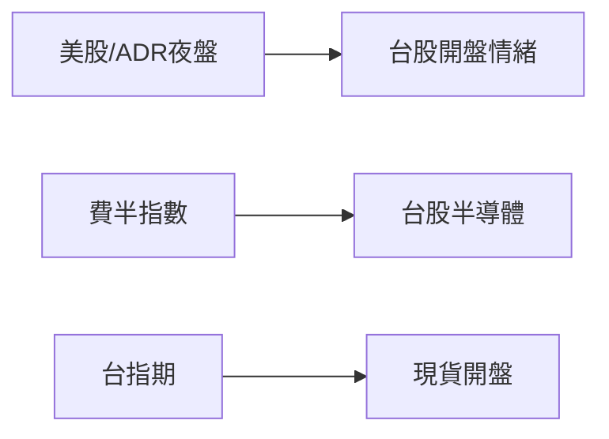

# 跨市場連動

## 本篇你會學到

- 台股與美股、指數、台指期的關係
- 如何把跨市場當「情緒參考」而非預測工具

## 為什麼要看跨市場

台股開盤前，**美股已交易一整晚**；半導體供應鏈、ADR 表現常影響台股權值與電子股情緒。部分 [評分因子](../03-tables/scoring.md) 中的「美股連動」即來自此概念。

## 常見參考指標

| 指標 | 意義 | 台股關聯 |
|------|------|----------|
| **那斯達克 / S&P 500** | 美國科技與大盤 | 外資風險偏好 |
| **費城半導體 SOX** | 半導體景氣 | 台積電、設計、封測鏈 |
| **台積電 ADR** | 海外對台積電定價 | 與 2330 常高度相關 |
| **台指期** | 預期台股方向 | 開盤前情緒，見 [期現價差](../02-glossary/chips.md#期現價差) |
| **VIX** | 恐慌指數 | 高檔代表波動預期升 |

## 怎麼讀（不當成鐵律）

| 情境 | 簡化解讀 |
|------|----------|
| 美股大漲 + 台指期正價差 | 開盤偏多氛圍，非保證漲 |
| 美股大跌 + ADR 弱 | 電子權值壓力增 |
| VIX 飆升 | 避險情緒，短線波動大 |

!!! warning "限制"
    跨市場是**參考**，台股仍有自身籌碼、匯率、政策與個股基本面。開高走低、開低走高皆常見。

## 與時間框架

| 框架 | 跨市場權重 |
|------|------------|
| 當沖 | 高——開盤_gap 常受夜盤影響 |
| 短線 | 中 |
| 中長期 | 低——仍以基本面與法人為主 |

## 重點回顧

- 夜盤美股、費半、ADR 幫助理解**開盤前情緒**。
- 台指期、期現價差是當日短線參考。
- 決策仍須回到 [三大支柱](three-pillars.md) 與個股 [K 線](../04-charts/kline-basics.md)。

相關：[四種時間框架](timeframes.md) · [評分量表](../03-tables/scoring.md)
