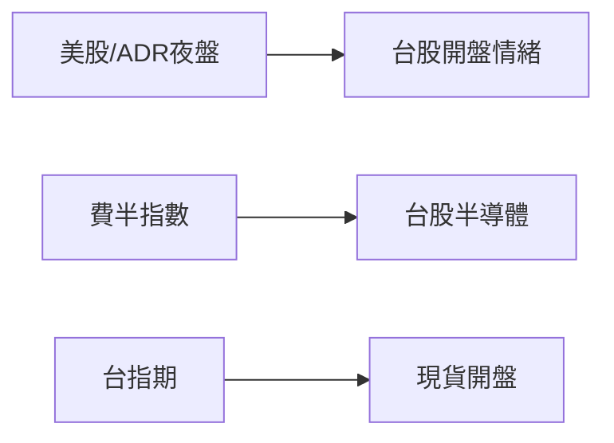

# 跨市場連動

## 本篇你會學到

- 台股與美股、指數、台指期的關係
- 如何把跨市場當「情緒參考」而非預測工具

## 為什麼要看跨市場

台股開盤前，**美股已交易一整晚**；半導體供應鏈、ADR 表現常影響台股權值與電子股情緒。部分 [評分因子](../03-tables/scoring.md) 中的「美股連動」即來自此概念。



## 常見參考指標

| 指標 | 意義 | 台股關聯 |
|------|------|----------|
| **那斯達克 / S&P 500** | 美國科技與大盤 | 外資風險偏好 |
| **費城半導體 SOX** | 半導體景氣 | 台積電、設計、封測鏈 |
| **台積電 ADR** | 海外對台積電定價 | 與 2330 常高度相關 |
| **台指期** | 預期台股方向 | 開盤前情緒，見 [期現價差](../02-glossary/chips.md#期現價差) |
| **VIX** | 恐慌指數 | 高檔代表波動預期升 |

## ADR 折溢價怎麼算 {#adr-折溢價怎麼算}

**ADR（美國存託憑證）** 是美國存託銀行發行、表彰台灣等海外公司股權的憑證，可在美股以美元交易。ADR 與原股**不是一對一**，須用「換算比例」與「匯率」換算。

以台積電（**TSM**）為例，1 單位 ADR 表彰 **5 股** 台股普通股（比例 1:5）：

```
台股等價價位 = ADR 股價 ÷ 換算比例 × 匯率
折溢價% = (ADR 等價價位 − 台股價格) ÷ 台股價格 × 100%
```

| 步驟 | 代入 | 結果 |
|------|------|------|
| 等價價位 | 150 美元 ÷ 5 × 32 | 960 元 |
| 對比台股 | 台股收 900 元 | 溢價 (960−900)/900 ≈ **+6.7%** |

- 換算後高於台股 → **溢價**；低於 → **折價**。
- 兩地交易時間脫鉤、投資人結構與避險成本不同，折溢價是**常態**。
- 長期過高溢價，常透過 ADR 回檔或台股補漲**收斂**。

!!! warning "換算比例用錯會反向"
    若誤把 1:5 當成 1:1 或 1:10，折溢價結論會完全顛倒。務必先確認該檔 ADR 的官方換算比例。

## 美股夜盤（Overnight Trading） {#美股夜盤overnight-trading}

為滿足亞洲時段交易，美股出現**夜盤**機制，台股開盤前即先消化昨夜消息。

| 特徵 | 說明 |
|------|------|
| **時段** | 美東 20:00～翌日 04:00（清算屬 T+1，週一晚成交歸週二）|
| **撮合** | 非 NYSE/Nasdaq 集中競價，而是受 SEC 監管的**替代交易系統（ATS）**（如 Blue Ocean）場外撮合，透明度較低 |
| **流動性** | 通常僅常規盤的 1%～5%，掛單稀薄 |
| **限價單強制** | 多數券商夜盤**只接受限價單**，未成交於 04:00 自動失效；市價單易閃崩滑價 |
| **標的** | 僅高流動性大型股與主流 ETF |

對台股而言，**ADR 的夜盤走勢**是早盤跳空開高／開低的精確領先指標。

## 怎麼讀（不當成鐵律）

| 情境 | 簡化解讀 |
|------|----------|
| 美股大漲 + 台指期正價差 | 開盤偏多氛圍，非保證漲 |
| ADR 夜盤溢價擴大 | 台股原股早盤偏強的領先參考 |
| 美股大跌 + ADR 弱 | 電子權值壓力增 |
| VIX 飆升 | 避險情緒，短線波動大 |

!!! warning "限制"
    跨市場是**參考**，台股仍有自身籌碼、匯率、政策與個股基本面。開高走低、開低走高皆常見。

## 與時間框架

| 框架 | 跨市場權重 |
|------|------------|
| 當沖 | 高——開盤_gap 常受夜盤影響 |
| 短線 | 中 |
| 中長期 | 低——仍以基本面與法人為主 |

## 重點回顧

- 夜盤美股、費半、ADR 幫助理解**開盤前情緒**。
- ADR 須用**換算比例 + 匯率**換算，比例用錯折溢價會反向。
- 夜盤走 ATS、只接限價單、流動性僅 1～5%，是領先參考非保證。
- 決策仍須回到 [三大支柱](three-pillars.md) 與個股 [K 線](../04-charts/kline-basics.md)。

相關：[四種時間框架](timeframes.md) · [評分量表](../03-tables/scoring.md) · [折溢價／ETF](../01-basics/etf-costs-and-premium.md) · [資料來源](../appendix/data-sources.md#跨市場參考用)
