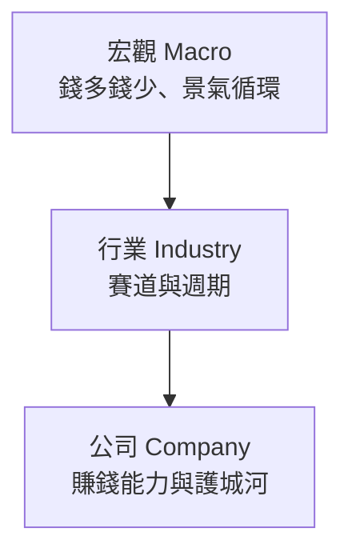

# 基本面分析框架

## 本篇你會學到

- 技術面與基本面各自適合回答什麼
- 宏觀、行業、公司三層次怎麼看
- 為什麼「好公司」不一定等於「好股票」

!!! note "影片參考"
    本頁改寫自 [小Lin说：專業投資人怎麼看門道](../appendix/video-resources.md#小lin说-分析框架)，並對齊本站 [三大支柱](three-pillars.md) 與台股學員閱讀習慣。

---

## 技術面 vs 基本面

| 面向 | 核心問題 | 主要資料 | 較適合時間 |
|------|----------|----------|------------|
| **技術面** | 價格與量能怎麼走？ | K 線、均線、指標 | 短～中期 |
| **基本面** | 公司與產業值不值得？ | 營收、財報、估值、總經 | 中～長期 |

專業投資人常指出：技術分析反映**短期供需與市場心理**；若你以中長線配置為主，應把更多精力放在基本面與總經，技術面用於**進出時機**輔助即可。

!!! tip "散戶務實態度"
    不必與量化基金比毫秒級技術優勢。建立自己的**檢查清單**（營收、法人、估值、趨勢）比追逐單一指標更重要。

相關：[三大分析支柱](three-pillars.md) · [四種時間框架](timeframes.md)

---

## 基本面三層次

### 宏觀層次 {#宏觀層次}

**為什麼要看**：股市整體漲跌，很大程度與經濟體中的**貨幣與信用環境**有關——錢寬鬆、利率低時，資金常尋找報酬而流入股市；緊縮時則相反。

| 常見觀察 | 學員怎麼用 |
|----------|------------|
| 利率、央行政策 | 理解「資金行情」背景，見 [總經與利率術語](../02-glossary/macro.md) 與 [市場術語](../02-glossary/market-terms.md#資金行情) |
| GDP、CPI、就業 | 判斷景氣位置，非逐日交易 |
| 台股 vs 美股連動 | [跨市場分析](cross-market.md) |

**若不想選個股**：可透過大盤或產業 **ETF** 參與宏觀方向，見 [ETF 入門](../01-basics/etf-intro.md)。

### 行業層次 {#行業層次}

**選賽道比選單一公司更重要**——同一時期，不同產業漲跌可以天差地遠。

分析行業可從四個維度著手：

| 維度 | 問自己 |
|------|--------|
| **所處週期** | 朝陽產業還是夕陽產業？ |
| **行業格局** | 進入門檻高（利潤較穩）還是殺價競爭？ |
| **政府政策** | 補貼、管制、法規對誰有利？ |
| **板塊輪動** | 當前資金偏好哪類 [類股](../02-glossary/trading-terms.md#類股)？ |

相關：[類股](../02-glossary/trading-terms.md#類股) · [月營收與同業比較](../03-tables/revenue.md)

### 公司層次 {#公司層次}

**核心概念**：股票理論上反映公司未來能為股東創造的**現金流**；分析公司就是評估其**盈利能力**與**持續性**。

#### 定性（質化）

| 項目 | 說明 |
|------|------|
| **商業模式** | 錢從哪裡來？成長靠新產品、新市場還是漲價？ |
| **護城河（Moat）** | 別人難以複製的優勢：品牌、研發、規模、用戶網絡、通路 |
| **管理層** | 策略執行力、說法與實際是否一致 → [法說會](conference.md) |

#### 定量（量化）

| 項目 | 說明 |
|------|------|
| **三大報表** | 資產負債表、損益表、現金流量表 → [財報摘要](../03-tables/financials.md) |
| **本益比 PER** | 股價 ÷ EPS；**不同產業標準差異極大** |
| **產業專屬指標** | 例如景氣循環股看產能利用率，金融股看利差與呆帳 |

---

## 本益比怎麼讀 {#本益比怎麼讀}

口袋小學堂等入門影片常給**粗略區間**（例如 PER 10 倍偏便宜、15 倍合理、20 倍以上偏貴）——這只適合**同一產業、獲利穩定**的粗估。

| 情況 | 注意 |
|------|------|
| 高成長科技股 | 獲利波動大，PER 可能很高或暫時無意義 |
| 景氣循環股 | 景氣頂峰時 EPS 高、PER 反而低（陷阱） |
| **大盤整體 PER** | 若長期偏高，可能是整體估值偏貴的警訊 |

詳見 [PER 術語](../02-glossary/fundamentals.md#per本益比) · [估值表](../03-tables/valuation.md)

---

## 好公司 ≠ 好股票 {#好公司好股票}

這是基本面分析最重要的結論之一：

| 概念 | 說明 |
|------|------|
| **好公司** | 獲利穩、護城河深、管理層佳 |
| **好股票** | 以**合理或偏低價格**買進，未來有上漲空間 |
| **Priced In** | 利多已被市場預期並反映在股價上，公布當下反而不漲甚至下跌 |

**小例子**：法說展望佳，但股價三個月已漲 50% → 消息可能 [利多出盡](../02-glossary/market-terms.md#利多利空出盡)。

相關案例：[估值陷阱](../07-cases/valuation-trap.md) · [法說與籌碼](../07-cases/conference-chips.md)

---

## 建議閱讀順序

1. [三大分析支柱](three-pillars.md)
2. 本篇（宏觀 → 行業 → 公司）
3. [月營收表](../03-tables/revenue.md) + [估值表](../03-tables/valuation.md)
4. [法說會怎麼讀](conference.md)
5. [實戰案例](../07-cases/revenue-turn.md)

---

## 自我檢查

??? question "1.（概念題）基本面三層次由上到下是什麼？"
    參考答案：**宏觀**（水位）→ **行業**（賽道）→ **公司**（個股質量）。

??? question "2.（判斷題）法說展望佳、股價已漲 50%，可以不加思考就買？"
    參考答案：要問是否 [利多出盡](../02-glossary/market-terms.md#利多利空出盡)——好消息可能已反映在股價。

??? question "3.（情境題）PER 落在歷史低位，你還會查哪兩層？"
    參考答案：**行業**景氣與同業比較、**公司** EPS 品質與 [月營收](../03-tables/revenue.md)；見 [估值陷阱案例](../07-cases/valuation-trap.md)。

## 重點回顧

- 中長線應以**基本面三層次**為主，技術面輔助時機。
- **行業**決定大方向，**公司**決定個股質量，**宏觀**決定水位。
- 買進前問：這是好消息，還是**早已反映在股價上的**好消息？

相關：[影片資源](../appendix/video-resources.md) · [評分量表](../03-tables/scoring.md)
