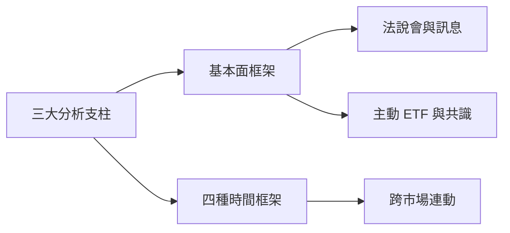

# 分析思維總覽

## 本篇你會學到

- 把零散資料變成**分析框架**的方法
- 三大支柱、時間框架、法說與跨市場各自的定位
- 建議的閱讀順序

!!! tip "先有框架，再看細節"
    名詞與表格是素材，分析思維是把素材組成判斷的方法。讀完本章再回頭看 [看表](../03-tables/index.md)、[看圖](../04-charts/index.md) 會更有方向。

---

## 本章地圖

| 主題 | 回答的問題 | 專章 |
|------|------------|------|
| **三大支柱** | 基本面、技術面、籌碼面怎麼分工？ | [三大分析支柱](three-pillars.md) |
| **基本面框架** | 宏觀、產業、公司怎麼層層拆解？ | [基本面分析框架](fundamental-framework.md) |
| **時間框架** | 不同持有期該看什麼？ | [四種時間框架](timeframes.md) |
| **法說與訊息** | 公司說法與行為一致嗎？ | [法說會與重大訊息](conference.md) |
| **跨市場連動** | 美股、匯率、期貨怎麼影響台股？ | [跨市場連動](cross-market.md) |
| **主動 ETF 共識** | 機構選股有沒有共識可參考？ | [主動 ETF 與共識分析](active-etf.md) |

---

## 建議閱讀順序

1. [三大分析支柱](three-pillars.md)：先建立「三面一起看」的習慣。
2. [基本面分析框架](fundamental-framework.md)：拆解宏觀 → 產業 → 公司。
3. [四種時間框架](timeframes.md)：把分析對齊你的持有期。
4. [法說會與重大訊息](conference.md) 與 [跨市場連動](cross-market.md)：補上訊息面與外部連動。
5. 進階線索：[主動 ETF 與共識分析](active-etf.md)。

---

## 重點回顧

- 分析思維把素材組成判斷，是 [看表](../03-tables/index.md)、[看圖](../04-charts/index.md) 的上層。
- 三面交叉驗證，優於單一訊號。
- 下一步：用 [實戰案例](../07-cases/index.md) 驗證框架，或進 [老手專區](../09-advanced/index.md) 的研究流程。
