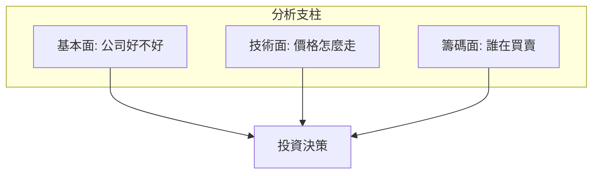

# 三大分析支柱

## 本篇你會學到

- 基本面、技術面、籌碼面各自回答什麼
- 如何組合使用而非互相否定

## 三支柱一覽

| 支柱 | 核心問題 | 主要資料 |
|------|----------|----------|
| **基本面** | 公司賺不賺錢、成長如何？ | 月營收、季報、估值 |
| **技術面** | 趨勢與進出時機？ | K 線、均線、MACD、RSI |
| **籌碼面** | 主力與散戶結構？ | 三大法人、融資融券、集保 |

## 時間尺度差異

| 支柱 | 較適合時間尺度 |
|------|----------------|
| 基本面 | 數週～數年 |
| 技術面 | 數日～數月（當沖更短） |
| 籌碼面 | 數日～數週（資料 T+1） |

## 延伸閱讀

- [基本面分析框架](fundamental-framework.md) — 宏觀、行業、公司三層次與「好公司 vs 好股票」
- [影片：小Lin说分析框架](../appendix/video-resources.md#小lin说-分析框架)

## 組合範例

| 情境 | 組合方式 |
|------|----------|
| 波段做多 | 基本面佳 + 法人買超 + 價格站上月線 |
| 短線當沖 | 技術面突破 + 量能 + 大盤氛圍（籌碼輔助） |
| 存股 | 基本面 + 殖利率，技術面只找進場點 |

## 常見錯誤

| 錯誤 | 說明 |
|------|------|
| 只看技術不看基本面 | 可能接到地雷股 |
| 只看基本面不看價格 | 可能買在高估區 |
| 籌碼單日就定論 | 需看連續性 |

## 言行一致檢查

當**公司說法**（法說、新聞）與**籌碼行為**（法人賣超）不一致時，應提高警覺，深入查證。詳見 [法說會重點](conference.md)。

## 重點回顧

- 三支柱是互補，不是互斥。
- 先定你的**交易週期**，再決定哪一支柱權重較高。
- 下一步：[四種時間框架](timeframes.md)。

相關：[月營收表](../03-tables/revenue.md) · [K 線基礎](../04-charts/kline-basics.md) · [法人表](../03-tables/institutional.md)
