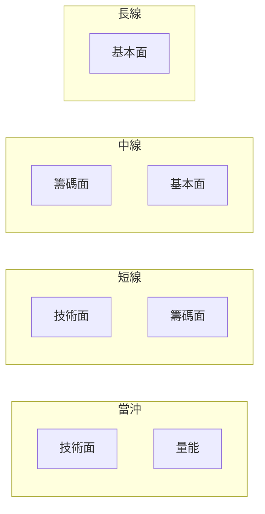

# 四種時間框架

## 本篇你會學到

- 當沖、短線、中線、長線的差異
- 不同框架下關注的因子與停損尺度

分析上常將投資決策分為四種**時間框架**，各自適用的工具與紀律不同。

!!! note "與「投資模式」的差異"
    本章是**分析刻度**（評分表、停損參考用）。實際操作風格（當沖、隔日沖、存股、ETF 等）請見 **[投資模式總覽](../08-investing/index.md)**，內含全站章節融會貫通地圖。

## 框架對照

| 框架 | 持倉時間 | 主要關注 | 停損尺度（參考） |
|------|----------|----------|------------------|
| **當沖** | 當日 | 量能、即時價量、大盤 | 淨利 -1%～-3% |
| **短線** | 數日～2 週 | K 線、均線、法人 | 淨利 -3%～-5% |
| **中線** | 數週～數月 | 月營收、法人趨勢、季線 | 結構停損或 -8%～-10% |
| **長線** | 數月～年 | 基本面、產業、股利 | 基本面失效或大幅估值修正 |

!!! note "說明"
    停損數字為**教學參考區間**，非個人化建議；實際請依資金與策略自訂。

## 因子權重示意

## 勿混用框架

| 錯誤 | 後果 |
|------|------|
| 用當沖停損做長線投資 | 容易被洗出場 |
| 用長線基本面做當沖 | 進場點可能不精準 |
| 短線進場卻長線死抱 | 小虧變大虧 |

## 評分思維（概念）

部分分析工具會對九種因子（如趨勢、量能、籌碼、估值等）在四種框架下**分別加權**得出分數。

學員只需理解：

- **同一檔股票**，當沖分數與長線分數可以差很多。
- 分數是**粗篩**，不是買賣按鈕。

## 重點回顧

- 先選框架，再選工具與停損。
- 當沖最重紀律與成本；長線最重基本面品質。
- **實戰專章**：[投資模式](../08-investing/index.md) · [當沖](../08-investing/day-trade.md) · [中線](../08-investing/swing-mid.md)
- 搭配 [風險與紀律](../06-risk/capital.md) 與 [當沖案例](../07-cases/day-trade-risk.md)。
