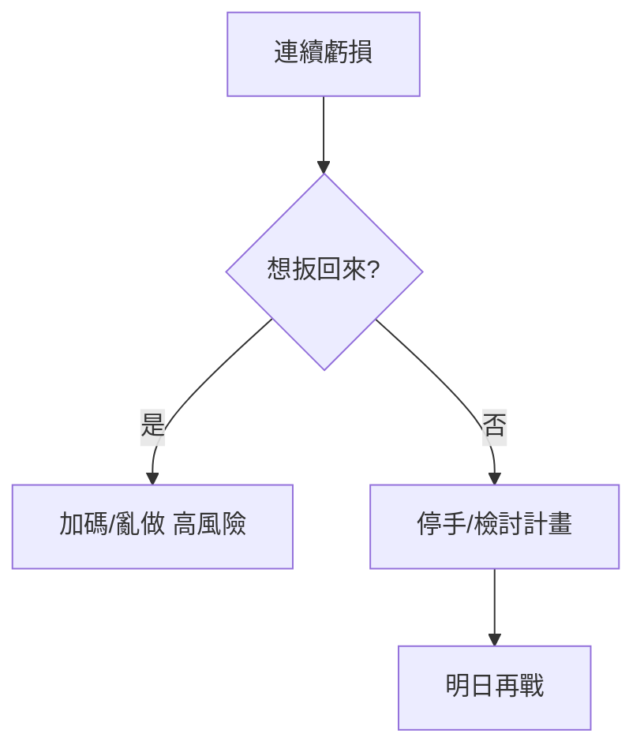

# 交易紀律

## 本篇你會學到

- 當沖不留倉、計畫交易、情緒管理
- 常見新手錯誤與對策
- 不同投資模式的**心態差異**見 [投資模式與心態](../08-investing/mode-psychology.md)

## 核心紀律

| 紀律 | 說明 |
|------|------|
| **計畫交易，交易計畫** | 進場前寫好停損、目標、理由 |
| **當沖不留倉** | 收盤前處理完當日沖銷部位 |
| **虧損守紀律，獲利守規則** | 停損不猶豫；獲利依移動停利或計畫出場 |
| **每日風險上限** | 達到即停止開新倉 |

## 情緒管理

| 情緒 | 對策 |
|------|------|
| FOMO 怕錯過 | 寫觀察清單，沒計畫就不追 |
| 報復性交易 | 設定每日最大虧損與連續停損次數 |
| 過度自信 | 連贏後降槓桿、降張數 |

## 常見新手錯誤

| 錯誤 | 對策 |
|------|------|
| 不設停損 | 進場同時設好停損價（淨利%） |
| 攤平下跌股 | 當沖/短線不補跌，承認錯誤 |
| 只看漲幅排行 | 搭配量、位置、大盤 |
| 過度交易 | 質優於量，每日筆數上限 |
| 忽略成本 | 用淨利評估，見 [損益術語](../02-glossary/pnl.md) |

## 交易日誌（建議） {#交易日誌建議}

每筆記錄：

- 進場理由（基本面/技術/籌碼）
- 停損與實際出場
- 情緒狀態（冷靜/急躁）
- 一週檢討一次

## 緊急停機

當發現以下情況，**今日不再開新倉**：

- 情緒失控
- 連續違反停損
- 帳戶與預期不符（需先釐清）

見 [Kill Switch 概念](../02-glossary/risk.md#緊急停機kill-switch)。

## 重點回顧

- 紀律是長期存活條件，不是限制獲利。
- 小虧是成本，大虧常來自無紀律。
- 實作練習：[當沖風控案例](../07-cases/day-trade-risk.md)。
