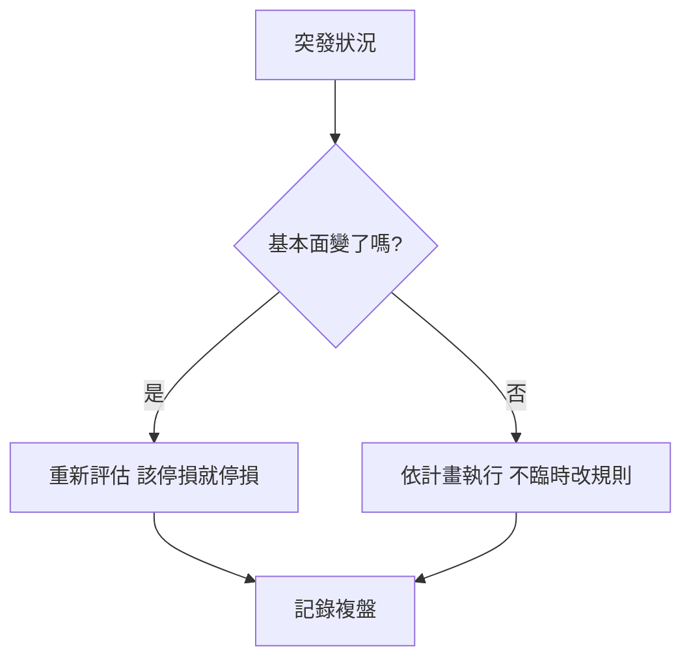

# 突發狀況應對手冊

## 本篇你會學到

- 跌停鎖死、處置股賣不出、被追繳、除息誤買時**當下怎麼辦**
- 每種狀況的成因與事前預防
- 對應的詳細章節

!!! warning "免責聲明"
    本頁提供**一般性處置思路**，非個別投資建議。實際規則以券商與交易所公告為準；遇重大狀況請直接聯絡你的營業員。

## 快速索引

| 狀況 | 你會看到 | 跳到 |
|------|----------|------|
| 跌停鎖死賣不掉 | 一直跌停、掛賣排不到 | [跌停鎖死](#跌停鎖死) |
| 處置股下不了單 | 改人工撮合、要預收款券 | [處置賣不出](#處置賣不出) |
| 融資被追繳 | 券商通知補錢，否則斷頭 | [被追繳](#被追繳) |
| 除權息誤買 | 莫名「賠錢」其實是除息 | [除息誤買](#除息誤買) |

---

## 跌停鎖死賣不出 {#跌停鎖死}

**成因**：賣壓遠大於買盤，價格跌到 −10% 上限後仍有大量賣單排隊，你的賣單排不到撮合。

**當下怎麼辦**：

1. **別恐慌掛更低價**——已經是跌停價，不會更低，只是排隊順序問題。
2. 評估是「**短期情緒**」還是「**基本面崩壞**」：
    - 若公司基本面出大事（財報地雷、下市疑慮），隔天可能續跌停，要有早點掛賣的心理準備。
    - 若只是大盤系統性下殺，可能隔日反彈。
3. 想出場就**一早就掛跌停價賣**（排隊較前面），而非盤中才掛。

**事前預防**：設好 [停損](stop-loss.md)，在跌停**之前**就出場；避免單一個股 [曝險](../02-glossary/risk.md#曝險) 過大。

---

## 處置股下不了單 / 賣不出 {#處置賣不出}

**成因**：標的被列為 [處置股](../01-basics/trading-restrictions.md)，改為**分盤集合競價**（例如每 5 或 20 分鐘撮合一次），且常需**預收款券**（全額）。

**當下怎麼辦**：

1. 確認券商是否要你**先圈存足額款／券**才能下單。
2. 理解**撮合變慢**：不是即時成交，要等到下一次集合競價。
3. 流動性差、價差大，**用限價單**避免成交在極端價。

**事前預防**：下單前查標記，見 [處置股、注意股與全額交割](../01-basics/trading-restrictions.md)；融資買進的處置股若停資，斷頭風險更高。

---

## 融資被追繳 {#被追繳}

**成因**：融資部位下跌，**維持率**低於門檻，券商發出 [追繳](margin-trading.md) 通知；未在期限內補錢，可能被 [斷頭](margin-trading.md)（強制賣出）。

**當下怎麼辦**：

1. 算清楚要補多少**保證金**，或主動**減碼**降低融資金額把維持率拉回。
2. 衡量「**補錢續抱**」還是「**認賠減碼**」——別只為了不被斷頭而投入更多生活費。
3. 注意期限：通常 T 日通知、隔一兩個營業日內處理，逾期券商有權處分。

**事前預防**：融資前讀 [信用交易實務](margin-trading.md)，預留維持率緩衝；不要把融資當作放大賭注的工具。

---

## 除權息誤買 / 誤判 {#除息誤買}

**成因**：除息當天，股價會**扣掉現金股利**作為參考價（如配 5 元，開盤參考價約 −5 元），帳面看起來「跌」，其實是技術性調整，不是虧損。

**當下怎麼辦**：

1. 確認當天是否為該股 [除權息日](../03-tables/dividend-schedule.md)——「跌」可能只是除息。
2. 股利會在之後入帳，總資產未必減少；關注的是**會不會填息**。
3. 若你是在除息**前一刻為了賺股利**才買，注意：股價已反映、還有**股利所得稅與二代健保**成本，未必划算。

**事前預防**：參與除權息前讀 [除權息入門](../01-basics/dividend.md) 與 [除權息案例](../07-cases/dividend-play.md)。

---

## 通用原則

1. **先分辨**：是情緒性波動，還是 [投資論點](../09-advanced/research-workflow.md) 真的失效。
2. **不臨時改規則**：事前寫好的 [停損](stop-loss.md) 就是契約。
3. **保留現金與冷靜**：別為了凹單投入生活費（[資金配置](capital.md)）。
4. **事後複盤**：把這次狀況寫進交易日誌。

## 重點回顧

- 跌停排隊、處置撮合、追繳期限、除息調整，**事前理解規則**就不會慌。
- 最好的應對是**預防**：停損、控制曝險、看懂標記、慎用融資。
- 分辨「情緒波動 vs 論點失效」是所有突發狀況的共同判斷核心。

相關：[交易限制](../01-basics/trading-restrictions.md) · [信用交易實務](margin-trading.md) · [停損三層](stop-loss.md) · [除權息入門](../01-basics/dividend.md) · [常見問答](../appendix/faq.md)
