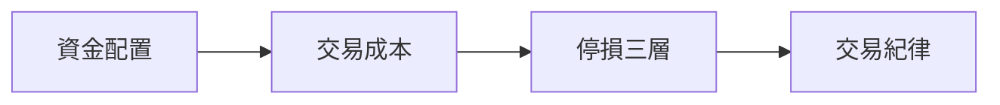

# 風險與紀律總覽

## 本篇你會學到

- 為什麼**活下來**比一時獲利更重要
- 資金、成本、停損、紀律四層的關係
- 建議的閱讀順序

!!! warning "免責聲明"
    本章為風險管理觀念整理，不構成投資建議。實際操作請依個人財務狀況評估。

---

## 四層防線

| 層級 | 回答的問題 | 專章 |
|------|------------|------|
| **資金配置** | 一檔、一筆該投入多少？ | [資金配置](capital.md) |
| **交易成本** | 手續費與稅吃掉多少獲利？ | [交易成本與期望值](trading-costs.md) |
| **停損** | 什麼時候該認賠出場？ | [停損三層概念](stop-loss.md) |
| **紀律** | 怎麼讓自己照計畫執行？ | [交易紀律](discipline.md) |

---

## 建議閱讀順序

1. [資金配置](capital.md)：先決定能虧多少、怎麼分配。
2. [交易成本與期望值](trading-costs.md)：算清楚每筆交易的損益平衡點。
3. [停損三層概念](stop-loss.md)：設定出場規則。
4. [交易紀律](discipline.md)：把規則變成習慣。

---

## 與其他章節的關係

| 想深入 | 去這裡 |
|--------|--------|
| 損益、停損名詞定義 | [損益與停損詞典](../02-glossary/pnl.md) |
| 風控名詞 | [風控詞典](../02-glossary/risk.md) |
| 模式與心態錯配 | [投資模式與心態](../08-investing/mode-psychology.md) |
| 系統化研究流程 | [研究流程](../09-advanced/research-workflow.md) |

---

## 重點回顧

- 風控的目標是**留在場上**，而非每筆都賺。
- 資金 → 成本 → 停損 → 紀律，四層缺一不可。
- 下一步：用 [實戰案例](../07-cases/index.md) 看風控如何影響結果。
