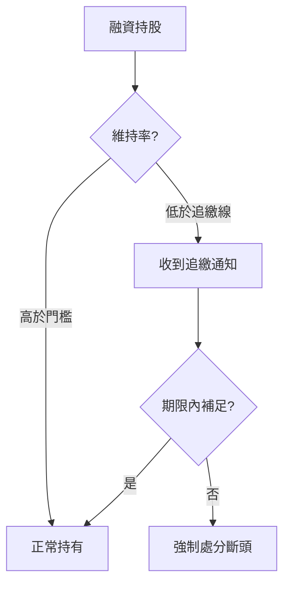

# 信用交易實務（融資融券）

## 本篇你會學到

- 融資維持率怎麼理解、追繳與斷頭是什麼
- 融券還券、借券費與軋空風險
- 試算淨成本時該加哪些項目

[← 風控總覽](index.md) · [融資融券表](../03-tables/margin.md) · [籌碼詞典](../02-glossary/chips.md#融資融券)

!!! warning "免責聲明"
    以下為教學整理，**不構成投資建議**。成數、維持率門檻、追繳時限依**券商系統與交易所公告**為準，下單前請向券商確認。

---

## 信用交易是什麼

| 類型 | 白話 | 你向券商借什麼 |
|------|------|----------------|
| **融資** | 借錢買股 | 資金 |
| **融券** | 借券賣出 | 股票 |
| **借券** | 借入股票（賣出或還券用途） | 股票 |

名詞定義見 [籌碼詞典](../02-glossary/chips.md#融資融券)。本頁聚焦**操作與風控**，籌碼解讀見 [融資融券表](../03-tables/margin.md)。

---

## 融資：維持率、追繳、斷頭

### 維持率（Maintenance Ratio）

**白話**：你的擔保品（主要是持股市值）相對於融資欠款是否「夠安全」。維持率太低，券商會要求補錢或賣股。

| 項目 | 說明 |
|------|------|
| **概念** | 維持率 = 擔保品價值 ÷ 融資金額 × 100%（各券商計算口徑可能含現金、不含某些標的，以對帳單為準） |
| **在哪裡看到** | 券商 APP「信用交易」「維持率」欄 |
| **常見門檻（教學用）** | 低於約 **130%** 可能收到**追繳**通知；低於約 **120%** 或逾期未補可能**強制處分（斷頭）** |
| **常見誤解** | 股價跌一點沒關係——槓桿會放大，連續下跌時維持率快速惡化 |

**小例子（簡化）**：

- 自備 40 萬、融資 60 萬買 100 萬市值股票 → 維持率概念上約 100÷60 ≈ **167%**
- 股價跌 20%，市值剩 80 萬 → 約 80÷60 ≈ **133%**，接近追繳區
- 再跌或未補保證金 → 可能斷頭

### 追繳（Margin Call）

| 項目 | 說明 |
|------|------|
| **定義** | 維持率低於券商規定時，要求你在**期限內**補入保證金或賣出部分持股 |
| **你可以做** | ① 補現金 ② 賣出部分股票降低融資 ③ 主動減碼，勿等到強制處分 |
| **常見誤解** | 可以一直拖——逾期券商可**不經你同意**賣出持股 |

### 斷頭（Forced Liquidation）

| 項目 | 說明 |
|------|------|
| **定義** | 未在期限內補足維持率，券商**強制賣出**你的持股以償還融資 |
| **實務影響** | 常在**低檔、流動性差**時被賣，形成「越跌越賣」 |
| **與停損的差別** | 停損是你依計畫出場；斷頭是**被動**、時點通常不利 |



---

## 融券：還券、借券費、軋空

| 項目 | 說明 |
|------|------|
| **還券** | 融券賣出後，須在期限內**買回**同等股數還給券商 |
| **借券費 / 融券利息** | 借券期間的持有成本，依標的與天數計算 |
| **軋空風險** | 股價大漲時被迫高價買回，虧損理論上無上限 |
| **在哪裡看到** | 融券餘額、券資比 → [融資融券表](../03-tables/margin.md) |

**試算成本**：融券不只算「股價差」，還要加**借券費 + 買賣手續費 + 證交稅**（賣出時）。見 [稅費總覽](../appendix/taxes-for-costing.md)。

相關案例：[軋空與融券](../07-cases/short-squeeze.md)

---

## 成本試算：信用交易要多算什麼

| 項目 | 融資 | 融券 |
|------|------|------|
| 手續費 | 買 + 賣 | 賣 + 買（還券） |
| 證交稅 | 賣出時 | 賣出時（開倉） |
| 利息／借券費 | 融資利息（按日） | 借券費（按日） |
| 機會成本 | 追繳時被迫賣在低點 | 軋空時被迫買在高點 |

**淨利試算公式（概念）**

```
融資淨利 ≈ 價差損益 − 買賣手續費 − 賣出證交稅 − 融資利息
融券淨利 ≈ 價差損益 − 買賣手續費 − 證交稅 − 借券費
```

勿只用 [毛價差](../02-glossary/pnl.md) 自我安慰。

---

## 與風控四層的關係

| 風控層 | 信用交易要注意 |
|--------|----------------|
| [資金配置](capital.md) | 融資 = 槓桿，單檔曝險應比現股更保守 |
| [交易成本](trading-costs.md) | 來回費稅 + 利息 |
| [停損](stop-loss.md) | 設在**斷頭之前**的主動出場 |
| [紀律](discipline.md) | 收到追繳勿賭反彈，先算維持率 |

---

## 常見誤區

| 誤區 | 正確理解 |
|------|----------|
| 融資多 = 看多必漲 | 可能是散戶槓桿過高，跌時斷頭賣壓大 |
| 維持率還夠就不用管 | 趨勢下跌時可能一日內從安全變追繳 |
| 融券一定賺 | 軋空 + 借券費 + 無限虧損風險 |
| 信用交易不用停損 | 斷頭停損點通常比你自己設的停損更差 |

## 自我檢查

??? question "1.（概念題）融資維持率約 100÷60 代表什麼？"
    參考答案：擔保品市值相對融資欠款的比例；越低越接近**追繳／斷頭**風險。

??? question "2.（判斷題）融券看空，股價大漲時最大虧損有上限？"
    參考答案：沒有明確上限，且有**軋空**與借券費；風險高於現股做多。

??? question "3.（情境題）收到追繳通知，你至少該做哪三件事之一？"
    參考答案：**補現金**、**賣股降融資**、**主動減碼**；勿賭反彈拖到強制處分。

## 重點回顧

- **維持率**是融資的生命線；**追繳**是警訊，**斷頭**是被動出場。
- 融券要算**借券費**與軋空風險，不是只看股價方向。
- 試算一律用**淨利**，並把利息／借券費算進去。

相關：[處置股與交易限制](../01-basics/trading-restrictions.md)（信用交易可能受限） · [稅費總覽](../appendix/taxes-for-costing.md) · [當沖風控案例](../07-cases/day-trade-risk.md)
