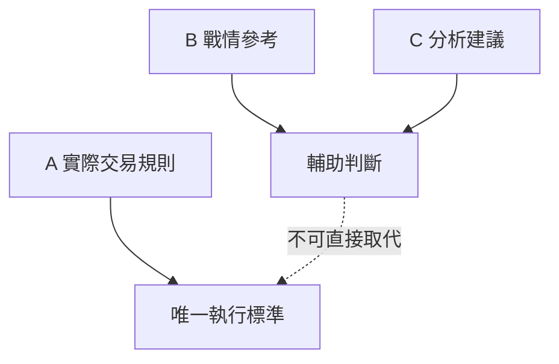

# 停損三層概念

## 本篇你會學到

- 實際交易、戰情建議、分析建議三種數字別混用
- 移動停利的正確理解

## 為什麼有三層

同一個詞「停損」「停利」，在不同情境下數字可能不同。混在一起會導致：以為賺 2% 就該賣，卻不知道那只是**分析參考**。

## 三層對照

| 層級 | 用途 | 典型數字（教學示意） | 誰決定 |
|------|------|----------------------|--------|
| **A. 實際交易規則** | 你真的會下單執行的停損停利 | 停損淨利 -2%～-3%；移動停利啟動 +5%～+6% | 你自己的交易計畫 |
| **B. 戰情 / 盤中參考** | 當日情勢的**人工參考** | 停損 -1%、參考停利 +2% | 分析備忘、非機械執行 |
| **C. 分析量表建議** | 多因子評分附帶的建議區間 | 當沖 -1%/+2% 等 | 研究工具輸出 |

## 移動停利

| 概念 | 說明 |
|------|------|
| **啟動門檻** | 淨利須先達到某%（如 +6%），才開始追蹤高點 |
| **回撤出場** | 從淨利高點回撤某%（如 2%）則賣出 |
| **不是固定賣點** | 啟動門檻 ≠ 「賺 6% 就賣」 |

**範例**：

1. 淨利升至 +6% → 啟動移動停利
2. 最高到 +8%
3. 回撤 2% → 約在 +6% 出場

## 毛價差陷阱

若用「股價漲 2%」當停利，可能扣完稅費後幾乎沒賺。請一律用 [淨利](../02-glossary/pnl.md#淨利)。

## 停利與減碼：何時獲利了結 {#停利與減碼}

停損保護本金；**停利與減碼**則回答「賺到了，什麼時候賣」。常見三種出場思路：

| 方式 | 做法 | 適合 |
|------|------|------|
| **目標停利** | 進場前設定目標淨利（如 +6%），到了就賣 | 短線、有明確壓力區 |
| **移動停利** | 獲利達門檻後追蹤高點，回撤才出（見上） | 想讓利潤奔跑的波段 |
| **分批減碼** | 達目標賣一部分，剩餘續抱或墊高停損 | 不確定能漲多遠時 |

**論點失效才全賣**：若當初買進的 [投資論點（thesis）](../09-advanced/research-workflow.md) 被推翻（如營收轉弱、法人翻空），不必等停利價，直接重新評估。

!!! tip "別讓獲利變虧損"
    部位由賺轉平時，至少把停損上移到**成本價**（保本），避免「紙上富貴」全數回吐。

## 實務建議

1. **寫在一張紙上**：你的 A 層停損停利是多少。
2. **進場前寫好**：沒寫就不進場。
3. **B、C 層僅參考**：不因分析建議 +2% 就推翻 A 層 -3% 停損。

## 自我檢查

??? question "1.（概念題）移動停利的「啟動門檻」是什麼意思？"
    參考答案：是**開始追蹤高點**的條件，不是「一到就賣」。例如 +6% 啟動後，要從淨利高點回撤設定幅度才出場。

??? question "2.（判斷題）股價漲了 2% 就達到你的停利目標，這樣對嗎？"
    參考答案：要看是**毛價差**還是**淨利**。漲 2% 扣掉來回費稅可能只剩 1.4%；一律以 [淨利](../02-glossary/pnl.md#淨利) 為準。

??? question "3.（情境題）持股獲利 +8% 後開始回落，你會怎麼做？"
    參考答案：若有移動停利，依回撤幅度出場；否則至少把停損上移到成本價保本。論點若失效則直接重新評估，見 [停利與減碼](#停利與減碼)。

## 重點回顧

- 只有 **A 層** 是你的執行契約。
- 移動停利追蹤的是**淨利高點**，不是股價高點。
- 停利、減碼要在進場前想好；論點失效就重新評估，搭配 [交易紀律](discipline.md)。

相關：[損益術語](../02-glossary/pnl.md) · [風控術語](../02-glossary/risk.md) · [組合管理再平衡](../09-advanced/portfolio.md#再平衡)
