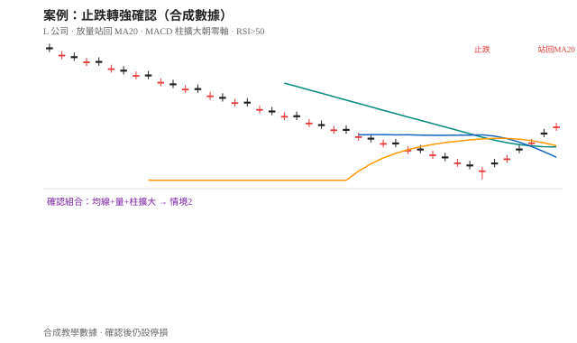
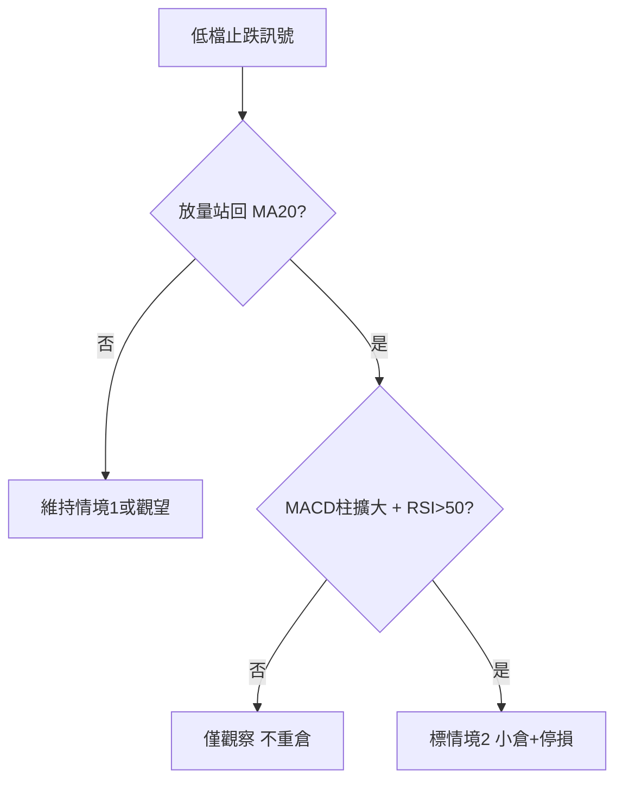

# 案例二十：止跌轉強確認

## 本篇你會學到

- 如何把「可能止跌」升級成「轉強候選」（情境 2）
- 與情境 1 接盤的差異：站回均線、零軸方向、放量
- 適用模式：[短線](../08-investing/swing-short.md) · [中線](../08-investing/swing-mid.md) · 專章：[接盤還是追高](../04-charts/catch-or-chase.md)

!!! warning "免責聲明"
    教學示意，非投資建議。數據為合成。

## 背景

「L 公司」先前下跌，出現低檔止跌 K 線後，社群分裂成「接盤」與「落底」兩派。你要用確認條件判斷能否標成**情境 2**。

## 看到的圖

| 現象 | 說明 |
|------|------|
| D0～D2 | 低檔長下影／鎚子後，連兩日收紅 |
| 均線 | D2 **放量收盤站上 MA20**；MA20 走平轉微上 |
| MACD | 仍可能在零軸下，但柱狀**連續擴大**並明顯朝零軸靠近 |
| 量 | 站上均線日明顯放量 |
| RSI | 由 35 附近升至 **50 上方** |
| 籌碼 | 法人三日合計由大幅賣超轉為小買或賣超大幅縮減 |

## 推理步驟

1. **排除情境 1**：若只金叉卻不站均線、不放量 → 仍是接盤風險，見 [案例十七](weak-rebound-trap.md)。
2. **確認清單**（手冊情境 2）：站回 MA20、柱擴大、量增、RSI＞50。
3. **計分卡 A**：本例多數項加分 → 可標「止跌轉強候選」，不是保證反轉。
4. **停損**：設在確認日前波低下方；破了就回到情境 1／觀望。
5. **與鎚子案例關係**：[鎚子+均線](hammer-ma.md) 偏單根啟動；本例偏**確認段**。

## 結論（教學用）

- **標記**：情境 **2 止跌轉強候選**。
- **空手**：可進觀察名單；確認後若進場必須寫停損。
- **勿做**：把第一根鎚子或零軸下金叉當已確認。

## 反思

| 錯誤 | 修正 |
|------|------|
| 確認日隔日就重倉 | 分批；防一日假突破 |
| 忽略法人仍大賣 | 三支柱打架要降分 |
| 確認後取消停損 | 轉強假設可失敗 |

## 重點回顧

- 情境 2＝**確認條件組合**，不是單一金叉。
- 相關：[接盤還是追高](../04-charts/catch-or-chase.md) · [速查](../04-charts/catch-chase-quickref.md) · [零軸](../02-glossary/technical.md#零軸)
