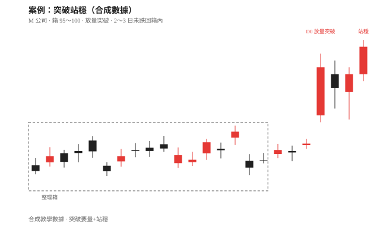
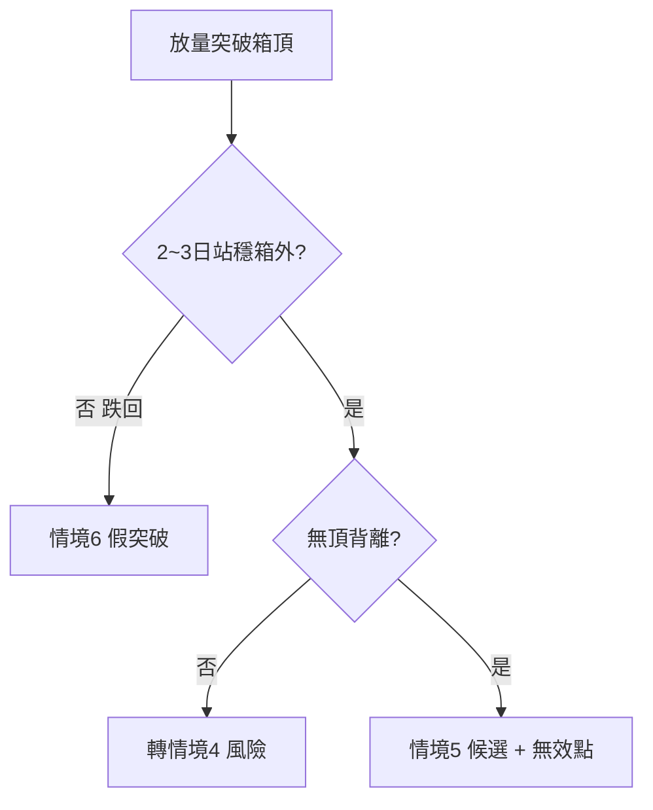

# 案例二十一：突破站穩（非假突破）

## 本篇你會學到

- 辨識情境 5「突破延續候選」與情境 6「假突破」的差別
- 量、站穩天數、MACD、回測壓力變支撐
- 適用模式：[短線](../08-investing/swing-short.md) · 專章：[手冊：接盤還是追高](../04-charts/catch-or-chase.md)

!!! warning "免責聲明"
    教學示意，非投資建議。數據為合成。

## 背景

「M 公司」在 95～100 整理多日後跳上 103。有人立刻追，有人怕假突破。你要判斷較像情境 5 還是 6。

## 看到的圖

| 現象 | 說明 |
|------|------|
| 整理 | 約 18 日箱在 95～100 |
| D0 | 放量收 104，站上箱頂 |
| D+1～D+2 | 拉回未跌破 100，收在箱頂上方（站穩） |
| 量 | D0 倍量；站穩日量能仍高於整理均值 |
| MACD | 零軸上方附近金叉或柱轉正擴大，**無頂背離** |
| 回測 | D+2 觸 100 附近止穩 → 壓力變支撐味道 |

## 推理步驟

1. **突破定義**：見 [定義：突破](../02-glossary/technical.md#突破)；穿越不夠，要量與站穩。
2. **排除情境 6**：對照 [案例：缺口假突破](gap-breakout.md)——本例兩三日未回補／未跌回箱內。
3. **排除情境 4**：非大乖離末端量縮創高；有量且無頂背離。
4. **計分卡 B**：位置、量、站穩、MACD 加分 → 偏情境 5。
5. **無效點**：收盤跌回 100 下方（或箱內）→ 改標情境 6，執行減碼／停損。

## 結論（教學用）

- **標記**：情境 **5 突破延續候選**。
- **追價紀律**：寧可等站穩，也不在 D0 無計畫市價追（防 FOMO）。
- **對照**：假突破長相見 [案例八](gap-breakout.md)。

## 反思

| 錯誤 | 修正 |
|------|------|
| D0 當下全倉 | 等站穩或小倉＋嚴格無效點 |
| 無量突破當真 | 量是必要條件之一 |
| 站穩後以為不會跌 | 假突破可延遲發生 |

## 重點回顧

- 突破要 **量 + 站穩 + 非背離**；缺一就往 4 或 6 靠。
- 相關：手冊／速查：[手冊：接盤還是追高](../04-charts/catch-or-chase.md) · [速查：接盤／追高](../04-charts/catch-chase-quickref.md) · 定義：[定義：突破](../02-glossary/technical.md#突破)
