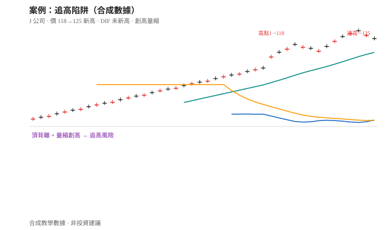
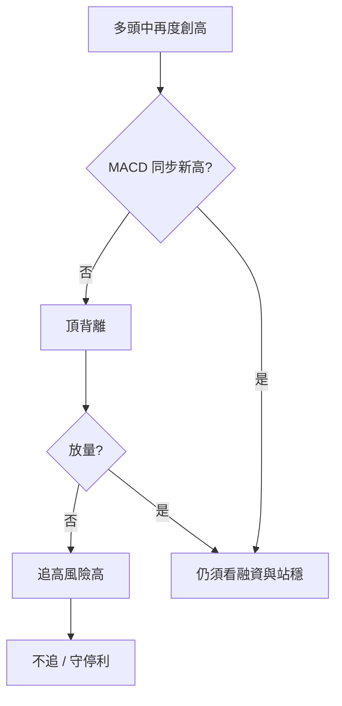

# 案例十八：追高陷阱（量縮創高）

## 本篇你會學到

- 辨識「已經漲一波後，情緒熱＋量縮創高」的追高風險
- 用乖離、MACD 頂背離、融資與量價交叉驗證
- 適用模式：[短線](../08-investing/swing-short.md) · 專章：[手冊：接盤還是追高](../04-charts/catch-or-chase.md)（情境 4）

!!! warning "免責聲明"
    教學示意，非投資建議。數據為合成。

## 背景

「J 公司」兩個月內由 80 附近漲至 120，新聞與社群熱度升高。股價再度創高至 125，朋友傳訊「不追會後悔」。你想確認這是突破延續，還是**追高風險**。

## 看到的圖

| 現象 | 說明 |
|------|------|
| 位置 | 收盤遠離 [MA20](../04-charts/ma.md)，短線乖離偏大 |
| 價格 | 前高約 118 → 新高 125 |
| MACD | DIF 前高較高、新高時 DIF **未創新高**（頂背離） |
| 量 | 創高日與前波高點比**量縮** |
| 籌碼 | 近五日融資餘額明顯上升（散戶槓桿追價跡象） |
| 情緒 | 社群 FOMO，見 [FOMO 族](../10-persona/active.md#⑧-fomo-追風族) |

## 推理步驟

1. **先標情境**：偏多環境但位置極高 → 候選 [情境 4 追高](../04-charts/catch-or-chase.md) 或情境 5；用下列項排除 5。
2. **動能**：價新高、MACD 未新高 → [教學：MACD 背離進階](../04-charts/macd.md#背離進階)，動能衰竭警訊。
3. **量價**：創高量縮 → 買盤不夠，假突破／過熱機率上升，見 [量價](../04-charts/volume-price.md)。
4. **籌碼**：融資增＋熱度高 → 抬轎結構，見 [融資表](../03-tables/margin.md)。
5. **計分卡 B**（教學示意）：位置 0、MACD 0、量 0、站穩未驗證、籌碼 0、情緒 0 → 極低分。
6. **決策**：空手不追；持倉者考慮移動停利或減碼，**不加碼**。

## 結論（教學用）

- **標記**：情境 **4 追高／過熱風險**（不是「突破必買」）。
- **空手**：不進場；若仍想做，改等回檔至計畫中的支撐區並重跑計分。
- **持倉**：論點若只剩「還會漲」，改為風控優先。

## 反思：常見錯誤

| 錯誤 | 修正 |
|------|------|
| 用「已經漲這麼多證明很強」合理化追價 | 強勢也可以過熱；看背離與量 |
| 怕錯過就市價追 | 錯過不是風險；帳戶回撤才是 |
| 忽略融資 | 槓桿追價常放大回檔殺傷 |
| 把頂背離當立刻放空指令 | 本站現股教學以「不追、減碼」為主 |

## 對照

- 若放量突破後站穩、無背離、融資未失控 → 才比較像 [手冊情境 5](../04-charts/catch-or-chase.md)；仍要防 [案例：缺口假突破](gap-breakout.md)。
- 接盤端對照：[案例：弱勢反彈](weak-rebound-trap.md)。
- 純動能背離拆解：[案例：MACD 頂背離](macd-divergence.md)。

## 重點回顧

- 追高典型組合：**大乖離 + 頂背離 + 量縮創高 + 融資熱**。
- 相關：手冊：[手冊：接盤還是追高](../04-charts/catch-or-chase.md) · 定義：[定義：追高殺低](../02-glossary/trading-terms.md#追高殺低)
