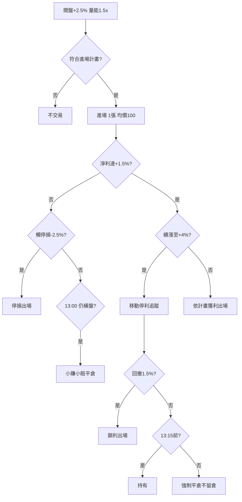

# 案例四：當沖風控決策樹

## 本篇你會學到

- 當沖進場前的檢查清單與決策樹
- 停損、停利、收盤前平倉的紀律
- 適用模式：[當沖](../08-investing/day-trade.md)

!!! warning "免責聲明"
    教學用決策流程，非鼓勵當沖，亦不構成投資建議。

## 背景

你以**當沖**練習紀律，總資金 50 萬、單檔最多 2 張。標的「D 公司」開盤強勢，漲幅約 +2.5%，成交量為 5 日均量 1.5 倍。

## 盤前 / 開盤檢查

| 項目 | 狀態 |
|------|------|
| 今日已虧損 | 0 |
| 大盤 | 小漲，氛圍中性偏多 |
| 流動性 | 成交量充足 |
| 交易計畫 A 層停損 | 淨利 -2.5% |

見 [停損三層](../06-risk/stop-loss.md) 與 [資金配置](../06-risk/capital.md)。

## 決策樹

## 情境推演

### 情境 A：停損

- 進場 100，股價回落至 97.5（毛 -2.5%，接近淨利停損）。
- **動作**：不猶豫出場，記錄「突破失敗」。
- **反思**：開盤追高若無計畫加碼，停損是預期成本。

### 情境 B：小賺出場

- 漲至 101.5（淨利約 +1.2%）後橫盤，午盤量能萎縮。
- **動作**：13:00 前平倉，不賭尾盤。
- **反思**：當沖不要求每筆大賺，累積小勝 + 守停損。

### 情境 C：移動停利

- 漲至 104（淨利約 +3.5%），啟動移動停利（假設啟動門檻 +3%）。
- 最高淨利 +4.2%，回撤 1.5% 出場。
- **動作**：約 +2.7% 淨利出場，不貪最後一段。

### 情境 D：收盤前

- 13:20 仍持倉 → **無論盈虧市價平倉**（當沖不留倉紀律）。

## 成本提醒

當沖損益平衡約需股價漲 **0.2%～0.3%** 以上（視券商折扣與稅率）。+0.5% 毛利的「小贏」扣費後可能微薄。

## 結論（教學用）

- 當沖核心不是「預測」，是**執行計畫**與**成本意識**。
- A 層停損停利寫死；B/C 層戰情建議不動搖 A 層。
- 連續 2 筆停損 → 當日停手（見 [交易紀律](../06-risk/discipline.md)）。

## 重點回顧

- 進場前已知最慘虧多少、幾點平倉。
- 收盤前清倉是當沖鐵律。
- 相關：[當沖概念](../01-basics/market-overview.md#當沖當日沖銷) · [淨利術語](../02-glossary/pnl.md)
