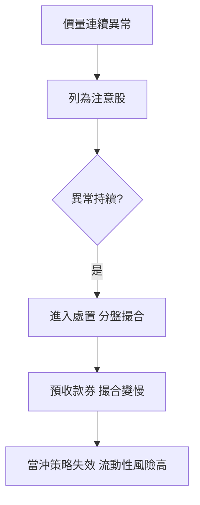

# 案例十六：追飆股追進處置股

## 本篇你會學到

- 飆股被列為注意股、處置股後的交易變化
- 分盤集合競價、預收款券對散戶的影響
- 進場前查交易標記的重要性

!!! warning "免責聲明"
    匿名教學案例，數據為合成，**不構成投資建議**。處置規則以證交所與券商公告為準。

## 背景

當沖客 D 看到一檔小型股連續漲停，第 5 天追進，卻發現「**下不了單**、**賣不掉**、**還被要求先付全額**」，原來這檔已因價量異常進入**處置**。

## 看到的數據

| 階段 | 標記 | 交易變化 |
|------|------|----------|
| 連續異常前幾天 | 注意股 | 提醒投資人留意，仍可正常交易 |
| 持續異常 | 處置股 | 改**分盤集合競價**（如每 5～20 分鐘撮合一次） |
| 處置加重 | 處置 + 預收 | 須**預收全額款／券**才能下單 |

## 推理步驟

1. **撮合變慢**：處置股不是即時成交，而是**每隔幾分鐘**集合競價一次，當沖「快進快出」前提瓦解。
2. **資金被圈住**：預收全額款券，等於要先準備整筆現金，且賣出也受限。
3. **流動性陷阱**：撮合次數少、參與者縮手，想停損時可能**賣不到理想價**，飆股回跌時尤其危險。

## 結論（教學用）

- 追強勢股前，**先查交易標記**（注意／處置／全額交割），see [交易限制](../01-basics/trading-restrictions.md)。
- 處置期間的撮合與資金規則改變，**不適合當沖**與短進短出。
- 已持有遇到處置，理解規則、用限價單、別恐慌追殺，see [處置賣不出](../06-risk/emergency-playbook.md#處置賣不出)。

## 反思

| 誤區 | 修正 |
|------|------|
| 飆股就追，不看標記 | 進場前查注意／處置狀態 |
| 處置股還想當沖 | 分盤撮合，當沖前提不存在 |
| 恐慌時市價殺出 | 流動性差，用限價避免成交極端價 |

## 重點回顧

- 連續異常 → 注意股 → 處置股，交易規則逐步收緊。
- 處置 = 分盤撮合 + 可能預收款券，當沖與短線風險大增。
- 下單前查標記，是避開此雷的唯一方法。

相關：[處置股、注意股與全額交割](../01-basics/trading-restrictions.md) · [突發狀況手冊](../06-risk/emergency-playbook.md#處置賣不出) · [當沖風控案例](day-trade-risk.md) · [當沖](../08-investing/day-trade.md)
