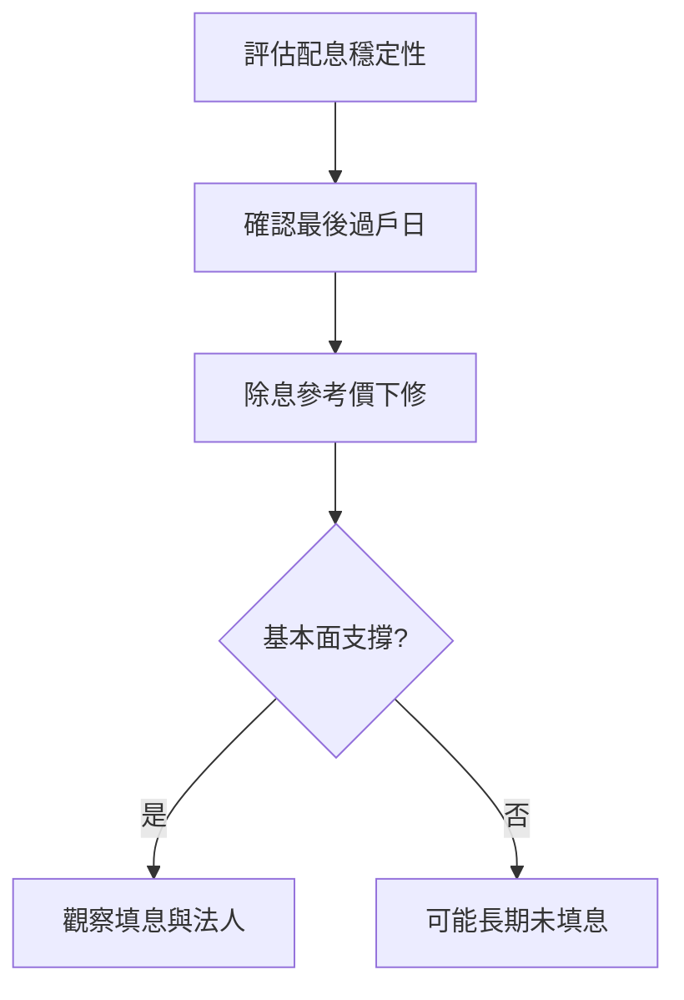

# 案例十：除權息參與與填息

## 本篇你會學到

- 除息參考價、填息流程與常見誤解
- 存股族如何評估配息品質
- 適用模式：[存股除權息](../08-investing/dividend-investing.md)

!!! warning "免責聲明"
    本案例使用**匿名化教學數據**，不代表真實個股建議，歷史表現不代表未來。

## 背景

穩健配息股「D 公司」每年穩定配現金 3 元，你考慮在除息前布局、參與**填息**行情。入門見 [除權息](../01-basics/dividend.md)、[填息](../02-glossary/market-terms.md#填息)。

## 看到的資料

| 項目 | 數值 |
|------|------|
| 除息前收盤 | 60 元 |
| 現金股利 | 3 元 |
| 除息參考價（簡化） | 約 57 元 |
| 除息後 20 交易日低點 | 55 元 |
| 除息後 60 日高點 | 61 元 |

**殖利率（除息前）**：3 ÷ 60 = 5%

**日程**：見 [除權息日程表](../03-tables/dividend-schedule.md) — 最後過戶日須在除息前持有。

## 推理步驟

1. **除息當下**：帳面總資產大致不變（股價下修約等於股利）；現金股利尚未入帳前，勿誤以為「虧 3 元」。
2. **息落股價跌**：除息後跌至 55 → 市場擔心獲利或產業，**填息失敗**一段時間。
3. **填息過程**：後續營收穩、法人買超，股價回升至 61 → **完成填息**並略高於除息前。
4. **稅費**：現金股利須扣二代健保 **2.11%**（單次 ≥2 萬門檻）及股利所得稅（依個人狀況）；詳見 [稅費總覽](../appendix/taxes-for-costing.md)。交易成本見 [交易成本](../06-risk/trading-costs.md)。
5. **參與時點**：除息前搶進常拉高股價、除息後回落；並非「越早買越划算」。

## 結論（教學用）

- **存股視角**：D 公司最終填息，適合說明「除息後耐心 + 基本面」的重要性。
- **短線視角**：除息前後波動大，須算清**稅費與機會成本**。
- **停損／出場**：若除息後跌破關鍵支撐且營收轉弱，填息假設可能失效。

## 反思

| 錯誤 | 後果 |
|------|------|
| 只看殖利率高 | 買進景氣轉差標的 |
| 除息前最後一天追高 | 息落股價跌雙重打擊 |
| 忽略稅與二代健保 2.11% | 實際報酬低於預期 | 用 [實領殖利率](../appendix/taxes-for-costing.md) 試算 |

## 重點回顧

- 填息是**結果**，不是除息日的保證。
- 搭配 [估值表](../03-tables/valuation.md)、[財報](../03-tables/financials.md) 評估配息能否持續。
- 日程與過戶規則以交易所公告為準。

相關：[股利政策分頁](../03-tables/deep-dive-tabs.md) · [基本面術語](../02-glossary/fundamentals.md)
