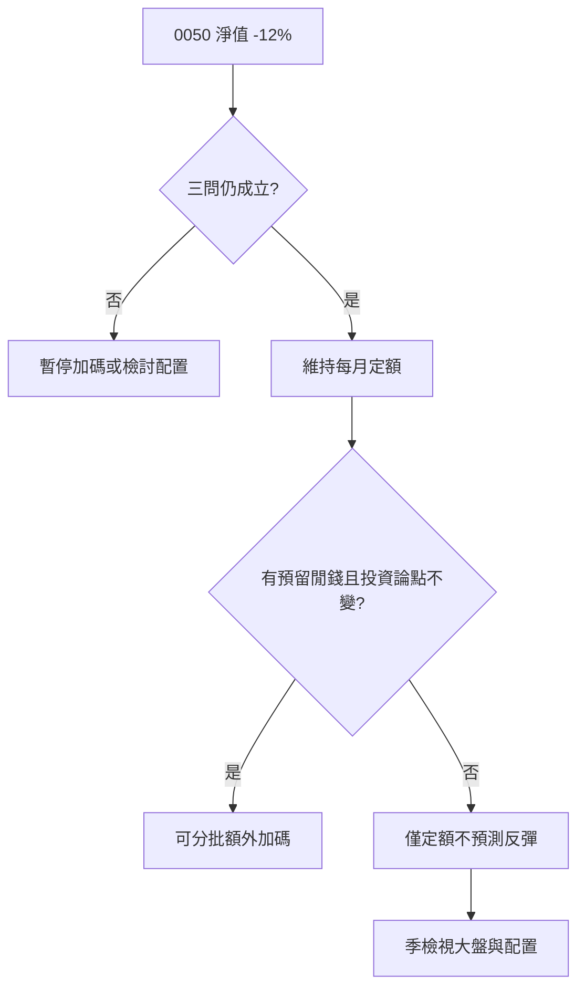

# 案例十一：0050 定期定額遇到大跌

## 本篇你會學到

- 定期定額在**大盤回撤**時該怎麼想、怎麼做
- 「閒錢」「進場前三問」在實際情境的應用
- 哪些反應合理、哪些屬於心態錯配

!!! warning "免責聲明"
    本案例使用**匿名化教學情境**，不代表真實報價建議，歷史表現不代表未來。

適用模式：[ETF 定期定額](../08-investing/etf-passive-dca.md) · [對號入座：股市萌新／小資](../10-persona/index.md)

---

## 背景

小安 2022 年起每月 5 日固定投入 **5,000 元**買 **0050**，已執行 18 個月。資金來源是**閒錢**（不影響房租與緊急預備金）。

2024 年中，加權指數自高點回撤約 **-18%**，0050 淨值同步走低。小安帳面浮虧約 **-12%**（因定額平滑，虧損%小於大盤跌幅）。

入門見 [ETF 入門](../01-basics/etf-intro.md)、[0050 專章](../08-investing/etf-passive-dca.md)。

---

## 進場前三問（當時 vs 大跌時）

| 問題 | 進場時 | 大跌時複檢 |
|------|--------|------------|
| **加倉空間** | 每月定額外，另留 3 萬閒錢 | 仍保留，未動用生活費 |
| **現金流需求** | 半年內無大額支出 | 仍成立 |
| **台股信心** | 願意持有 5 年以上 | 未改變，但情緒焦慮 |

三問仍成立 → 教學上可維持定額，並**依原計畫**評估是否用預留閒錢加碼（非借貸）。

---

## 三種常見反應

| 反應 | 行為 | 教學評估 |
|------|------|----------|
| **A. 恐慌全賣** | 「賠了趕快止損」一次賣光 | ❌ 用短線心態操作長線配置；若急需用錢才合理 |
| **B. 假裝沒事** | 定額繼續，但每天看分 K 焦慮 | ⚠️ 紀律對，但**資訊頻率**錯配，見 [ETF 心態](../08-investing/mode-psychology.md#etf心態) |
| **C. 依計畫執行** | 維持定額；季檢視；可選用預留閒錢加碼 | ✅ 符合專章建議 |

小安選 **C**。

---

## 推理步驟

1. **確認資金性質**：仍是閒錢 → 無 [認賠殺出](../06-risk/capital.md#閒錢與生活費) 壓力。
2. **區分帳面與實現**：未賣出前是浮虧；定額在低位買入**降低平均成本**（不保證未來獲利）。
3. **加碼規則**：僅用預留 3 萬，分 2 次投入，**不**借錢、不動生活費。
4. **檢視頻率**：改為**每季**看 [大盤圖](../04-charts/market-charts.md)，平日不盯分 K。
5. **不做的話**：不預測「下週一定反彈」；不把 0050 當當沖標的。

---

## 數字示意（教學用）

| 項目 | 說明 |
|------|------|
| 定額 18 期累計投入 | 約 9 萬元 |
| 大跌時帳面市值 | 約 7.9 萬元（浮虧約 -12%） |
| 維持定額 +6 期後 | 平均成本下移；若大盤回升，回本所需漲幅**可能**較低 |
| 關鍵 | 回升**不保證**；若大盤多年低迷，仍可能長期帳面虧損 |

---

## 結論（教學用）

- **ETF 定額的價值**在紀律與分散進場，不在「保證賺錢」。
- 大跌時最重要的是：**閒錢、三問、對齊檢視頻率**，而非預測短期。
- 若三問不成立（例如明年要付學費），應先處理**現金流**，而非硬撐定額。

---

## 反思

| 錯誤 | 後果 |
|------|------|
| 把定額當「一定賺」 | 大跌時信心崩潰、全賣低點 |
| 每天看淨值 | 情緒疲勞、想亂改計畫 |
| 無預留卻想加碼 | 動到生活費或借貸 |

---

## 重點回顧

- 0050 定額遇大跌：先複檢**三問**與**閒錢**，再決定維持／加碼／暫停。
- 心態可參考定存的**耐心**，風險**不像**定存。
- 延伸：[0050 專章](../08-investing/etf-passive-dca.md) · [ETF 投資模式](../08-investing/etf-investing.md) · [心態錯配](../08-investing/mode-psychology.md#心態錯配)
