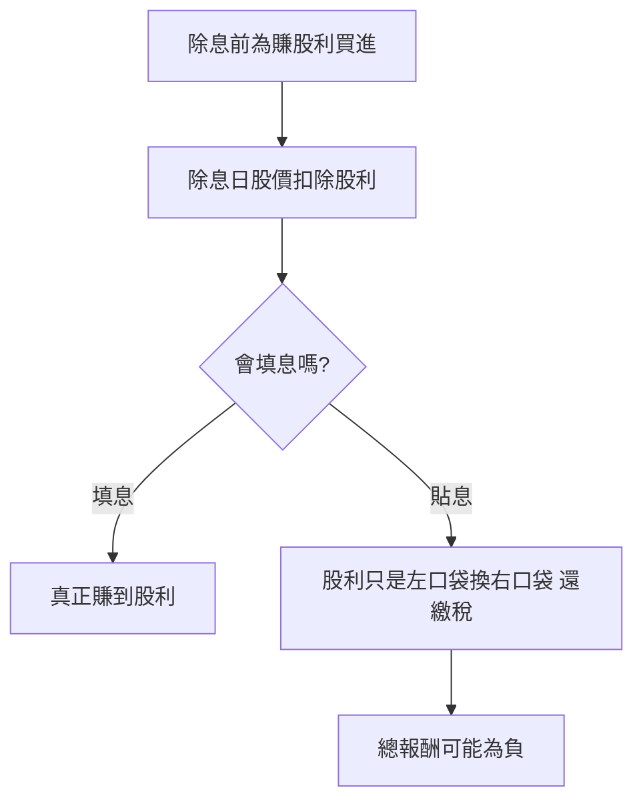

# 案例十五：除權息的三種誤操作

## 本篇你會學到

- 「賺股利」短進短出的常見誤判
- 除息跳空被當利空、貼息的判讀
- 配息的稅務與健保成本

!!! warning "免責聲明"
    匿名教學案例，數據為合成，**不構成投資建議**。稅率與健保費率以主管機關公告為準。

## 背景

投資人 E 看到某金融股「殖利率 6%」，在**除息前一天**買進想賺股利，結果除息後股價沒填息、還繼續跌，加上收到稅單才發現「賺股利」是一場誤會。

## 看到的數據

| 時點 | 股價 | E 的認知 | 實際 |
|------|------|----------|------|
| 除息前一天買 | 50.0 | 馬上賺 6% 股利 | 股價已反映股利 |
| 除息日 | 47.0（−3 元股利） | 「跌了 6%！」 | 技術性調整，非虧損 |
| 一個月後 | 45.0 | 「股利白賺了」 | 貼息：未填息 |
| 隔年報稅 | — | 沒想到 | 股利所得稅 + 二代健保補充保費 **2.11%**（單次 ≥2 萬門檻） |

## 推理步驟

1. **股價已反映**：除息前買，除息日股價就扣掉股利，帳面總值不變——股利不是「多送的」。
2. **填息才是關鍵**：真正賺到股利的前提是**填息**；若貼息，等於拿自己的本金配給自己，還要繳稅。
3. **稅與健保成本**：現金股利併入所得，且單次達 **2 萬元**門檻可能扣 **2.11%** 二代健保補充保費（見 [稅費總覽](../appendix/taxes-for-costing.md)），短進短出領息常不划算。

## 結論（教學用）

- 除權息**不是無風險套利**；參與前要評估**填息能力**（公司獲利與過往紀錄）。
- 除息日的「跌」多為**技術性調整**，別誤當利空殺出。
- 為了賺一次股利而短進短出，常被稅費與貼息侵蝕，**長期持有體質好的標的**才是存股邏輯。

## 反思

| 誤區 | 修正 |
|------|------|
| 除息前買就賺股利 | 股價已反映，要看填息 |
| 除息跳空是利空 | 多為扣除股利的調整 |
| 只看殖利率排行 | 高殖利率可能是股價跌出來的（[估值陷阱](valuation-trap.md)） |

## 重點回顧

- 股利不是多送的；**填息**才算真賺到。
- 除息跳空 ≠ 利空；別誤殺。
- 留意股利所得稅與二代健保 **2.11%**（單次 ≥2 萬），短線領息常不划算；試算見 [稅費總覽](../appendix/taxes-for-costing.md)。

相關：[除權息入門](../01-basics/dividend.md) · [除權息日程表](../03-tables/dividend-schedule.md) · [除息誤買應對](../06-risk/emergency-playbook.md#除息誤買) · [估值陷阱案例](valuation-trap.md)
