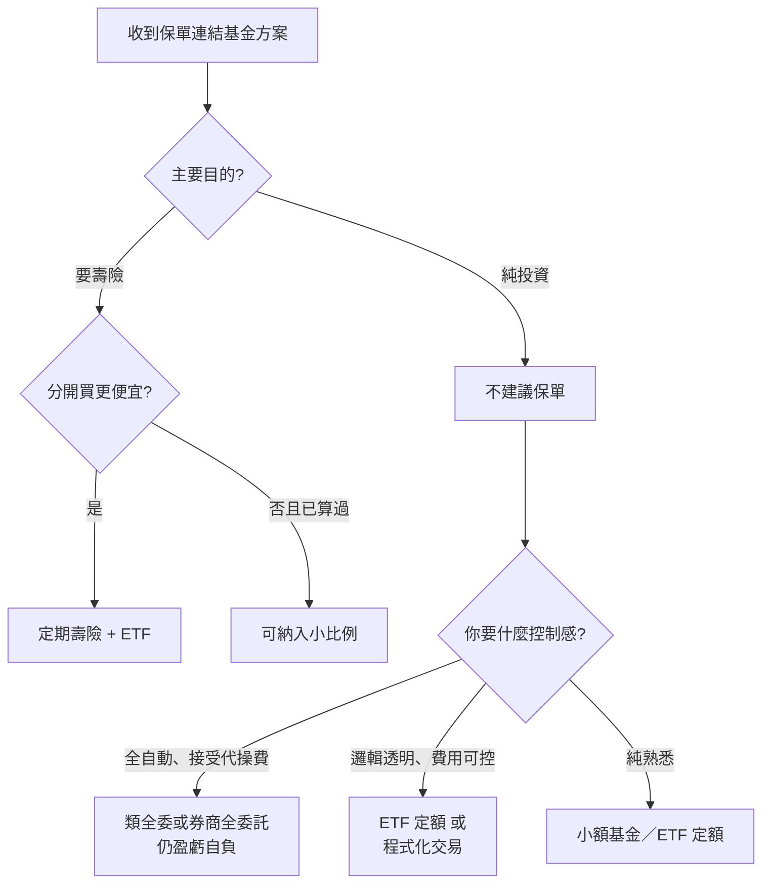

# 案例十二：基金與保單實戰問答

## 本篇你會學到

- 面對業務推銷時，**該問什麼、怎麼判斷**
- 基金、ETF、投資型保單在**費用、變現、報酬敘事**上的差異
- 若拒絕保單綁定，還有哪些**務實替代路徑**

!!! warning "免責聲明"
    本案例整理自**匿名化真實對話情境**，用於教學對照，不構成投保或投資建議。

適用：[共同基金入門](../01-basics/mutual-fund-intro.md) · [投資型保單](../08-investing/investment-linked-policy.md) · [0050 定期定額](../08-investing/etf-passive-dca.md)

---

## 背景

投資人小芽（化名）收到業務員推薦**投資型保單連結基金**的方案。她花數日研究後提出一系列問題，最終決定：

- **壽險綁定 OUT**（寧可算得出手續費，不要看不懂的保費）
- 現有「半委託、自己下決定、風險自負」方案不適合
- 若投資，傾向**全委託**或**自建程式／API 交易**，把邏輯與資金握在自己手上
- 可考慮小額**定期定額**純熟悉，興趣有限

以下依**主題**整理問答，並標註本站文件立場。

---

## Q1：微笑曲線是什麼？是買基金的策略嗎？

| 項目 | 說明 |
|------|------|
| **是什麼** | 定期定額時，平均成本隨市場起伏形成的曲線；低點買多、高點買少 |
| **是不是保單專利** | **不是**；ETF 定額、銀行基金定額都有 |
| **保證獲利嗎** | **不保證**；牛市可能跑輸單筆投入 |

→ 詳解：[微笑曲線與定期定額](../01-basics/mutual-fund-intro.md#微笑曲線與定期定額)

---

## Q2：產品裡都是基金嗎？有沒有股票？

| 標的類型 | 保單常見？ | 白話 |
|----------|------------|------|
| **共同基金** | ✅ 最常見 | 你持有基金單位，不是直接持股 |
| **ETF** | ✅ 部分保單可選 | 本質是一籃股票，但仍透過基金／保單管道 |
| **單一個股** | ❌ 通常不連結 | 散戶自己開證券戶買 |

業務說的「都是基金」**大致正確**；但若連結 ETF，底層仍是股市曝險，不是「跟股票無關」。

---

## Q3：基金要長期持有？變現後再買要重扣手續費？

| 管道 | 長期持有 | 變現後再投入 |
|------|----------|--------------|
| **銀行／平台基金** | 較能平滑波動，但不保證賺 | 贖回可能收贖回費；再申購可能收申購費 |
| **投資型保單** | 業務常鼓勵長抱 | **部分提領**（不解約）通常不重扣首年前置費；**加籌**會再扣前置費 |
| **ETF 定額** | 同上 | 賣出收手續費 + 證交稅；再買再收買進費 |

→ 詳解：[長期持有、變現與手續費](../01-basics/mutual-fund-intro.md#長期持有變現與手續費) · [部分提領專節](../08-investing/investment-linked-policy.md#部分提領解約與加籌)

---

## Q4：長期投資下，交易日影響大嗎？分批進出能低損耗？

| 說法 | 本站看法 |
|------|----------|
| 交易日影響較小 | **定期定額、長抱**下合理；cut-off、未知價仍要注意 |
| 分批可降低損耗 | **部分正確**——平滑進場，但頻繁買賣會累積摩擦成本 |
| 機會成本 | 牛市單筆投入長期可能贏過慢慢買 |
| 交易摩擦 | 基金申赎費、保單轉換費、ETF 手續費 + 證交稅 |

業務與小芽在此**大致不衝突**；關鍵是「低損耗」≠「零成本」。

---

## Q5：除費用表外，買賣完全無額外稅費嗎？

| 管道 | 答案 |
|------|------|
| **投資型保單** | 表列前置費、B、管理費、轉換費等**都是真實成本**；「明碼標價」≠「無成本」 |
| **共同基金** | 申購費（外扣）、經理費（內扣於淨值） |
| **ETF（證券戶）** | 手續費 + **賣出證交稅**（0.1%） |
| **個股** | 手續費 + 證交稅 0.3% |

→ [交易成本](../06-risk/trading-costs.md) · [話術對照表](../08-investing/investment-linked-policy.md#業務話術對照表)

---

## Q6：每年約 6 次免費轉換，超過 NT$500／次？ETF 仍收申購費？

**小芽理解正確**（依多數商品教學量級）：

| 項目 | 教學參考 |
|------|----------|
| 免費轉換次數 | 常約 **6 次／年**（依契約） |
| 超過後 | 常 **NT$500／次** |
| 連結 ETF | 契約上**仍可能**收標的申購費 |

→ [費用一覽](../08-investing/investment-linked-policy.md#費用一覽)

---

## Q7：投資經理人電話報明牌，看人嗎？

| 項目 | 說明 |
|------|------|
| **性質** | 關係維護、促加碼；**不是**保證獲利 |
| **全委託** | 經理人可自行調標的，未必逐筆通知 |
| **風險** | 建議品質因人而異；**盈虧仍自負** |
| **誘因** | 業務常因加籌、轉換有業績；見 [三方獲利](../08-investing/investment-linked-policy.md#三方的獲利結構) |

---

## Q8：「基金年報酬 30%」——我賺得到嗎？

**小芽結論正確：那不屬於你。**

| 層次 | 可能是 30% 的東西 | 你實際拿到？ |
|------|-------------------|--------------|
| 標的層 | 某基金某年淨值 | 只有進 A 的部分享受漲幅 |
| 帳戶層 | 保單帳戶年度變化 | 還扣 B、管理費、前置費 |
| 你的 IRR | 含繳費、提領、解約 | 長期常 **1%～3%** 量級（教學參考） |

→ [三層數字](../08-investing/investment-linked-policy.md#三層數字常被混成一層)

---

## Q9：壽險分開買，會不會比綁保單更便宜？

| 立場 | 說法 |
|------|------|
| **小芽** | 投資是勾子；分開買定期壽險通常更便宜透明 |
| **業務** | 若考慮壽險，定期壽不會更便宜 |
| **本站** | 多數人 **Buy Term, Invest the Difference**（ETF + 定期壽險）較划算 |

小芽已決定**不買壽險**，討論時把 B 當純支出即可。

---

## Q10：配息型基金，為什麼還可能虧？

| 原因 | 一句話 |
|------|--------|
| 配息來自淨值 | 領配息 ≠ 賺錢；可能是本金配息 |
| 經理費內扣 | 每天從淨值扣 |
| 標的下跌 | 經理人不能保證正報酬 |
| 保單外層 | B、前置費讓帳戶更易虧 |

→ [配息型基金為何仍可能虧損](../01-basics/mutual-fund-intro.md#配息型基金為何仍可能虧損)

---

## Q11：有經理人了，為什麼還要買賣基金？

**兩層不同：**

- **經理人**：調整籃子**內部**持股
- **你**：申購／贖回整檔基金，或在保單內**轉換**連結標的

→ [為什麼還要買賣／轉換基金](../01-basics/mutual-fund-intro.md#為什麼還要買賣轉換基金)

---

## Q12：市場心理與倖存者偏差

小芽提出：大家唱多才會好、業務只能展示成功案例、公司制度誘因等——這些屬於**投資心理與產業結構**反思，本站補充：

| 觀點 | 對應章節 |
|------|----------|
| 情緒影響市場 | [投資模式與心態](../08-investing/mode-psychology.md) |
| 倖存者偏差 | 簡報績效 ≠ 全體保戶 IRR |
| 業務誘因 | [三方獲利結構](../08-investing/investment-linked-policy.md#三方的獲利結構) |
| 眼見不一定為實 | 用**費用表、十年試算**驗證，不靠口述 |

---

## 小芽的最終決策與替代路徑

| 小芽的選擇 | 本站對照 |
|------------|----------|
| 壽險 OUT | ✅ [不建議名單](../08-investing/investment-linked-policy.md#不建議多數人) |
| 拒絕半委託 + 風險自負 | ✅ 費用與決策成本不值得 |
| 自建 API／機器人 | ⚠️ 進階路徑；先釐清 [交易成本](../06-risk/trading-costs.md)、[資料來源](../appendix/data-sources.md) |
| 小額定額熟悉 | ✅ [0050 定額](../08-investing/etf-passive-dca.md) 或銀行基金定額 |

### 若你走「程式化交易」

| 步驟 | 建議 |
|------|------|
| 1 | 先用 **ETF 定額**建立紀律與成本概念 |
| 2 | 學會算 **手續費 + 證交稅 + 滑價** |
| 3 | 策略用**閒錢**回測，再上實盤 |
| 4 | API 串接注意券商規範與風控 |

本站目前以**教學與決策框架**為主；程式實作可參考 [附錄：資料來源](../appendix/data-sources.md)。

---

## 對話 vs 文件：快速對照表

| 主題 | 小芽／業務共識 | 與文件差異 |
|------|----------------|------------|
| 長期優於短線進出 | ✅ 大致一致 | — |
| 部分提領不解約 | 業務有說 | 文件補充：**非零成本** |
| 明碼標價 | 業務強調 | 文件：**≠ 無成本** |
| 定期壽險較貴 | 業務：綁保單較划算 | 文件：**多數人分開買較划算** |
| 30% 報酬 | 小芽：不屬於我 | ✅ 文件一致 |
| 配息不虧 | 小芽追問 | 文件：**仍可能虧** |
| 自建程式 | 小芽最終取向 | 文件：**新補替代路徑** |

---

## 建議閱讀順序

1. [共同基金入門](../01-basics/mutual-fund-intro.md)
2. [投資型保單](../08-investing/investment-linked-policy.md)
3. [0050 定期定額](../08-investing/etf-passive-dca.md)
4. [如何選模式](../08-investing/choose-style.md)

---

## 重點回顧

- 問業務時抓三層：**基金淨值 → 帳戶價值 → 你的 IRR**。
- 「明碼標價」「微笑曲線」「免費轉換」都要追問**十年總成本**。
- 拒絕保單綁定後，**ETF 定額**是多數人預設；進階可走全委託或程式化，但仍須**自負盈虧、算清摩擦**。

相關：[話術對照表](../08-investing/investment-linked-policy.md#業務話術對照表) · [交易成本](../06-risk/trading-costs.md)
