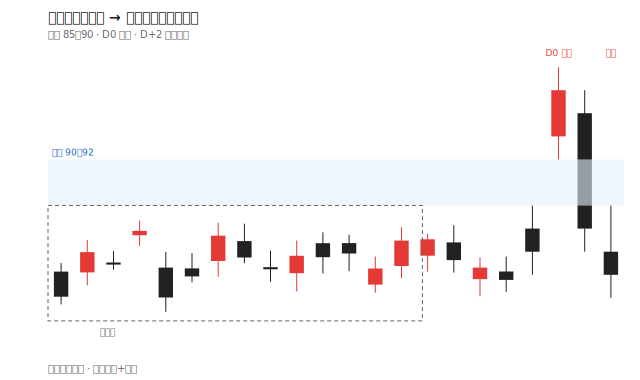
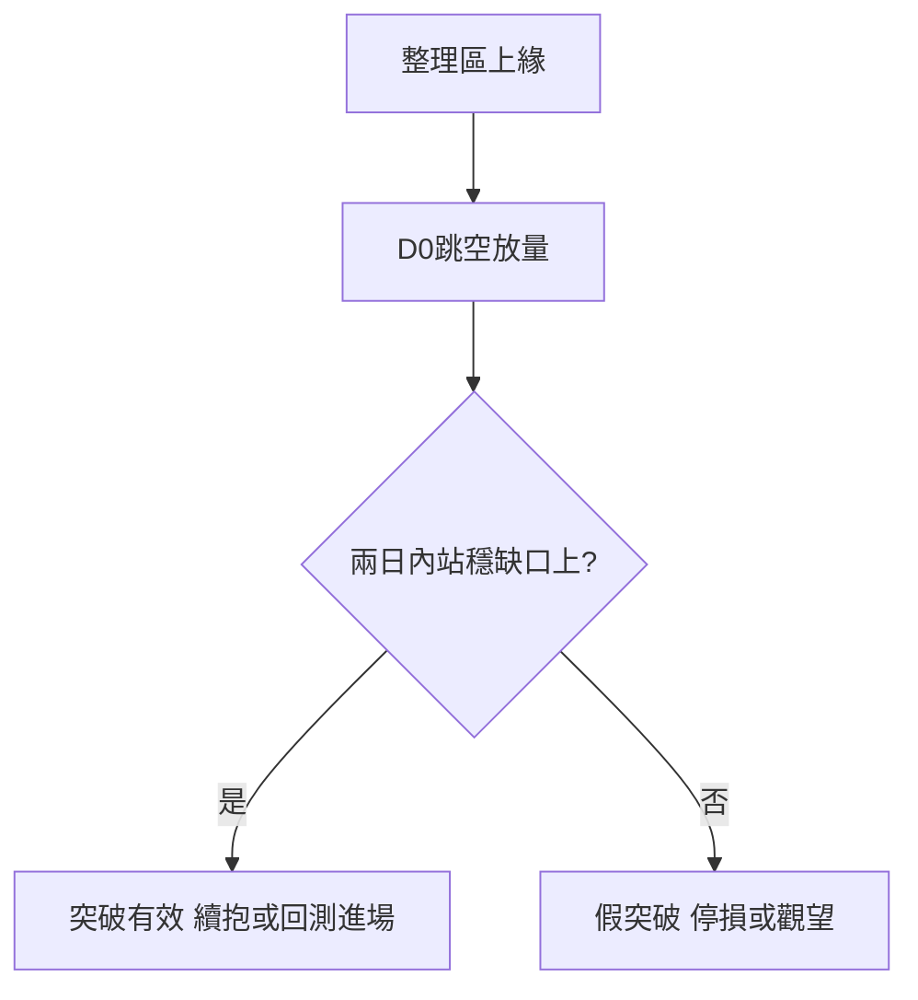

# 案例八：突破缺口與假突破

## 本篇你會學到

- **跳空缺口**的延續與假突破辨識
- 隔日沖進出場的紀律參考
- 適用模式：[隔日沖](../08-investing/overnight.md) · [短線](../08-investing/swing-short.md)

!!! warning "免責聲明"
    本案例使用**匿名化教學數據**，不代表真實個股建議，歷史表現不代表未來。

## 背景

某半導體封測廠「B 公司」在 85～90 元區間整理六週。你關注是否出現**有效向上突破**。相關術語見 [跳空與缺口](../02-glossary/market-terms.md)。

## 看到的圖與表

**日 K 示意（教學用）**

| 日期 | 開 | 高 | 低 | 收 | 量(張) |
|------|---:|---:|---:|---:|------:|
| D-1 | 89 | 90 | 87 | 88 | 3,200 |
| D0 | 93 | 96 | 92 | 95 | 8,500 |
| D+1 | 94 | 95 | 88 | 89 | 6,100 |
| D+2 | 88 | 90 | 86 | 87 | 4,800 |

- D0：向上**跳空**開在 93，整日最低 92 > D-1 最高 90 → 形成 **90～92 缺口**。
- D+1～D+2：股價回落至 87，**回補缺口**。

同期法人：D0 外資買超 1,200 張；D+1 轉賣超 800 張。

## 推理步驟

1. **缺口性質**：整理區上緣突破 + D0 放量 → 初看像 [突破缺口](../02-glossary/market-terms.md#缺口)。
2. **確認失敗**：兩日內跌回缺口內且收在 90 以下 → 偏向**假突破**。
3. **籌碼**：外資一日買、一日賣 → 缺乏連續性。
4. **技術**：若 [MACD](../04-charts/macd.md) 在 D0 才金叉、D+2 柱狀體縮短 → 動能不足。
5. **停損紀律**：若以 D0 收盤追進，缺口下緣 90 或 D0 低點 92 失守應出場。

## 結論（教學用）

- **偏多失敗**：缺口未守穩，不宜把單日長紅當趨勢起點。
- **替代策略**：等待重新站回 [月線 MA20](../04-charts/ma.md) 且法人連續買超再評估。
- **若已進場**：假突破停損優於「等反彈」的侥幸心理。

## 反思

| 錯誤 | 後果 |
|------|------|
| 只看跳空標題就追 | 買在短線高點 |
| 忽略回補缺口 | 小虧拖成大虧 |
| 不設停損 | 跌回整理區下緣才認賠 |

## 重點回顧

- 突破要**量 + 站穩**；回補缺口是假突破的常見警訊。
- 搭配 [法人表](../03-tables/institutional.md) 與量能，比單看 K 線可靠。

相關：[市場進階術語](../02-glossary/market-terms.md) · [K 線組合型態](../04-charts/candle-combinations.md)
