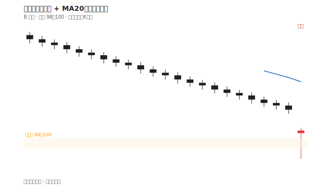
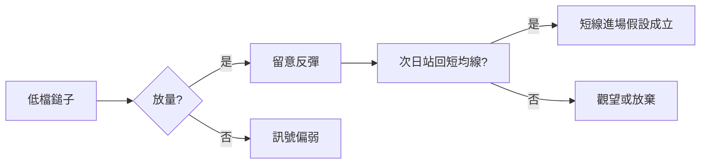

# 案例二：鎚子線 + 均線

## 本篇你會學到

- 鎚子線與均線支撐的短線進場邏輯
- 停損與目標價如何設定
- 適用模式：[短線](../08-investing/swing-short.md)

!!! warning "免責聲明"
    本案例為**教學示意**，非即時行情與投資建議。

## 背景

「B 公司」經過一個月回檔，股價由 120 跌至 100 附近，接近前波低點支撐。你以**短線反彈**角度觀察。

## 看到的圖

**日 K 最後一根**（示意）：

| 開 | 高 | 低 | 收 |
|----|----|----|-----|
| 101 | 102 | 96 | 101.5 |

- 長**下影線**、短實體、收盤略高於開盤 → 符合 [紅K鎚子](../04-charts/candle-patterns.md#紅k鎚子吊人線上漲) 特徵。
- 股價仍在 [MA20](../04-charts/ma.md) 下方，但 MA20 下彎速度趨緩。
- 成交量較前一日放大約 30%。

## 推理步驟

套用 [三招讀懂 K 線](../04-charts/kline-reading.md)：紅K（多方勝）+ 短實體（力道不強）+ 長下影（盤中激烈交戰）→ 屬「短實體 + 長影線」，趨勢延續性低，需等確認。

1. **型態**：鎚子出現在**低檔支撐**才有反轉意義；若在高檔則可能是吊人線警訊。定義見 [紅K鎚子](../04-charts/candle-patterns.md#紅k鎚子吊人線上漲)。
2. **位置**：前低 98～100 區間曾多次反彈 → 支撐區測試。
3. **均線**：尚未站回 MA20 → 僅是「可能止跌」，非趨勢反轉確認。
4. **量能**：放量鎚子優於縮量鎚子。
5. **確認**：等待隔日收盤能否站回 MA5 或 MA10，或第二根紅K 吞噬鎚子實體。

## 結論（教學用）

- **觀察清單**：低檔紅K鎚子 + 支撐 + 放量 → 列入隔日確認名單。
- **若進場**：停損設在鎚子最低點 96 下方（或淨利 -2%），目標先看 MA20。
- **若不確認**：單根鎚子不進場，避免「抄底抄在半山腰」。

## 反思：常見錯誤

| 錯誤 | 說明 |
|------|------|
| 任何鎚子都買 | 忽略高檔吊人 |
| 不設停損 | 支撐跌破變深跌 |
| 只看 K 線 | 大盤暴跌日個股鎚子常失效 |

## 重點回顧

- 鎚子 = 位置 + 確認，不是單根訊號。
- 均線用來確認趨勢是否轉強。
- 相關：[K 線基礎](../04-charts/kline-basics.md) · [三招讀懂 K 線](../04-charts/kline-reading.md) · [型態速查表](../04-charts/candle-quickref.md)
