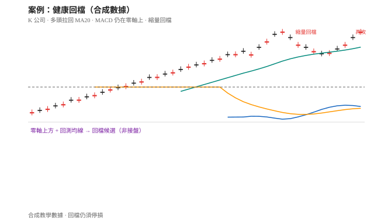
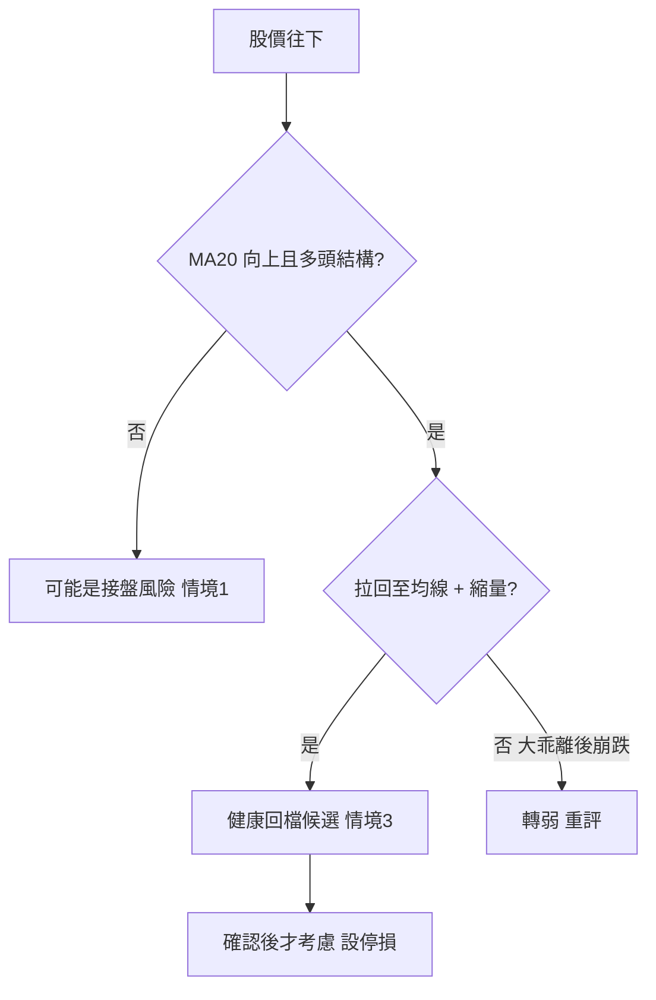

# 案例十九：健康回檔（不是接盤）

## 本篇你會學到

- 分辨「多頭回檔買點候選」與「空頭接盤」
- 同樣是「往下買」，零軸與均線環境完全不同
- 適用模式：[短線](../08-investing/swing-short.md) · [中線](../08-investing/swing-mid.md) · 專章：[手冊：接盤還是追高](../04-charts/catch-or-chase.md)（情境 3）

!!! warning "免責聲明"
    教學示意，非投資建議。數據為合成。

## 背景

「K 公司」處於上升趨勢，股價由 90 逐步墊高至 115 後拉回。有人說「跌了可以低接」，也有人說「這是接盤」。你要用框架判斷它比較像哪一種。

## 看到的圖

| 現象 | 說明 |
|------|------|
| 結構 | 高點與低點上移；拉回低點仍高於前波低點 |
| 均線 | 上升中的 [MA20](../04-charts/ma.md)；股價拉回至 MA20 附近後止穩 |
| MACD | **零軸上方**；回檔時柱縮短，止穩後再度轉強（非零軸下金叉） |
| 量 | 上漲段放量、拉回段**縮量**、再攻放量 |
| RSI | 由過熱區回落到 50～60，未崩到長期＜50 |

## 推理步驟

1. **環境**：收盤多數時間在 MA20 上，MA20 向上 → **偏多環境**，與接盤案例的空頭環境相反。
2. **回檔定義**：這是趨勢中的 [回檔](../02-glossary/trading-terms.md#回檔)，不是下跌趨勢中的 [反彈](../02-glossary/trading-terms.md#反彈)。
3. **MACD**：動能仍在零軸上 → 不像 [情境 1 零軸下接盤](weak-rebound-trap.md)。
4. **量價**：拉回縮量屬健康；若拉回放量長黑，故事會轉弱。
5. **計分卡 A**（教學示意）：環境、均線、MACD、量多項加分 → 較像情境 3，不是情境 1。
6. **決策**：可列為「計畫中的回檔觀察區」；仍須停損（例如跌破 MA20 且收不回去）。

## 結論（教學用）

- **標記**：情境 **3 健康回檔買點候選**（不是接盤）。
- **關鍵差異**：多頭回檔 vs 空頭反彈——看均線方向與 MACD 零軸。
- **仍非保證**：回檔可以失敗變轉折；破關鍵均線要重標情境。

## 反思：常見錯誤

| 錯誤 | 修正 |
|------|------|
| 凡是下跌中買進都叫「布局」 | 先分回檔或反彈 |
| 把接盤案例的金叉邏輯套到多頭 | 零軸上下故事不同 |
| 回檔區一次重倉 | 分批＋停損 |
| 忽略大盤轉弱 | 個股回檔遇上大盤崩跌，成功率下降 |

## 對照表

| | 本例（回檔） | [接盤陷阱](weak-rebound-trap.md) |
|--|--------------|----------------------------------|
| 趨勢 | 上升 | 下降 |
| MA20 | 向上，價格回測 | 向下，價格在下方 |
| MACD | 零軸上 | 零軸下金叉 |
| 量 | 拉回縮量 | 反彈縮量、再跌放量 |
| 標籤 | 情境 3 | 情境 1 |

## 重點回顧

- 「往下買」之前先問：**我是在接回檔，還是接刀子？**
- 相關：[手冊：接盤還是追高](../04-charts/catch-or-chase.md) · [均線](../04-charts/ma.md) · 定義：[定義：回檔](../02-glossary/trading-terms.md#回檔)
