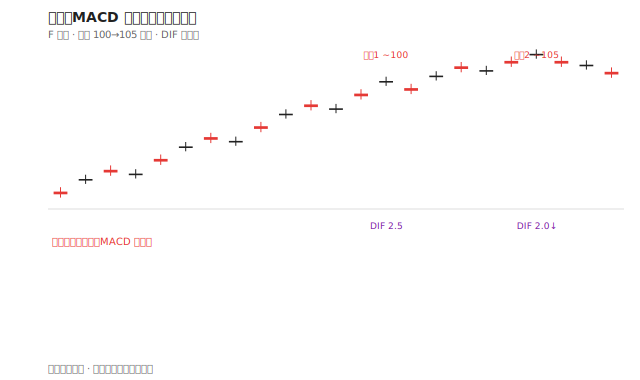
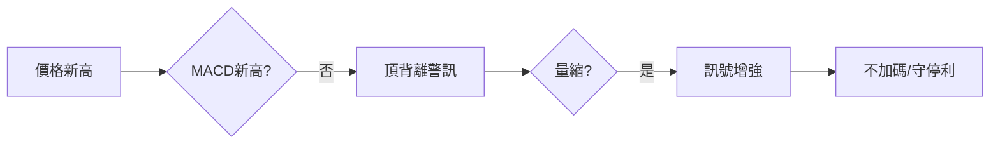

# 案例六：MACD 頂背離

## 本篇你會學到

- MACD **頂背離**的辨識與短線出場參考
- 技術訊號與停損的搭配
- 適用模式：[短線](../08-investing/swing-short.md)

!!! warning "免責聲明"
    教學示意，非投資建議。

## 背景

「F 公司」處於上升趨勢，股價創波段新高，你考慮是否加碼。

## 看到的圖

| 現象 | 說明 |
|------|------|
| 股價 | 兩次高點：100 → 105（新高） |
| MACD DIF | 第一次高點 2.5，第二次 2.0（未創高） |
| 成交量 | 第二次新高時量縮 |
| K 線 | 第二次高點出現 [倒鎚](../04-charts/candle-patterns.md#倒鎚紅k) |

此為 **頂背離**：價格新高，MACD 未新高。

## 推理步驟

1. **背離定義**：見 [MACD 教學](../04-charts/macd.md#背離進階)。
2. **動能衰竭**：上漲力道減弱，不等於立刻大跌。
3. **量價**：量縮新高增加假突破疑慮。
4. **K 線**：高檔倒鎚呼應上方壓力。
5. **決策**：不加碼；持倉者考慮 [移動停利](../02-glossary/pnl.md#移動停利) 或減碼，非恐慌清倉。

## 反例

背離後有時橫盤數週再創新高——背離是**警訊**不是**賣出指令**。

## 重點回顧

- 背離需搭配位置（高檔較重要）、量、K 線。
- 相關：[指標速查表](../04-charts/indicator-quickref.md) · [三招讀懂 K 線](../04-charts/kline-reading.md)
