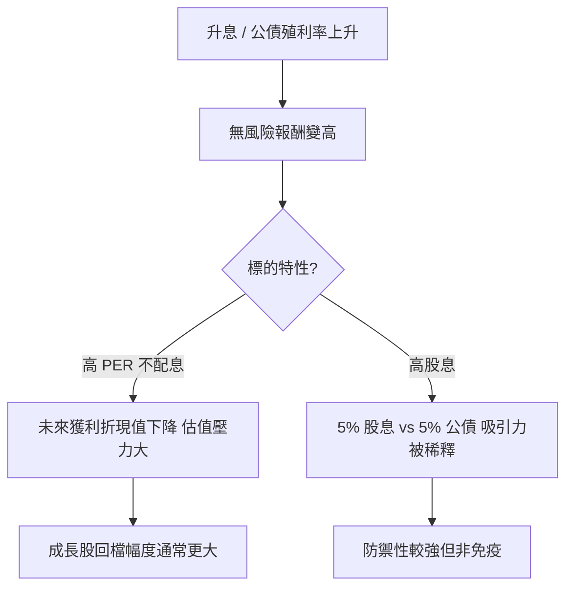

# 案例十三：升息環境下的估值取捨

## 本篇你會學到

- 利率環境如何影響不同類型股票的估值
- 升息時「高 PER 成長股」與「高股息 ETF」的判讀差異
- 總經背景如何融入個股決策

!!! warning "免責聲明"
    匿名教學案例，數據為合成，**不構成投資建議**。利率政策與市場反應依實際公告與情勢而定。

## 背景

某年市場進入**升息循環**：央行連續調高政策利率，[美國 10 年期公債](../02-glossary/macro.md#國債) 殖利率由 3% 升至約 5%。投資人 W 同時關注兩個標的：

- **G 公司**：高成長科技股，PER 35 倍，不配息
- **D ETF**：高股息 ETF，殖利率約 5%

## 看到的數據

| 項目 | G 公司（成長股） | D ETF（高股息） |
|------|------------------|------------------|
| PER | 35 | — |
| 殖利率 | 0% | 5% |
| 對利率敏感度 | 高 | 中 |
| 升息半年股價 | −30% | −8% |

## 推理步驟

1. **無風險報酬上升**：公債殖利率 5% 時，市場對「風險資產」要求更高回報。
2. **成長股受傷較重**：G 公司的價值多來自**未來**獲利，折現率上升會大幅壓低現值（[DCF](../02-glossary/fundamentals.md#dcf現金流折現) 概念），高 PER 因此承壓。
3. **高股息被比較**：D ETF 的 5% 股息，在公債也有 5% 時吸引力下降；但其成分股多為成熟、現金流穩定的公司，波動相對小。
4. **不是非黑即白**：升息不代表成長股一定崩、高股息一定穩；仍要看個別公司獲利是否持續。

## 結論（教學用）

- 升息環境下，**估值越高、越依賴未來獲利的股票，對利率越敏感**。
- 高股息標的相對防禦，但「股息 vs 無風險利率」的價差才是關鍵，而非單看殖利率數字。
- 總經是**背景**，不是進出訊號；最終仍要回到 [估值表](../03-tables/valuation.md) 與 [財報](../03-tables/financials.md) 看個股體質。

## 反思

| 誤區 | 修正 |
|------|------|
| 升息就全部賣股 | 看標的對利率的敏感度，分類處理 |
| 高股息 5% 永遠划算 | 要和當下無風險利率比較 |
| 只看個股、忽略總經 | 先確認資金環境（[總經輪動](../09-advanced/macro-rotation.md)） |

## 重點回顧

- 利率環境決定資金的「機會成本」，是估值的背景。
- 成長股與高股息股對升息的反應不同，需分類判讀。
- 總經 → 類股 → 個股，三層一起看，見 [基本面框架](../05-analysis/fundamental-framework.md#宏觀層次)。

相關：[總經與利率術語](../02-glossary/macro.md) · [總經與類股輪動](../09-advanced/macro-rotation.md) · [估值表](../03-tables/valuation.md) · [估值陷阱案例](valuation-trap.md)
