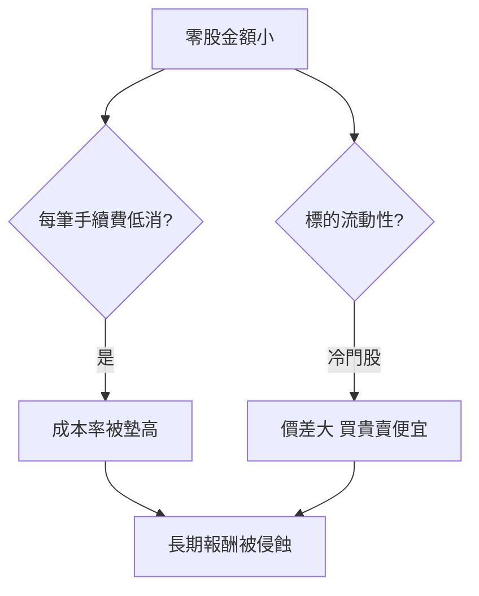

# 案例十四：零股小資的三個踩雷

## 本篇你會學到

- 零股交易常見的三個成本與流動性陷阱
- 小資族怎麼用零股長期投資而不被費用吃掉
- 對應的交易與費用章節

!!! warning "免責聲明"
    匿名教學案例，數據為合成，**不構成投資建議**。手續費與時段以券商與交易所公告為準。

## 背景

小資族 S 每月有 6,000 元想投資，覺得零股「便宜又彈性」，於是頻繁地買各種冷門高價股的零股，三個月後發現帳戶**幾乎沒成長，還倒虧**。

## 看到的數據

| 行為 | 細節 | 後果 |
|------|------|------|
| 一次買 5 股冷門股 | 成交金額約 1,500 元 | 手續費低消 20 元 → 成本率 1.3% |
| 掛市價搶買 | 冷門股零股價差大 | 成交價比預期高 2% |
| 每週分散買 8 檔 | 每筆都吃低消 | 一個月光手續費吃掉約 1.5% |

## 推理步驟

1. **低消陷阱**：多數券商每筆有最低手續費（如 20 元）。買 1,500 元卻付 20 元，成本率 1.3%，遠高於整張的 0.1425% 折扣後費率。
2. **流動性陷阱**：冷門股零股掛單少，市價單容易成交在不利價位。
3. **過度分散陷阱**：8 檔各買一點，每筆都吃低消，分散沒帶來好處，只放大費用。

## 結論（教學用）

- 零股**適合定期定額買流動性好的標的**（如 0050、市值型 ETF），而非頻繁買冷門高價股。
- 留意券商**手續費低消**：把每月金額**集中**幾筆，讓單筆金額大於「低消÷折扣費率」的損益點。
- 想買冷門股零股時用**限價單**，避免價差吃掉報酬。

## 反思

| 誤區 | 修正 |
|------|------|
| 零股一定便宜 | 小額被低消墊高成本率 |
| 越分散越安全 | 每筆吃低消，過度分散反而貴 |
| 市價單買零股 | 冷門股用限價，控制成交價 |

## 重點回顧

- 零股的敵人是**手續費低消**與**流動性**。
- 小資長期投資：用零股定額買**流動性好**的 ETF，金額適度集中。
- 算清成本見 [交易成本與期望值](../06-risk/trading-costs.md)。

相關：[零股怎麼買](../01-basics/trading-flow.md#零股) · [交易成本](../06-risk/trading-costs.md) · [0050 與定期定額](../08-investing/etf-passive-dca.md) · [個股總覽表](../03-tables/watchlist.md)
