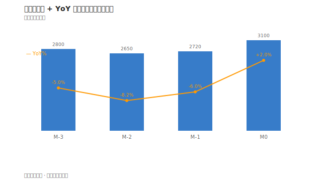
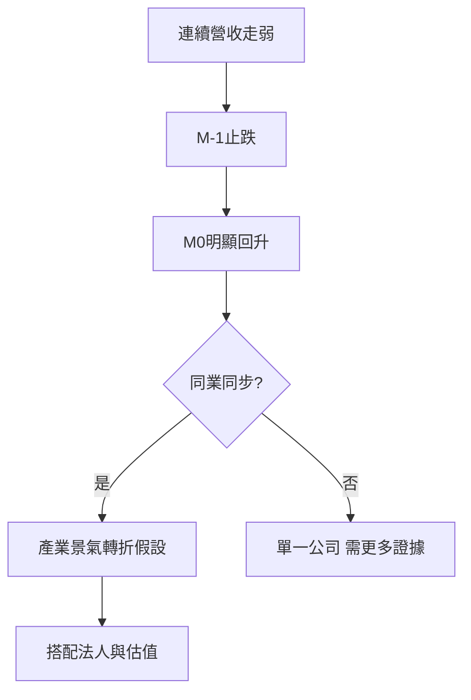

# 案例一：月營收轉折

## 本篇你會學到

- 如何用**月營收 MoM/YoY** 推理中線布局
- 營收轉折與估值、進出場的交叉驗證
- 適用模式：[中線波段](../08-investing/swing-mid.md)

!!! warning "免責聲明"
    本案例使用**匿名化教學數據**，不代表真實個股建議，歷史表現不代表未來。

## 背景

某電子零組件廠「A 公司」，市場原本預期受客戶庫存調整，營收將連續走弱。你正在評估是否適合**中線**布局。

## 看到的表

| 月份 | 營收(百萬) | MoM% | YoY% |
|------|----------:|-----:|-----:|
| M-3 | 2,800 | -8.0 | -5.0 |
| M-2 | 2,650 | -5.4 | -8.2 |
| M-1 | 2,720 | +2.6 | -6.0 |
| M0 | 3,100 | +14.0 | +2.0 |

同期 [估值表](../03-tables/valuation.md) 示意：PER 由 22 降至 18（股價橫盤、EPS 預期下修後）。

---

1. **趨勢**：M-3～M-2 連續 MoM 負成長，符合「庫存調整」敘事。
2. **轉折**：M-1 止跌、M0 明顯 MoM +14%，YoY 轉正 → **營收動能可能見底**。
3. **交叉驗證**：查同業是否同步好轉 → 若產業整體回升，較非單一公司噪音。
4. **股價位置**：若股價仍在年線下方、法人近 5 日轉買超 → 籌碼與基本面故事較一致。
5. **風險**：若 M0 成長來自一次性急單，下月可能回落 → 看公司說明與 [法說重點](../05-analysis/conference.md)。

## 結論（教學用）

- **偏多觀察**：營收出現「連續下跌後的明顯回升 + YoY 轉正」，可作中線候選列入 watchlist。
- **進場紀律**：不等於立即買進；可等回測 [月線 MA20](../04-charts/ma.md) 或法人連續買超 3 日再評估。
- **停損**：若下一月營收再度大幅 MoM 負成長，假設可能失效 → 結構停損或基本面出場。

## 反思：若做錯可能在哪

| 錯誤 | 後果 |
|------|------|
| 只看單月 M0 就重倉 | 可能是單月噪音 |
| 忽略毛利率 | 營收增但以價換量 |
| 股價已反映 | 營收好但股價已漲 30% |

## 重點回顧

- 營收看**連續性**與 **YoY**，不只單月。
- 表（營收）要與圖（K 線）、籌碼交叉驗證。
- 相關：[月營收表](../03-tables/revenue.md) · [月營收術語](../02-glossary/fundamentals.md#月營收)
