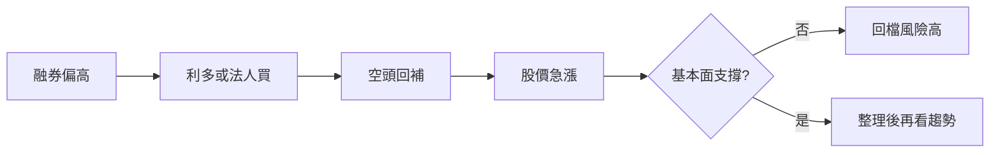

# 案例九：融券與軋空

## 本篇你會學到

- 融券餘額、軋空機制與高波動風險
- 短線參與軋空行情的心態與停損
- 適用模式：[短線](../08-investing/swing-short.md)

!!! warning "免責聲明"
    本案例使用**匿名化教學數據**，不代表真實個股建議，歷史表現不代表未來。

## 背景

某生技題材股「C 公司」三個月漲幅已大，空頭認為估值過高而**融券增加**。股價卻在利多公告後連續飆升，媒體標題出現「軋空」。術語見 [軋空](../02-glossary/market-terms.md#軋空)。

## 看到的表

**融資融券（示意）**

| 週 | 融券餘額(張) | 融券使用率 | 股價 |
|----|------------:|----------:|-----:|
| W-2 | 1,200 | 18% | 45 |
| W-1 | 1,850 | 26% | 48 |
| W0 | 1,600 | 22% | 58 |
| W+1 | 980 | 14% | 52 |

**法人（W0～W+1）**：外資連續買超合計 2,400 張；投信小幅賣超。

## 推理步驟

1. **融券結構**：W-1 融券餘額創高 → 空頭部位集中。
2. **觸發**：W0 利多（例如授權金或臨床進度）+ 外資大買 → 空頭**被迫回補**買進。
3. **軋空特徵**：短時間漲幅大、量暴增、融券餘額 W0→W+1 明顯下降。
4. **風險**：W+1 股價回落 10%，融券已降 → 軋空**動能衰竭**，追高者易套牢。
5. **基本面**：若營收尚未跟上題材 → 漲幅多由籌碼驅動，波動後常劇烈回檔。

## 結論（教學用）

- **解讀**：本例符合「高融券 + 觸發 + 快速回補」的軋空**型態**，不代表可無限追高。
- **不建議**：在 W0 長紅後無停損追價；軋空末端波動極大。
- **若研究標的**：等融券餘額與股價**同步冷卻**，搭配 [月營收](../03-tables/revenue.md) 再評估。

## 反思

| 錯誤 | 後果 |
|------|------|
| 融券高就放空 | 軋空爆虧 |
| 軋空中新聞追高 | 買在 W0 尖峰 |
| 忽略外資是否持續買 | W+1 快速回落 |

## 重點回顧

- 軋空是**籌碼機制**，不是基本面保證。
- 必看 [融資融券表](../03-tables/margin.md) 與法人連續性。
- 高波動標的須嚴守 [停損](../06-risk/stop-loss.md) 與 [資金配置](../06-risk/capital.md)。
