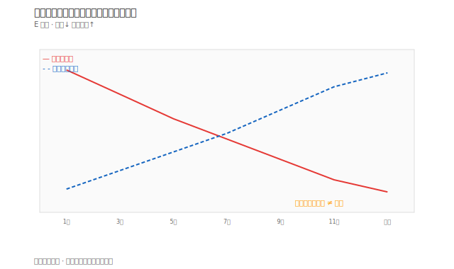

# 案例五：估值陷阱（高殖利率）

## 本篇你會學到

- 高殖利率背後的**基本面風險**
- 長期投資如何避免「便宜陷阱」
- 適用模式：[長期價值](../08-investing/long-term.md) · [存股](../08-investing/dividend-investing.md)

!!! warning "免責聲明"
    匿名教學案例，非投資建議。

## 背景

「E 公司」為傳產股，股價一年內由 80 跌至 50，殖利率由 4% 被動升至 **6.5%**。社群標榜「便宜、高殖利率」。

## 看到的表

| 項目 | 數值 | 解讀 |
|------|------|------|
| 股價 | 50 | 一年 −37% |
| PER | 12 | 低於同業 18 |
| 殖利率 | 6.5% | 表面吸引人 |
| 月營收 YoY | 連 4 月負成長 | 基本面轉弱 |
| 法人 | 近 10 日賣超為主 | 籌碼不配合 |

## 推理步驟

1. **殖利率高 ≠ 便宜**：股價跌會把殖利率「墊高」。
2. **PER 低**：若 EPS 即將下修，PER 會被動變高（分母變小）。
3. **營收連續走弱**：[月營收表](../03-tables/revenue.md) 趨勢比單月 PER 重要。
4. **法人賣超**：與「便宜」敘事矛盾，見 [言行反查](../05-analysis/conference.md) 思維。
5. **結論**：屬**價值陷阱**候選，需等營收止跌或股價不再破低。

## 若仍想觀察

- 列入觀察清單（watchlist），**不**因高殖利率立即重倉。
- 觸發條件改為：營收 YoY 轉正 + 法人轉買 + 股價站上月線。

## 反思

| 錯誤 | 說明 |
|------|------|
| 只看殖利率排行 | 忽略獲利趨勢 |
| PER 低就買 | 景氣循環股高點 EPS 也低 |
| 忽略股價趨勢 | 下跌趨勢中接刀 |

## 重點回顧

- 估值要與營收、籌碼、趨勢一起看。
- 相關：[估值表](../03-tables/valuation.md) · [除權息入門](../01-basics/dividend.md)
