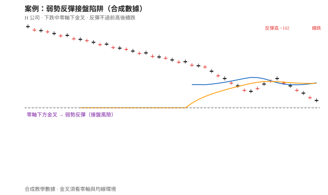
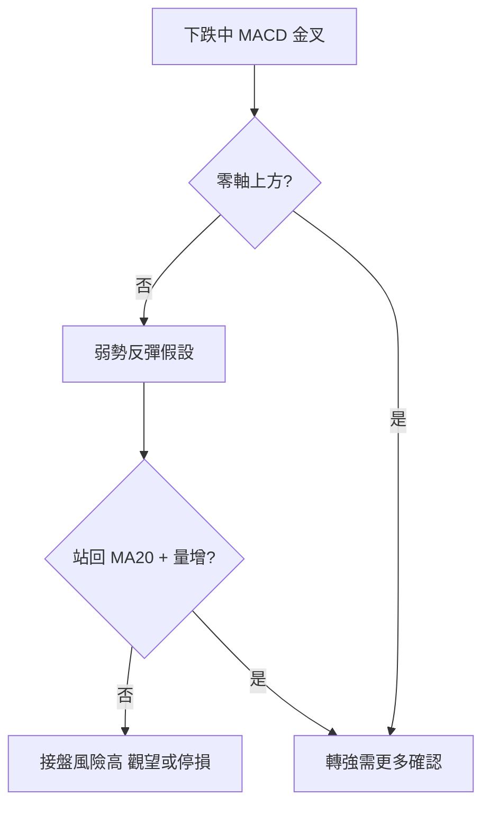

# 案例十七：弱勢反彈接盤陷阱

## 本篇你會學到

- 如何辨識「下跌趨勢中的 MACD 金叉」常只是弱勢反彈
- 用均線位置 + 零軸 + 量價，避免抄底抄在半山腰
- 適用模式：[短線](../08-investing/swing-short.md) · 概念專章：[手冊：接盤還是追高](../04-charts/catch-or-chase.md)

!!! warning "免責聲明"
    教學示意，非投資建議。數據為合成。

## 背景

「H 公司」連跌數週，股價由 120 附近跌至 95。社群出現「跌深了該低接」「MACD 金叉了」的說法。你想確認這是止跌轉強，還是**接盤風險偏高的弱勢反彈**。

## 看到的圖

| 現象 | 說明 |
|------|------|
| 價格結構 | 高點與低點持續下移；反彈高點約 102，未過前高 108 |
| 均線 | 全程在 [MA20](../04-charts/ma.md) 下方；MA20 仍向下 |
| MACD | **零軸下方**出現金叉；柱狀由負轉正後迅速縮短 |
| 成交量 | 反彈段縮量；再度下跌時量能放大 |
| RSI | 由 28 回升至 42，**未站穩 50** |

## 推理步驟

1. **環境優先**：收盤在 MA20 下且均線下彎 → 仍屬下跌趨勢環境，見 [手冊：接盤還是追高](../04-charts/catch-or-chase.md)。
2. **MACD 位置**：金叉發生在零軸下 → 依 [MACD](../04-charts/macd.md) 常見誤用，多為弱勢反彈而非大反轉。
3. **動能持續性**：金叉後柱狀未連續擴大，數日後又轉弱 → 反彈力道不足。
4. **量價**：漲時縮量、跌時放量 → 反彈缺乏買盤支持，見 [量價圖](../04-charts/volume-price.md)。
5. **冷熱**：RSI 未過 50 → 多方環境未建立，見 [RSI](../04-charts/rsi.md)。
6. **決策**：不把此次金叉當抄底訊號；若已小倉試單，反彈失敗跌破近低應執行停損。

## 結論（教學用）

- **標記**：本情境應標成「弱勢反彈／接盤風險」，不是「底部確認」。
- **空手**：優先觀望，等待站回 MA20、MACD 朝零軸靠近、放量確認。
- **若已進場**：停損放在反彈前低下方；論點是「止跌」，論點失效就出場。

## 反思：常見錯誤

| 錯誤 | 修正 |
|------|------|
| 看到金叉就等同買訊 | 先問零軸上還是下 |
| 「跌很多」當唯一理由 | 跌幅 ≠ 趨勢結束 |
| 無停損硬凹 | 逆勢單更需要事前停損 |
| 忽略量價 | 縮量反彈可信度低 |

## 對照：什麼比較不像接盤？

若同一檔之後出現：放量站回 MA20、MACD 柱連續擴大並接近零軸、RSI 站上 50，才比較接近「止跌轉強候選」——仍須寫停損，見 [鎚子+均線](hammer-ma.md)。

高檔另一端風險見：[追高陷阱](chase-high-trap.md)、[MACD 頂背離](macd-divergence.md)。多頭回檔對照：[健康回檔](healthy-pullback.md)。

## 重點回顧

- 零軸下金叉 + 均線空方 + 縮量反彈 ≈ 接盤陷阱典型組合。
- 相關：手冊／速查：[手冊：接盤還是追高](../04-charts/catch-or-chase.md) · 教學：[MACD](../04-charts/macd.md) · 定義：[定義：抄底](../02-glossary/trading-terms.md#抄底)
