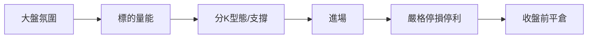

# 當沖（當日沖銷）

## 本篇你會學到

- 當沖的定義、資格與適合條件
- 早盤為何宜集中觀望、再進場
- 盤中該看什麼圖表與數據
- 與其他模式的關鍵差異

[← 投資模式總覽](index.md)

---

## 什麼是當沖

| 項目 | 說明 |
|------|------|
| **持倉** | 同一交易日內完成買賣沖銷，**不留過夜** |
| **目的** | 賺取當日價差，非分享公司長期成長 |
| **資格** | 須向券商申請當沖資格，見 [市場概覽](../01-basics/market-overview.md#當沖當日沖銷) |

與 [隔日沖](overnight.md) 差異：當沖**不承擔隔夜跳空**；隔日沖賭的是隔日開盤後動能。

---

## 適合 / 不適合

| 較適合 | 較不適合 |
|--------|----------|
| 盤中能專心盯盤 | 上班無法看盤 |
| 嚴格停損紀律 | 容易 [追高殺低](../02-glossary/trading-terms.md#追高殺低) |
| 已計算 [交易成本](../06-risk/trading-costs.md) | 小資金且頻繁交易 |

---

## 方法概要

| 步驟 | 做什麼 |
|------|--------|
| 1 | 看加權指數、台指期、夜盤線索 → [跨市場](../05-analysis/cross-market.md) |
| 2 | 選成交量大、波動適中標的 |
| 3 | 用 **1/5 分 K** + 當日 [開高開低](../02-glossary/quotes.md#開高開低) 判斷 |
| 4 | 停損常見淨利 -1%～-3%（教學參考，見 [時間框架](../05-analysis/timeframes.md)） |
| 5 | **13:20 前** 規劃是否強制平倉，避免收盤來不及 |

---

## 早盤觀望：先看清走向再進場

當沖多數機會集中在 **09:00–10:30**；這段也是散戶情緒交易最密集的時段。實務上宜：

| 階段 | 做什麼 |
|------|--------|
| **09:00–09:30** | 觀望：看大盤、台指期、個股是否站穩均價線；開盤壓力大時**少追** |
| **09:30 後** | 方向較明朗再考慮首次進場 |
| **10:30 後** | 新開倉須更謹慎；已有部位依停損停利執行 |
| **13:20 前** | 規劃強制平倉 |

詳見 [盤中時間熱點](../04-charts/intraday-charts.md#盤中時間熱點早盤宜集中觀望) · [期貨輔助判斷](../09-advanced/futures-signal.md)。

---

## 該看 / 不該過度依賴

| 建議看 | 原因 |
|--------|------|
| 分 K、量能 | 當日供需 |
| 委買賣五檔 | 短期壓力（非絕對） |
| 昨日法人 | 僅作背景，**非**即時籌碼 |

| 勿當主因 | 原因 |
|----------|------|
| 月營收、本益比 | 資料慢，不適合當日決策 |
| 當日法人買超 | 盤中尚未公布 |

深入：[K 線週期](../04-charts/kline-basics.md#時間週期) · [16 種型態](../04-charts/candle-patterns.md)（短實體、十字在盤中常見）

---

## 風控重點

- **成本**：當沖獲利目標常僅 1%～2%，手續費與稅必算。
- **停損**：到價必出，不「等回來」。
- **部位**：單筆不宜過大，見 [資金配置](../06-risk/capital.md)。
- **案例**：[當沖風控](../07-cases/day-trade-risk.md)

---

## 心態與建議

| 面向 | 當沖 |
|------|------|
| 心理關鍵 | 今日輸贏今日了；停損不猶豫 |
| 常見陷阱 | FOMO 追價、報復性加碼、收盤來不及平倉 |
| 盯盤 | **09:00–10:30 集中觀望**；尾盤平倉同樣關鍵 |
| 延伸 | [當沖心態詳解](mode-psychology.md#當沖心態) |

---

## 重點回顧

- 當沖賣的是**紀律與速度**，不是基本面故事。
- 工具鏈：分 K → 量 → 停損 → 收盤前平倉。
- 對照：[隔日沖](overnight.md) · [短線](swing-short.md)
