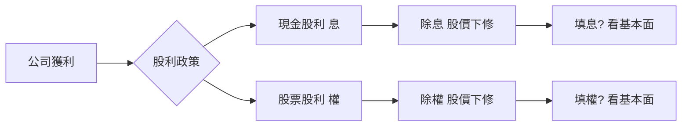
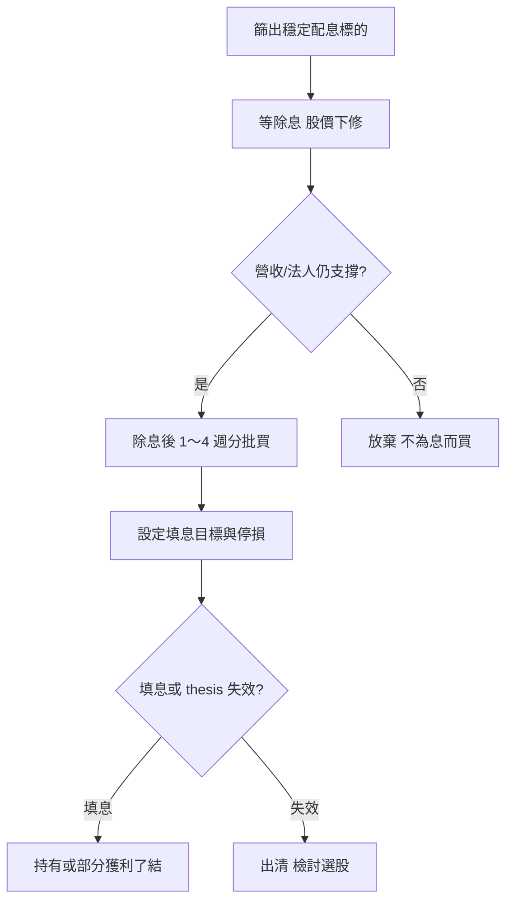
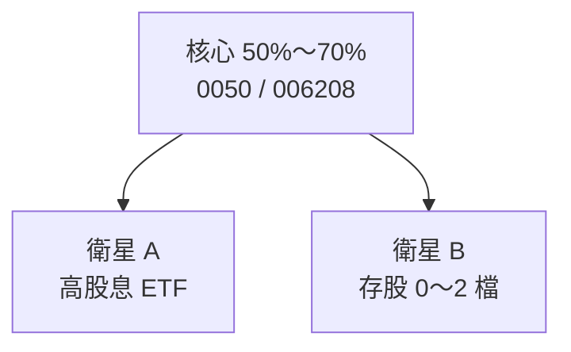

# 配股配息投資策略

## 本篇你會學到

- 五種常見**配股配息**策略與適用情境
- **現金股利（息）**與**股票股利（權）**的操作差異
- 除權息時序：滾息、填息、現金流怎麼選
- 與高股息 ETF、長線配置的結合方式

[← 存股與除權息](dividend-investing.md) · [除權息入門](../01-basics/dividend.md)

!!! warning "免責聲明"
    以下為**教學策略框架**，不構成投資建議，亦不保證配息、填息或報酬。

---

## 先釐清：配息 ≠ 額外收入

除權息當下，股價會依權值調整；配息是把資產從「股價」換成「現金／更多股數」，**不是無風險利息**。名詞見 [除權息入門](../01-basics/dividend.md)；心態見 [存股心態](mode-psychology.md#存股心態)。

---

## 策略地圖：依你的目標選

| 你的主要目標 | 建議策略 | 持倉時間 |
|--------------|----------|----------|
| 長期累積、少折騰 | **滾息存股** | 數年 |
| 願意研究個股、等填息 | **除息後填息布局** | 數月至 1～2 年 |
| 每月要有現金流 | **月配 ETF + 年配個股** | 持續 |
| 不想選股、要分散 | **核心大盤 + 高股息衛星** | 持續 |
| 降低平均成本、部位變大 | **股票股利再持有** | 數年 |

模式總覽見 [存股與除權息](dividend-investing.md)；高股息 ETF 細節見 [高股息 ETF](etf-high-dividend.md)。

---

## 策略一：品質存股 + 股利再投入（滾息）

### 邏輯

選**配息紀錄穩定、現金流能支撐股利**的標的，長期持有；領到現金股利後**再買回同一檔或同類標的**（類似 DRIP），用時間放大複利。

### 選股檢查（精簡）

| # | 條件 | 工具 |
|---|------|------|
| 1 | 近 5 年配息不中斷或僅極少例外 | [除權息日程](../03-tables/dividend-schedule.md) |
| 2 | 營業現金流 > 股利支出 | [財報](../03-tables/financials.md) |
| 3 | 殖利率非「股價暴跌」堆高 | [估值表](../03-tables/valuation.md) |
| 4 | 產業與投資論點（thesis）仍成立 | [基本面框架](../05-analysis/fundamental-framework.md) |

### 操作節奏

| 時點 | 動作 |
|------|------|
| 平時 | 分批建倉，不追除息前最後一天 |
| 除息日 | 接受股價下修；確認股利入帳時程 |
| 入帳後 | 依計畫再投入（可與下次定額合併） |
| 每季 | 檢視營收、EPS 是否仍支撐股利 |

### 風險

- 公司削減或停發股利 → thesis 失效，應檢討出清；見 [停損三層](../06-risk/stop-loss.md)。
- 單一標的集中 → 宜 3～5 檔分散或搭配 ETF。

---

## 策略二：除息後填息布局

### 邏輯

不搶除息前最後一刻追高；在**除息參考價下修後**，若基本面仍佳，於相對低檔分批布局，目標參與**填息**（股價回升至除息前水準附近）。見 [填息](../02-glossary/market-terms.md#填息)、[填息案例](../07-cases/dividend-play.md)。

### 流程

### 進場參考（教學用，非公式）

| 觀察 | 說明 |
|------|------|
| 除息後跌幅過大 | 若跌幅明顯大於股利金額，市場可能擔心獲利；需查 [月營收](../03-tables/revenue.md) |
| 法人連續買超 | 籌碼輔助，非保證填息 |
| 支撐區 | 前低、均線；見 [均線](../04-charts/ma.md) |
| 時間窗 | 填息常需數週～數月，非保證 |

### 不適合

- 無法承受除息後再跌 5%～10% 的心理壓力。
- 只做短線、無法持有超過一季。

---

## 策略三：現金流型（月配 + 年配）

### 邏輯

生活開銷需要**穩定現金流入**時，可用 **高股息 ETF（常月配）** 提供每月現金流，**年配個股** 負責成長或填息彈性。

| 部位 | 角色 | 常見工具 |
|------|------|----------|
| **現金流桶** | 每月可預期入帳 | 高股息 ETF → [專章](etf-high-dividend.md) |
| **成長／填息桶** | 年配、資本利得 | 個股存股 → [存股模式](dividend-investing.md) |

### 配置示意（教學參考）

| 風險偏好 | 現金流桶 | 成長桶 |
|----------|----------|--------|
| 保守 | 60%～70% | 30%～40% |
| 平衡 | 40%～50% | 50%～60% |
| 積極 | 20%～30% | 70%～80% |

!!! tip "配息 ≠ 報酬"
    月配金額要搭配**含息總報酬**與 [收益平準金](../01-basics/etf-costs-and-premium.md#收益平準金) 占比一起看，勿只看「每月領多少」。

### 稅與現金規劃

- 股利、二代健保等依個人狀況而異，預留稅款緩衝。
- 見 [資金配置](../06-risk/capital.md#閒錢與生活費)：**生活費勿全押高殖利率標的**。

---

## 策略四：核心—衛星（大盤 + 高股息）

### 邏輯

以 **0050／006208 等大盤 ETF** 為核心（參與台股成長），以 **高股息 ETF 或 1～2 檔存股** 為衛星（提高現金流或殖利率曝險）。與 [組合管理](../09-advanced/portfolio.md) 的核心—衛星一致。

| 步驟 | 動作 |
|------|------|
| 1 | 核心用 [定期定額](etf-passive-dca.md) 建立紀律 |
| 2 | 衛星依 [高股息 ETF 檢查表](etf-high-dividend.md#選高股息-etf-檢查表) 篩選 |
| 3 | 每年檢視比例，偏離目標 ±5% 可 [再平衡](../09-advanced/portfolio.md#再平衡) |

---

## 策略五：股票股利（配股）的部位管理

### 現金息 vs 股票權

|  | 現金股利（息） | 股票股利（權） |
|--|----------------|----------------|
| **你得到** | 現金 | 更多股數（股價下修） |
| **除權息日** | 除息 | 除權 |
| **稅務** | 股利所得等（依規定） | 股利所得等（依規定）；實務請查當年法規 |
| **操作重點** | 再投入或提領現金 | 股數變多、成本攤平；留意**股本膨脹**是否稀釋 EPS |

### 配股策略要點

1. **長期持有者**：配股等同自動加碼，無需除息日搶買；仍要問公司為何用股票而非現金發放（有時為保留現金）。
2. **想變現者**：配股後若要賣，仍須算 [交易成本](../06-risk/trading-costs.md#費用結構)。
3. **零股**：累積零股後可併單或持續累積，留意券商規則。

深入見 [除權息入門](../01-basics/dividend.md)、[股利政策分頁](../03-tables/deep-dive-tabs.md)。

---

## 不建議的策略（常見陷阱）

| 策略 | 為什麼危險 | 改正 |
|------|------------|------|
| **殖利率排行買第一** | 可能是股價暴跌造成虛高殖利率 | 看 [殖利率陷阱](../02-glossary/fundamentals.md#殖利率) |
| **除息前最後一天搶息** | 息落股價跌，雙重風險 | 提早布局或改除息後填息 |
| **把配息當定存** | 股價波動、削息風險 | 心態見 [ETF 定額專章](etf-passive-dca.md#關於長期一定賺正確說法) |
| **全倉單一高息股** | 類股、公司事件風險 | 分散或 ETF |
| **忽略稅與二代健保** | 實領現金低於帳面殖利率 | 預留稅費、諮詢專業 |

---

## 策略與模式對照

| 策略 | 最搭 [投資模式](index.md) | 主要圖表／表 |
|------|---------------------------|--------------|
| 滾息存股 | 存股除權息、長期價值 | 財報、除權息日程 |
| 除息後填息 | 存股、中線波段 | 日 K、法人表 |
| 現金流型 | 存股 + ETF 配置 | 高股息 ETF 持股、配息公告 |
| 核心—衛星 | ETF + 存股 | 大盤圖、組合配置 |
| 配股持有 | 長期存股 | 股本、EPS 趨勢 |

---

## 建議閱讀順序

1. [除權息入門](../01-basics/dividend.md)
2. [存股與除權息](dividend-investing.md)
3. **本篇**
4. [高股息 ETF](etf-high-dividend.md)（若走 ETF 路線）
5. [填息案例](../07-cases/dividend-play.md)
6. [組合管理](../09-advanced/portfolio.md)（多檔持股時）

---

## 重點回顧

- 配股配息策略的核心是**股利品質與 thesis**，不是殖利率排行榜。
- **滾息**重紀律與再投入；**填息**重除息後基本面與耐心；**現金流**常搭配月配 ETF。
- 配股會增加股數，仍須追蹤 EPS 與公司獲利是否跟上。
- 延伸：[除權息日程](../03-tables/dividend-schedule.md) · [存股心態](mode-psychology.md#存股心態) · [資金配置](../06-risk/capital.md)
