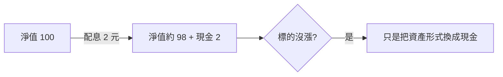
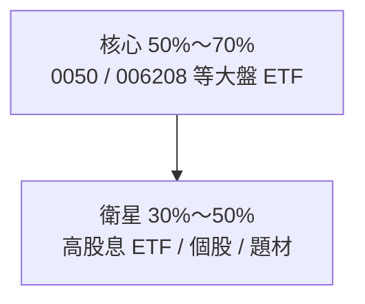
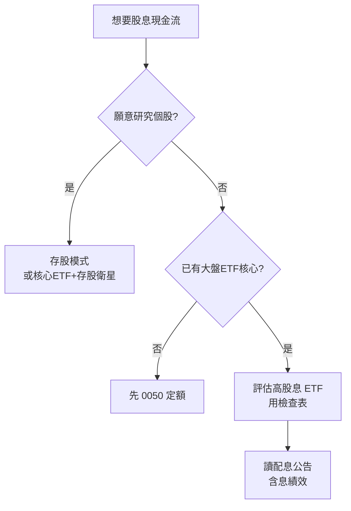

# 高股息 ETF

## 本篇你會學到

- 高股息 ETF 與**個股存股**的差異
- 選高股息 ETF 的檢查表
- 配息、收益平準金、殖利率的常見誤解
- 與大盤 ETF 的**核心—衛星**配置

[← ETF 投資模式](etf-investing.md) · [ETF 費用與折溢價](../01-basics/etf-costs-and-premium.md)

!!! warning "免責聲明"
    以下為教學整理，**不構成投資建議**，亦不保證任何報酬。

---

## 先講結論

| 問題 | 答案 |
|------|------|
| 高股息 ETF 是什麼？ | 成分股偏重**高股息／高現金流**公司的 ETF（如 0056 等） |
| 跟個股存股差在哪？ | **一檔分散多檔**；配息機制含 ETF 層的分配政策 |
| 跟 0050 怎麼配？ | 常見：**0050 核心 + 高股息衛星**；比例依現金流需求 |
| 最該警惕什麼？ | 「月配 X%」≠ 年化報酬；**收益平準金占比**、配息後淨值下修 |

---

## 高股息 ETF vs 個股存股

|  | 高股息 ETF | 個股存股 |
|--|------------|----------|
| **分散** | 一檔含多檔成分 | 集中單一或數檔公司 |
| **研究深度** | 看 ETF 成分與政策 | 需看個股財報、配息紀錄 |
| **配息** | ETF 依契約分配（可能含平準金） | 公司股利政策 |
| **費用** | 內扣費 + 交易費 | 僅交易費 |
| **適合** | 要現金流、少選股 | 願意深度研究個股投資論點（thesis） |

個股存股完整流程 → [存股與除權息](dividend-investing.md)

---

## 選高股息 ETF 檢查表 {#選高股息-etf-檢查表}

| # | 檢查項 | 為什麼重要 | 哪裡查 |
|---|--------|------------|--------|
| 1 | **內扣費率** | 長期複利差距 | 公開說明書 |
| 2 | **成分股品質** | 高息是否來自景氣衰退（股價跌→殖利率虛高） | 投信官網持股 |
| 3 | **配息來源占比** | 股利 vs **收益平準金** | 收益分配公告 |
| 4 | **含息總報酬** | 勿只看配息金額 | 投信績效表 |
| 5 | **規模與成交量** | 流動性、折溢價 | 證交所 |
| 6 | **追蹤誤差**（指數型） | 偏離標的程度 | 公開說明書 |

!!! warning "殖利率陷阱"
    股價大跌 → 殖利率數字變漂亮 → 可能是獲利或景氣問題。見 [基本面術語](../02-glossary/fundamentals.md#殖利率)。

---

## 配息機制：三個常見誤解

### 誤解 1：「月配 1% = 年配 12%」

| 實際 |
|------|
| 配息率常依**除息前參考價**計算 |
| 配息後**淨值下修**（除息概念） |
| 要看**含息 vs 不含息**長期績效 |

### 誤解 2：「配息 = 賺到的錢」

與 [共同基金配息陷阱](../01-basics/mutual-fund-intro.md#配息基金特別要小心) 邏輯相同。

### 誤解 3：「收益平準金 = 額外 bonus」

會計調節機制，**不是**額外獲利；除息公告須看平準金占比。完整說明 → [ETF 費用與折溢價：收益平準金](../01-basics/etf-costs-and-premium.md#收益平準金)

---

## 與大盤 ETF 的配置

| 部位 | 角色 | 常見標的類型 |
|------|------|--------------|
| **核心** | 參與台股大盤、長期定額 | 0050、006208 |
| **衛星** | 提高現金流、產業或策略曝險 | 高股息 ETF、少數個股 |

完整組合邏輯 → [組合管理](../09-advanced/portfolio.md)

| 情境 | 建議 |
|------|------|
| 新手、時間少 | 先**大盤 ETF 定額**建立紀律，再考慮高股息 |
| 要月配現金流 | 確認**含息報酬**與平準金占比，非只看配息數字 |
| 已有多檔高股息 | 檢查是否**產業集中**（例如都偏金融） |

---

## 高股息 ETF vs 0050 定額

|  | 0050 類大盤 ETF | 高股息 ETF |
|--|-----------------|------------|
| **目標** | 參與大盤成長 | 偏重股息現金流 |
| **成分** | 市值前 50 大 | 高股息策略篩選 |
| **波動** | 隨大盤 | 可能因金融、傳產權重而異 |
| **新手** | 常作第一檔 | 可作第二檔或衛星 |

0050 定額入門 → [被動 ETF 與定期定額](etf-passive-dca.md)

---

## 決策流程

---

## 重點回顧

- 高股息 ETF = **分散的高息策略**，不是「比 0050 穩」的保證。
- 選前必看：**內扣費、成分品質、配息來源、含息報酬**。
- 常見配置：**大盤 ETF 核心 + 高股息衛星**。
- 延伸：[存股與除權息](dividend-investing.md) · [ETF 費用與折溢價](../01-basics/etf-costs-and-premium.md) · [組合管理](../09-advanced/portfolio.md)
