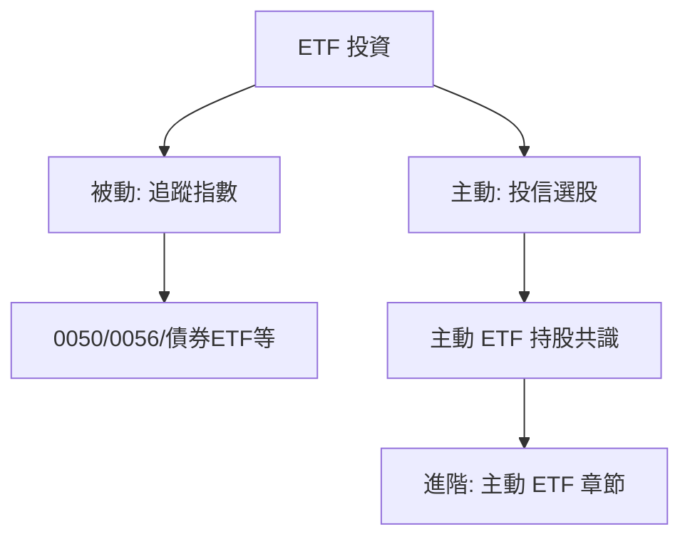

# ETF 投資與配置

## 本篇你會學到

- 被動 ETF 與主動 ETF 的投資用法
- 定期定額 vs 單筆配置
- 何時用 ETF 取代個股

[← 投資模式總覽](index.md)

---

## 什麼是 ETF 投資模式

| 項目 | 說明 |
|------|------|
| **標的** | 一籃股票或債券的基金，在交易所買賣 |
| **目的** | 分散風險、參與大盤或產業，減少選股負擔 |
| **時間** | 可短可長；散戶常見為**中長期配置** |

入門：[ETF 介紹](../01-basics/etf-intro.md)

---

## 兩條路徑

| 類型 | 適合誰 | 延伸 |
|------|--------|------|
| **被動 ETF** | 不想選股、要分散 | 定期定額、長抱 |
| **主動 ETF** | 想看機構選股方向 | [主動 ETF 分析](../05-analysis/active-etf.md) |

---

## 常見做法

| 做法 | 說明 |
|------|------|
| **定期定額** | 每月固定金額買入，平滑進場價 |
| **資產配置** | 股債比例依年齡與風險調整 |
| **核心衛星** | 大盤 ETF 為核心，少數個股為衛星 |

新手常從 **0050 定期定額** 入門，完整觀念（用途、加碼、常見說法修正）見 **[被動 ETF 與定期定額](etf-passive-dca.md)**。費用與折溢價見 [ETF 費用與折溢價](../01-basics/etf-costs-and-premium.md)；高股息策略見 [高股息 ETF](etf-high-dividend.md)。實戰情境：[0050 定額遇大跌](../07-cases/etf-dca-drawdown.md)。

[基本面框架](../05-analysis/fundamental-framework.md#宏觀層次)：宏觀決定「股債比例」，ETF 是執行工具。

---

## 與個股模式的選擇

| 選 ETF | 選個股 |
|--------|--------|
| 時間少、要分散 | 願意研究單一公司 |
| 參與大盤即可 | 要超額報酬（承擔更高風險） |
| 新手建立習慣 | 已有中線以上能力 |

可並行：**核心 ETF + 衛星個股**（見 [資金配置](../06-risk/capital.md)）。

---

## 看什麼資料

| 被動 ETF | 主動 ETF |
|----------|----------|
| 追蹤誤差、管理費、規模 | 持股清單、權重變化 |
| 大盤趨勢 [多頭空頭](../02-glossary/market-terms.md#多頭空頭) | [共識訊號](../05-analysis/active-etf.md) |

---

## 心態與建議

| 面向 | ETF 配置 |
|------|----------|
| 心理關鍵 | [閒錢](../06-risk/capital.md#閒錢與生活費) + 定額；少預測短期 |
| 常見陷阱 | 把 0050 當短線、大跌恐慌全賣 |
| 盯盤 | 定額日執行；檢視以季～年為單位 |
| 延伸 | [ETF 心態詳解](mode-psychology.md#etf心態) · [0050 專章](etf-passive-dca.md) |

---

## 自我檢查

??? question "1.（概念題）ETF 配置的核心定位是什麼？"
    參考答案：**配置工具**——用一籃子分散風險，不是取代研究個股的賭博替代品。

??? question "2.（判斷題）0050 大跌 20% 就應全倉賣出改當沖？"
    參考答案：否。定額配置看**長期**；恐慌全賣是常見陷阱，見 [0050 定額遇大跌案例](../07-cases/etf-dca-drawdown.md)。

??? question "3.（情境題）被動大盤 ETF 與主動 ETF，你各會盯什麼？"
    參考答案：被動看**追蹤誤差、管理費、規模**；主動看**持股清單、權重變化**與 [共識訊號](../05-analysis/active-etf.md)。

## 重點回顧

- ETF 是**配置工具**，不是賭博替代品。
- 被動大盤 ETF（如 0050）→ [定期定額專章](etf-passive-dca.md)。
- 進階選股線索可看主動 ETF，但仍需 [三大支柱](../05-analysis/three-pillars.md) 驗證。
- 延伸：[如何選模式](choose-style.md)
