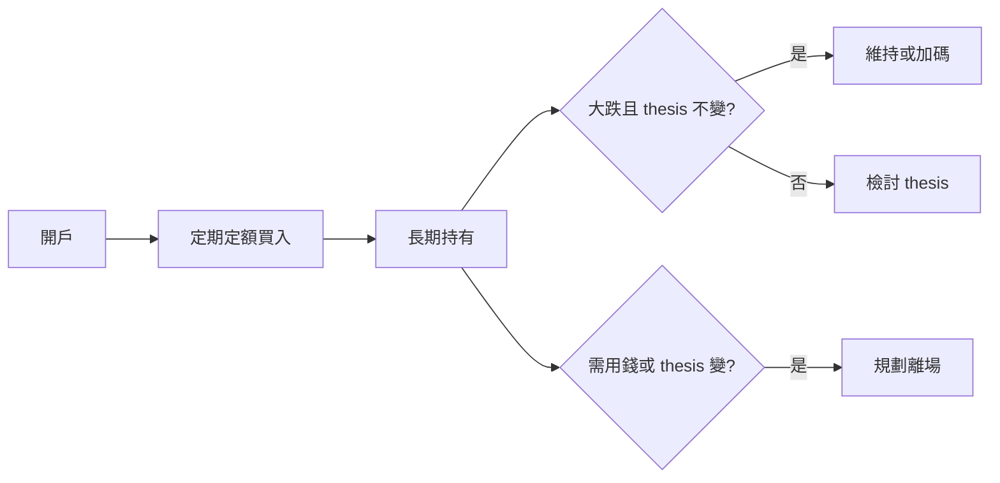
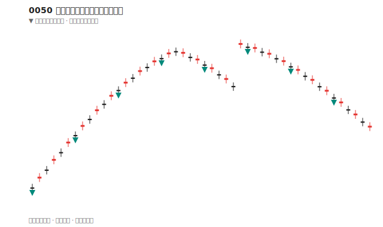
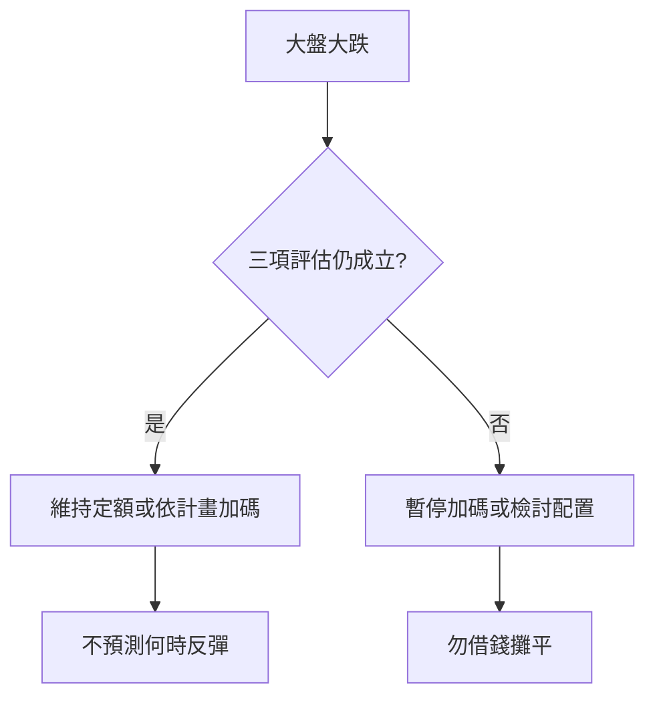

# 被動 ETF 與定期定額（以 0050 為例）

## 本篇你會學到

- 0050 是什麼、買它的用途與獲利方式
- 基本買賣、加碼與離場的意義
- 進場前三項自我評估
- 為什麼必須用閒錢（與認賠殺出的關係）
- 網路常見說法哪些要保留、哪些要修正

[← ETF 投資模式](etf-investing.md) · [ETF 入門](../01-basics/etf-intro.md)

!!! warning "免責聲明"
    以下為教學觀念整理，**不構成投資建議**，亦不保證任何報酬。

---

## 0050 是什麼

| 項目 | 說明 |
|------|------|
| **代號** | 0050（4 碼，在交易所像股票一樣買賣） |
| **類型** | **被動型 ETF**（指數股票型基金） |
| **追蹤標的** | 台灣 50 指數 — 台股市值前 50 大成分股的一籃子 |
| **白話** | 買一檔 0050 ≈ 一次分散買進多檔大型權值股 |

與 [個股](../01-basics/what-is-stock.md) 差異：風險較分散，但報酬仍隨**大盤與產業結構**起伏，並非穩賺。

### 0050 vs 006208

兩檔皆追蹤台灣 50，**長期定額選其一即可**（不必兩檔都買）。對照表、費率與折溢價 → [ETF 費用與折溢價](../01-basics/etf-costs-and-premium.md#0050-vs-006208)

---

## 核心概念：用途與獲利方式

### 買 0050 通常為了什麼

| 目的 | 說明 |
|------|------|
| **參與台股大盤** | 看好台灣整體經濟與龍頭企業長期表現 |
| **分散** | 降低「只押一檔公司」的風險 |
| **少選股** | 不必逐一研究 50 檔成分股 |

### 獲利從哪裡來

| 來源 | 說明 |
|------|------|
| **價差** | 賣出價高於買入成本（含淨值成長） |
| **成分股股利** | 0050 持有成分股所配發的股息，會反映在基金運作與配息政策上（依 ETF 設計，見公開說明書） |

**不是**保證利息；與銀行定存機制完全不同（見下文）。

---

## 操作流程：買賣、加碼、離場

| 動作 | 意義 |
|------|------|
| **買進** | 透過券商下單（限價/市價），見 [交易流程](../01-basics/trading-flow.md) |
| **定期定額** | 每月固定日期、固定**金額**買入，平滑不同價位；小幅折溢價可忽略，大額單筆宜留意 iV 值 |
| **加碼** | 市場低迷時，在定額之外**額外**用預留閒錢買入（需事先規劃） |
| **離場** | 賣出換現金；長期配置者通常**少賣**，但生活所需或投資論點（thesis）改變時仍須賣 |

交割與稅費見 [交割與稅費](../01-basics/settlement-fees.md)、[交易成本](../06-risk/trading-costs.md)。

案例：[0050 定額遇到大跌](../07-cases/etf-dca-drawdown.md)

---

## 新手常見建議（本站整理版）

若你對個股、技術分析尚不熟悉，但又想開始投資，**許多教學會建議**：

1. 只用**閒錢**（不影響生活費、緊急預備金）
2. 採**被動型大盤 ETF**（如 0050）+ **定期定額**
3. **長期持有**，少做短線進出
4. 心態要有**耐心**，接受淨值起伏

這與「先把紀律建立好，再談進階操作」一致，見 [如何選模式](choose-style.md)。

!!! tip "心態像定存，風險不像定存"
    可以學定存的**耐心與紀律**（不天天盯、不亂砍），但 0050 **會波動**，短期可能虧損，**沒有定存本金保證**。

---

## 為什麼強調「閒錢」 {#為什麼強調閒錢}

定期定額與長期持有的前提是：**不必為生活費在低點被迫賣出**（[認賠殺出](../06-risk/capital.md#閒錢與生活費)）。

| 資金類型 | 遇到大跌又急需用錢時 |
|----------|----------------------|
| 生活費、短期會用到的錢 | 可能被迫低點賣出，虧損變實際損失 |
| **閒錢**（短時間內不會動用） | 較能撐過低谷，維持定額紀律 |

完整風控說明見 [資金配置](../06-risk/capital.md#閒錢與生活費)。這也是 [進場前三項評估](#進場前三項評估) 裡「現金流需求」與「加倉空間」的底層原因。

---

## 進場前三項評估 {#進場前三項評估}

在開始定期定額前，建議先想清楚：

| # | 問題 | 為什麼重要 |
|---|------|------------|
| 1 | **加倉空間** | 大跌時若仍看好，你還有閒錢能分批加碼嗎？ |
| 2 | **現金流需求** | 這筆錢放進去，會影響日常開銷或緊急用錢嗎？ |
| 3 | **台股信心** | 你是否願意**多年**持有，並相信台灣經濟與產業中長期仍具競爭力？ |

三項越踏實，遇到回撤時越不容易恐慌賣在低點。資金原則見 [資金配置](../06-risk/capital.md)。

---

## 關於「長期一定賺」：正確說法 {#關於長期一定賺正確說法}

### 網路常見說法

> 「拉長幾年看通常還是賺的」「長期趨勢一直成長」「反彈只是早晚的事」

### 本站修正（教學用）

| 可接受 | 需修正 |
|--------|--------|
| 過去台股大盤**曾**有長期向上階段 | ❌ 「保證」幾年後賺錢 |
| 定期定額可**降低**買在最高點的風險 | ❌ 「跟定存一樣穩」 |
| 若 thesis 不變，大跌可視為加碼機會 | ❌ 「反彈**一定**很快」 |

| 精準表述 |
|----------|
| **投資沒有保證獲利**；0050 追蹤大盤，大盤可多年低迷或大幅回撤。 |
| 定期定額的價值在**紀律與分散進場**，不在消除虧損可能。 |
| 能否「撐過低谷」取決於閒錢、加倉空間與心理承受度。 |

歷史績效 ≠ 未來承諾。見 [長期投資](long-term.md)、[ETF 投資模式](etf-investing.md)。

---

## 遇到大跌怎麼辦

| 做法 | 說明 |
|------|------|
| **維持定額** | thesis 不變時，紀律繼續買 |
| **加碼** | 僅用**預先保留**的閒錢，非借貸 |
| **不建議** | 恐慌全賣、或無計畫 all in 抄底 |

「逢低加碼」的前提是：**你還有錢、且仍看好台股中長期** — 不是賭明天反彈。

---

## 「牛市賣、熊市多買」？

| 對象 | 建議 |
|------|------|
| **新手** | 先專心**定期定額 + 長抱**，不要頻繁「低買高賣」大盤 |
| **進階** | 可在 [組合管理](../09-advanced/portfolio.md) 下做核心再平衡，需有書面規則 |

「牛市賣一些」與「長期不建議賣」並不矛盾：**核心部位長抱，僅在明確規劃下減碼**（例如獲利了結一部分、或生活需用錢）。

---

## 0050 以外的選擇

0050 偏重**大型權值股**（電子權重高）。依需求可認識：

| 類型 | 方向（舉例） |
|------|--------------|
| 高股息 ETF | 偏重配息策略 → [高股息 ETF](etf-high-dividend.md) |
| 全市場 ETF | 涵蓋範圍更廣 |
| 債券 ETF | 股債配置、降低波動 |

詳見 [ETF 入門](../01-basics/etf-intro.md)、[ETF 費用與折溢價](../01-basics/etf-costs-and-premium.md)；進階主動型見 [主動 ETF](../05-analysis/active-etf.md)。

---

## 常見說法對照表

| 說法 | 本站看法 |
|------|----------|
| 0050 是 ETF | ✅ 正確 |
| 用閒錢投資 | ✅ 正確 |
| 新手定期定額、少騷操作 | ✅ 務實 |
| 進場前想加倉空間、現金流、信心 | ✅ 正確 |
| 長期一定賺 | ❌ 改為「可能，但不保證」 |
| 跟定存一樣 | ❌ 改為「紀律可參考，風險不同」 |
| 反彈早晚的事 | ❌ 改為「若 thesis 在，可等待，但時間不確定」 |

---

## 建議閱讀順序

1. [ETF 入門](../01-basics/etf-intro.md)
2. [ETF 費用與折溢價](../01-basics/etf-costs-and-premium.md)
3. 本篇
4. [ETF 投資模式](etf-investing.md)
5. [資金配置](../06-risk/capital.md)
6. [案例：定額遇大跌](../07-cases/etf-dca-drawdown.md)
7. [大盤與類股圖](../04-charts/market-charts.md)

## 自我檢查

??? question "1.（概念題）進場前三項評估是哪三項？"
    參考答案：**加倉空間**（大跌還有閒錢嗎）、**現金流需求**（不影響生活費）、**台股信心**（願意多年持有）。

??? question "2.（判斷題）「0050 長期一定賺」可以當定額理由嗎？"
    參考答案：不行。可接受的是「過去曾有多頭階段、定額降低買在最高點風險」，但**不保證**未來獲利。

??? question "3.（情境題）定額途中遇到 -30% 回撤，你事先該準備什麼？"
    參考答案：閒錢、可選的加碼規則、心理預期與 thesis；見 [案例：定額遇大跌](../07-cases/etf-dca-drawdown.md)。

## 重點回顧

- 0050 = 被動型大盤 ETF，適合**閒錢、長期、紀律**參與台股。
- 進場前評估：**加倉空間、現金流、台股信心**。
- **不保證獲利**；心態可像定存般耐心，風險絕不像定存。
- 新手優先：**定期定額**；大跌加碼需有預留資金與堅定 thesis。

相關詞條：[ETF](../02-glossary/dictionary.md) · [定期定額](../02-glossary/dictionary.md)
