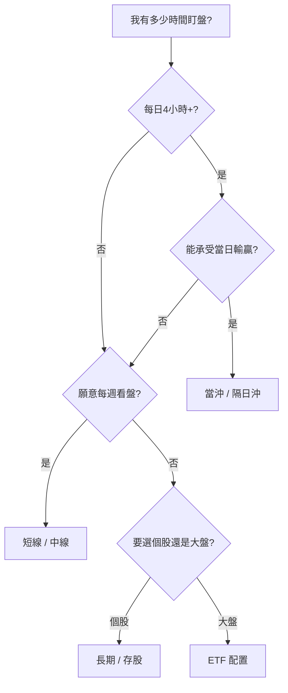

# 投資模式總覽

## 本篇你會學到

- 台股常見的七種投資／交易模式
- 如何依模式選擇「該讀哪一章、該看哪張表」
- 各模式在**心態與紀律**上的差異（見 [投資模式與心態](mode-psychology.md)）
- 本站各章節如何融會貫通

!!! warning "免責聲明"
    以下為**教學分類**，幫助你組織知識與工具，不構成任何模式優於另一模式的建議。

---

## 先選模式，再選工具

同一個名詞（例如「回檔」「本益比」）在不同模式下**意義與權重不同**：

| 名詞 | 當沖 | 長線存股 |
|------|------|----------|
| 回檔 | 可能是出場訊號 | 可能是加碼機會 |
| 本益比 | 通常不重要 | 核心估值工具 |
| 三大法人 | T+1，盤中僅能看昨日 | 連續趨勢極重要 |

因此本站建議路徑：**先在本章選定模式 → 依下方「模式學習地圖」深入各章 → 最後用案例驗證**。

[四種時間框架](../05-analysis/timeframes.md) 是分析上的**時間刻度**；本章是投資人實際可選的**操作風格**，兩者對照見下表。

---

## 七種模式對照

| 模式 | 持倉時間 | 核心問題 | 專章 |
|------|----------|----------|------|
| **當沖** | 當日 | 盤中價量是否給短線機會？ | [當沖](day-trade.md) |
| **隔日沖** | 1～3 日 | 隔日開盤動能能否延續？ | [隔日沖](overnight.md) |
| **短線** | 數日～2 週 | 技術＋籌碼是否同步？ | [短線](swing-short.md) |
| **中線波段** | 數週～數月 | 營收與法人趨勢是否成立？ | [中線波段](swing-mid.md) |
| **長期價值** | 數月～年 | 公司值不值得長抱？ | [長期投資](long-term.md) |
| **存股除權息** | 年為單位 | 配息穩定、能否填息？ | [存股除權息](dividend-investing.md) · [配股配息策略](dividend-strategies.md) |
| **ETF 配置** | 依目標 | 大盤或產業配置即可？ | [ETF 投資](etf-investing.md) · [0050 定期定額](etf-passive-dca.md) |
| **另類管道** | 依契約 | 保單、外幣定存值得嗎？ | [投資型保單](investment-linked-policy.md) · [共同基金](../01-basics/mutual-fund-intro.md) · [外幣帳戶](insurance-fx-products.md) |

不確定時，先 [對號入座](../10-persona/index.md) 找身分，或讀 [如何選擇適合自己的模式](choose-style.md)。選定後務必對照 [投資模式與心態](mode-psychology.md)，避免「方法對、心態錯」。

---

## 模式與心態（速覽）

| 模式 | 一句心態話 | 詳解 |
|------|------------|------|
| 當沖 | 今日輸贏今日了，不留隔夜 | [當沖心態](mode-psychology.md#當沖心態) |
| 隔日沖 | 賭延續，但隔日不符就走 | [隔日沖心態](mode-psychology.md#隔日沖心態) |
| 短線 | 小賠快砍，不講長線故事 | [短線心態](mode-psychology.md#短線心態) |
| 中線 | 每週檢視，忍受洗盤 | [中線心態](mode-psychology.md#中線心態) |
| 長期 | 賣看投資論點（thesis），不看日漲跌 | [長期心態](mode-psychology.md#長期心態) |
| 存股 | 配息品質優於殖利率數字 | [存股心態](mode-psychology.md#存股心態) |
| ETF | 閒錢定額，少預測短期 | [ETF 心態](mode-psychology.md#etf心態) |

完整對照表與心態錯配 → [投資模式與心態](mode-psychology.md)

---

## 模式學習地圖（融會貫通） {#模式學習地圖融會貫通}

以下將**入門、術語、看表、看圖、分析、風控、案例**串成一條路，避免只在影片或單一章節打轉。

### 當沖

| 層次 | 必讀 | 深入 |
|------|------|------|
| 規則 | [市場概覽](../01-basics/market-overview.md#當沖當日沖銷) | [持倉術語](../02-glossary/position.md#當沖) |
| 看圖 | [分時圖](../04-charts/intraday-charts.md)、分 K | [量價](../04-charts/volume-price.md)、[圖表總覽](../04-charts/index.md) |
| 風控 | [交易成本](../06-risk/trading-costs.md) | [停損](../06-risk/stop-loss.md)、[案例：當沖](../07-cases/day-trade-risk.md) |
| 勿混用 | 不要用 [月營收](../03-tables/revenue.md) 當進場主因 | 法人為 T+1 參考 |

### 隔日沖

| 層次 | 必讀 | 深入 |
|------|------|------|
| 術語 | [跳空](../02-glossary/market-terms.md#跳空)、[買超賣超](../02-glossary/chips.md#買超賣超) | [追高殺低](../02-glossary/trading-terms.md#追高殺低) |
| 看圖 | 日 K、[量價](../04-charts/volume-price.md) | [案例：突破缺口](../07-cases/gap-breakout.md) |
| 風控 | [隔日沖專章](overnight.md) | [跨市場夜盤](../05-analysis/cross-market.md) |

### 短線

| 層次 | 必讀 | 深入 |
|------|------|------|
| 分析 | [三大支柱](../05-analysis/three-pillars.md) | [四時間框架](../05-analysis/timeframes.md) |
| 看圖 | [K線+指標](../04-charts/index.md)、[量價](../04-charts/volume-price.md) | [16 種型態](../04-charts/candle-patterns.md) |
| 看表 | [法人](../03-tables/institutional.md)、[融資融券](../03-tables/margin.md) | [評分短線因子](../03-tables/scoring.md) |
| 案例 | [鎚子+均線](../07-cases/hammer-ma.md) | [MACD 背離](../07-cases/macd-divergence.md) |

### 中線波段

| 層次 | 必讀 | 深入 |
|------|------|------|
| 看表 | [月營收](../03-tables/revenue.md)、[估值](../03-tables/valuation.md) | [基本面圖](../04-charts/fundamental-charts.md) |
| 分析 | [基本面框架](../05-analysis/fundamental-framework.md) | [法說會](../05-analysis/conference.md) |
| 術語 | [回檔](../02-glossary/trading-terms.md#回檔)、[打底](../02-glossary/market-terms.md#打底) | [分批](../02-glossary/trading-terms.md#分批) |
| 案例 | [營收轉折](../07-cases/revenue-turn.md) | [法說與籌碼](../07-cases/conference-chips.md) |

### 長期／存股

| 層次 | 必讀 | 深入 |
|------|------|------|
| 分析 | [基本面框架](../05-analysis/fundamental-framework.md#好公司好股票) | [財報](../03-tables/financials.md) |
| 存股 | [除權息入門](../01-basics/dividend.md) | [存股專章](dividend-investing.md)、[配股配息策略](dividend-strategies.md)、[填息案例](../07-cases/dividend-play.md) |
| 風控 | [資金配置](../06-risk/capital.md) | 基本面失效停損 |

### ETF

| 層次 | 必讀 | 深入 |
|------|------|------|
| 入門 | [ETF 介紹](../01-basics/etf-intro.md) | [0050 與定期定額](etf-passive-dca.md) |
| 費用 | [ETF 費用與折溢價](../01-basics/etf-costs-and-premium.md) | [交易成本](../06-risk/trading-costs.md) |
| 配置 | [ETF 投資專章](etf-investing.md) | [資金配置](../06-risk/capital.md) |
| 高股息 | [高股息 ETF](etf-high-dividend.md) | [存股除權息](dividend-investing.md) |
| 心態 | [對號入座](../10-persona/index.md) | [ETF 心態](mode-psychology.md#etf心態) |
| 案例 | [0050 定額遇大跌](../07-cases/etf-dca-drawdown.md) | [大盤圖](../04-charts/market-charts.md) |
| 進階 | [主動 ETF](../05-analysis/active-etf.md) | [宏觀配置](../05-analysis/fundamental-framework.md#宏觀層次) |

### 投資型保單

| 層次 | 必讀 | 深入 |
|------|------|------|
| 標的 | [共同基金入門](../01-basics/mutual-fund-intro.md) | 淨值、申購費、經理費 |
| 結構 | [投資型保單](investment-linked-policy.md) | 「投資」是什麼、三方獲利、建議 |
| 對照 | [ETF 定期定額](etf-passive-dca.md) | [交易成本](../06-risk/trading-costs.md) |
| 實戰 | [基金與保單問答](../07-cases/fund-policy-faq.md) | 話術對照、決策情境 |
| 配置 | [資金配置](../06-risk/capital.md) | [組合管理](../09-advanced/portfolio.md) |

### 外幣帳戶

| 層次 | 必讀 | 深入 |
|------|------|------|
| 用途 | [外幣帳戶](insurance-fx-products.md) | 定存 vs 海外 ETF |
| 匯率 | [跨市場](../05-analysis/cross-market.md) | [組合管理](../09-advanced/portfolio.md) |

---

## 同一概念：入門 → 深入 → 實戰 {#同一概念入門-深入-實戰}

影片與術語詞典常**點到為止**；本站用三層結構避免重複卻學不深：

| 概念 | ① 入門（是什麼） | ② 深入（怎麼用） | ③ 實戰（案例） |
|------|------------------|------------------|----------------|
| 回檔 / 反彈 | [交易術語](../02-glossary/trading-terms.md#回檔) | [均線](../04-charts/ma.md)、依模式見上表 | [鎚子案例](../07-cases/hammer-ma.md) |
| 跳空 / 缺口 | [市場術語](../02-glossary/market-terms.md#跳空) | [組合型態](../04-charts/candle-combinations.md) | [假突破](../07-cases/gap-breakout.md) |
| 本益比 | [基本面術語](../02-glossary/fundamentals.md#per本益比) | [基本面框架](../05-analysis/fundamental-framework.md#本益比怎麼讀) | [估值陷阱](../07-cases/valuation-trap.md) |
| 軋空 | [市場術語](../02-glossary/market-terms.md#軋空) | [融資融券表](../03-tables/margin.md) | [軋空案例](../07-cases/short-squeeze.md) |
| 三大支柱 | [影片索引](../appendix/video-resources.md) | [三大支柱](../05-analysis/three-pillars.md) | 依模式選案例 |
| ETF 定額 | [0050 專章](etf-passive-dca.md) | [ETF 心態](mode-psychology.md#etf心態) | [定額遇大跌](../07-cases/etf-dca-drawdown.md) |

---

## 與評分表、時間框架的關係

[評分量表](../03-tables/scoring.md) 對九因子在**當沖／短／中／長**四刻度分別評分。使用方式：

1. 在本章選定你的**主要模式**。
2. 看評分時**只優先看對應刻度**（例如中線波段 → 看中線分數）。
3. 分數是粗篩，進出場仍依該模式的 [停損](../06-risk/stop-loss.md) 與 [紀律](../06-risk/discipline.md)。

---

## 模式穩定之後

熟悉某一 [投資模式](index.md) 後，下一步是 **系統化** → [老手專區](../09-advanced/index.md)（研究流程、組合、多週期、事件手冊）。

---

## 重點回顧

- **模式**決定你看什麼、看多久；**分析三支柱**決定你看什麼面向。
- 影片名詞 → [術語詞典](../02-glossary/index.md) → 本章地圖 → 專章 → 案例 → **老手專區**。
- 下一步：[如何選擇適合自己的模式](choose-style.md) 或 [老手專區](../09-advanced/index.md)。

相關：[四種時間框架](../05-analysis/timeframes.md) · [影片資源](../appendix/video-resources.md) · [學習路徑（首頁）](../index.md)
