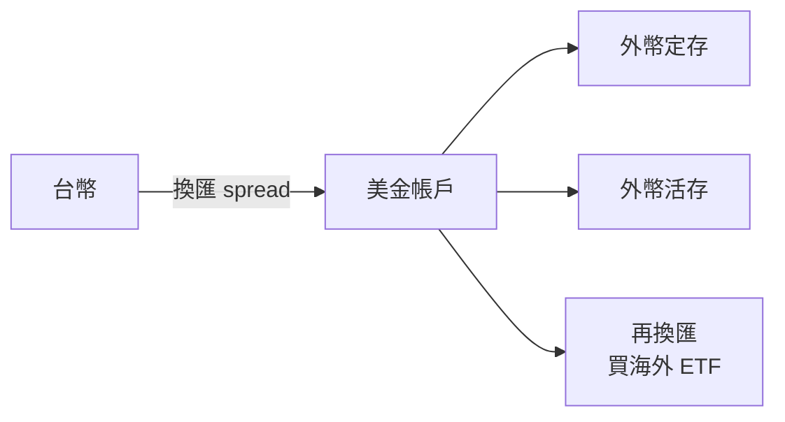

# 外幣帳戶（美金定存）

## 本篇你會學到

- 外幣活存／定存是什麼、銀行怎麼賺
- 跟直接買海外 ETF、跟投資型保單的差異
- 什麼狀況適合用外幣帳戶

[← 投資模式總覽](index.md) · [投資型保單專章](investment-linked-policy.md)

!!! warning "免責聲明"
    以下為教學整理，不構成投資建議。利率與匯率以各銀行牌告為準。

---

## 一句話理解

**外幣帳戶** = 把台幣換成美金等外幣，存在銀行活存或定存。銀行賺**匯差**＋把存款拿去做**放款、投資**——邏輯類似台幣定存，**不是**股票投資，也**不綁壽險**。

投資型保單的完整說明見 **[投資型保單專章](investment-linked-policy.md)**（本篇不混談）。

---

## 外幣帳戶結構

| 項目 | 說明 |
|------|------|
| **開戶** | 多數銀行可在台幣帳戶下加開外幣子帳戶 |
| **換匯成本** | 銀行**買賣匯差**；通常略高於券商換匯 |
| **定存利率** | 依牌告，隨 Fed 等政策變動 |
| **銀行怎麼賺** | **匯差** + 存款**放款、投資** |

---

## 利弊

| 優點 | 缺點 |
|------|------|
| 波動通常低於股票 | **匯率**影響台幣計價 |
| 操作簡單 | 利率未必跑贏通膨 |
| 短期美元需求（留學、旅遊） | 定存期間流動性受限 |
| 無保險前置費、無 B | 長期成長機會成本 |

**匯率是獨立風險**：美金定存「利息賺了、台幣升值」，台幣計價仍可能變少。見 [跨市場分析](../05-analysis/cross-market.md)。

---

## 三管道對照

|  | 外幣定存 | 券商海外 ETF | 投資型保單 |
|--|----------|--------------|------------|
| **目的** | 美元配置、收息 | 長期成長 | 保障 + 投資 |
| **成本** | 匯差 | 低管理費 + 交易費 | B + 多層保單費 |
| **保障** | 無 | 無 | 有（依契約） |

---

## 建議

| 情境 | 建議 |
|------|------|
| 1～3 年內要用美元 | 外幣活存／短期定存 ✅ |
| 長期美元資產成長 | **券商海外 ETF** ✅ |
| 被「比台股穩」說服 all in 定存 | 釐清是**保值**還是**增值** |
| 想投資又想要保障 | 見 [投資型保單專章](investment-linked-policy.md)，勿與定存混比 |

---

## 重點回顧

- 外幣帳戶 = **換匯 + 定存／活存**；銀行賺匯差與存貸利差。
- 短期美元需求適合；**長期成長**應對照海外 ETF。

## 相關

- [投資型保單](investment-linked-policy.md) · [共同基金入門](../01-basics/mutual-fund-intro.md) · [跨市場連動](../05-analysis/cross-market.md)
