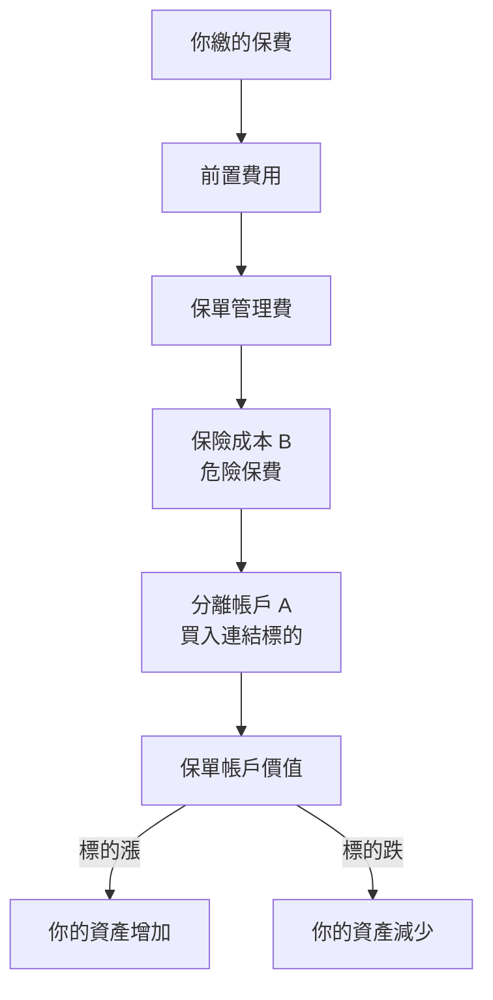
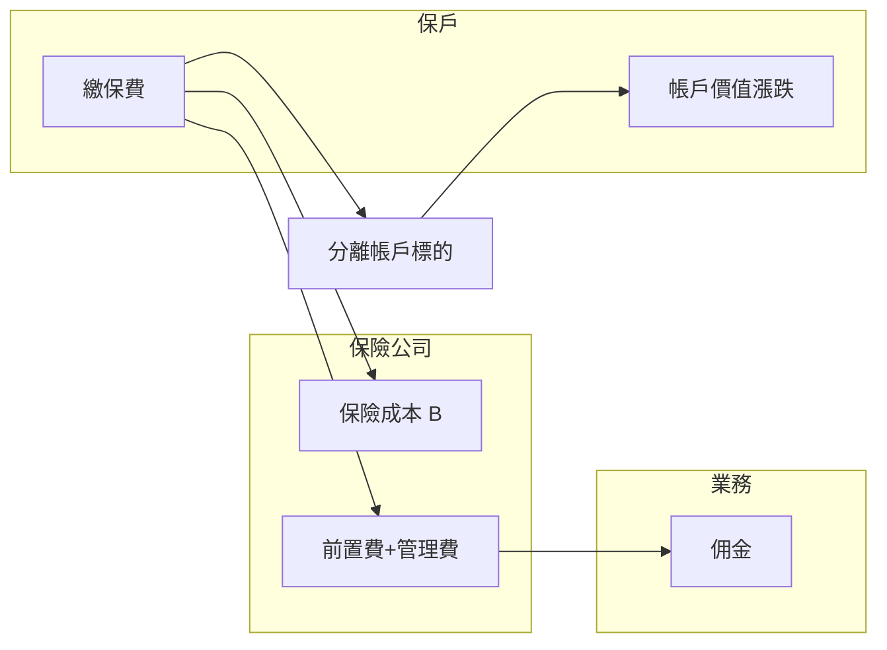
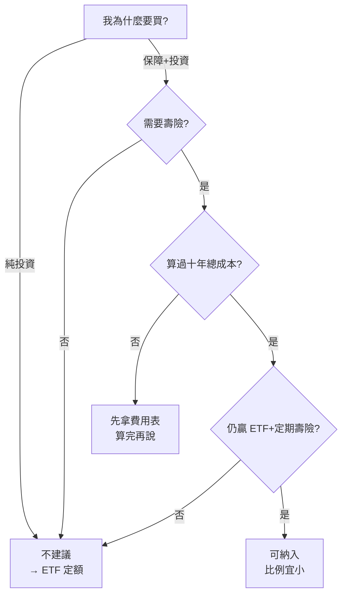
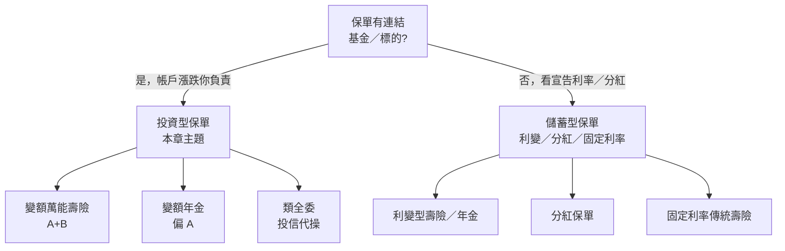

# 投資型保單：「投資」到底是什麼？

## 本篇你會學到

- 投資型保單裡的「投資」**不是**一般理解的買股票／ETF
- 保戶、業務／投信、保險公司**各自怎麼獲利**
- 為什麼簡報講「基金年報酬 30%」，你**拿不到 30%**
- **什麼狀況建議買、什麼狀況不建議**

[← 投資模式總覽](index.md) · [共同基金入門](../01-basics/mutual-fund-intro.md) · [外幣帳戶](insurance-fx-products.md)

!!! warning "免責聲明"
    以下為**教學整理**，不構成投保、加碼或解約建議。費率與條款以各商品說明書為準。

---

## 先講結論

| 問題 | 答案 |
|------|------|
| 「投資」是什麼？ | 保費扣完各種費用與保險成本後，**剩餘部分**買入保單連結的基金／ETF；帳戶價值**隨標的漲跌，盈虧自負** |
| 划不划算（純投資）？ | **多數人不划算**——同樣標的，自己用券商買 ETF 長期幾乎一定更便宜 |
| 一定要透過保單才能投？ | **不用**。標的多半是公開**共同基金**；見 [共同基金入門](../01-basics/mutual-fund-intro.md) |
| 30% 報酬是真的嗎？ | 可能是**某基金某一年**的數字，**不是**你保單扣費後的實際報酬 |

---

## 投資型保單是什麼

**投資型保單**（投資型人壽保險）= 把**保險契約**當容器，裡面裝一個**分離帳戶**，帳戶資金拿去買連結標的（基金、ETF、全委託等）。

常見子類型：

| 類型 | 有無壽險成本 | 白話 |
|------|--------------|------|
| **變額萬能壽險** | 有（可調保額） | 最常見；A 投資 + B 保障 |
| **變額壽險** | 有（較固定） | 繳費較固定 |
| **變額年金** | 通常無或極低 | 偏退休累積，見文末附錄 |

本章以 **變額萬能壽險** 為主（市占最高、結構最有代表性）。

---

## 「投資」到底是什麼？（跟 ETF 定額不一樣）

很多人以為：月繳 1 萬 = 每月投資 1 萬進基金。**實際不是。**

### 真正的「投資部位」

| 名詞 | 是什麼 | 算不算「你的投資」 |
|------|--------|-------------------|
| **分離帳戶（A）** | 扣完費用後買基金／ETF 的部分 | ✅ **這才是投資** |
| **保險成本（B）** | 維持身故保障，每月從帳戶扣 | ❌ 是**買保障**，不是投資 |
| **前置費用** | 繳費當下被扣掉 | ❌ 進不了 A |
| **保單帳戶價值** | A 的市值 − 持續被扣的 B 等 | ✅ 你**真正擁有的可變動資產** |

### 跟券商 ETF 定額的本質差異

|  | 券商 ETF 定額 | 投資型保單的「投資」 |
|--|---------------|----------------------|
| **容器** | 證券帳戶 | 保險契約 + 分離帳戶 |
| **每塊錢進場比例** | 接近 **100%**（扣極低手續費） | 常只有 **60%～85%**，首年可能更低 |
| **額外每月扣款** | 無 | **保險成本 B**（隨年齡升） |
| **報酬歸誰** | 幾乎全歸你 | 標的報酬 − 多層費用 − B |
| **保障** | 無 | 有（壽險等，依契約） |

**白話：投資型保單的「投資」= 用保險包裝的基金帳戶，且每個月要付「包裝費 + 保障費」。**

標的層（基金淨值怎麼漲跌、申購費與配息陷阱）→ 請先讀 **[共同基金入門](../01-basics/mutual-fund-intro.md)**。

---

## 三方的獲利結構

### 1. 保戶（你）— 怎麼「賺」、怎麼「虧」

| 獲利／損失來源 | 說明 |
|----------------|------|
| **標的帳戶漲** | 連結的基金／ETF 淨值上升 → 帳戶價值增加 |
| **標的帳戶跌** | 淨值下跌 → **盈虧自負**，沒有保證本金 |
| **身故／失能理賠** | 契約保障成立時給付（**不是**日常投資報酬） |
| **隱性成本** | 前置費、B、管理費持續吃掉報酬 → **實際年化常遠低於標的報酬** |

你**不是**保險公司的股東；你拿的是**扣完所有費用後的帳戶殘值 + 保障**。

### 2. 業務員／投信 — 怎麼賺

| 來源 | 說明 |
|------|------|
| **佣金（前置費的一部分）** | 你繳保費、加籌時，**首年計畫保費**前置費可能很高（教學案例曾達 **60%** 量級）→ 業務佣金多來自這裡 |
| **續期佣金** | 部分商品後續年度仍有服務佣金（依公司制度） |
| **轉換標的、加碼** | 每次加籌、調整標的可能觸發業績或服務費 |
| **「報明牌」服務** | 投信代操或業務電話提醒 → **不是**保證獲利，是**維持關係、促加碼** |

業務的誘因是**你多繳、早繳、加籌**——不是「幫你賺到比 ETF 更高報酬」。

### 3. 保險公司 — 怎麼賺

| 來源 | 說明 | 占比概念 |
|------|------|----------|
| **保險成本（B）** | 危險保費；年齡↑、保額↑ → 扣越多 | **長期往往是大頭之一** |
| **前置費用** | 保費進場先扣 | 首年最明顯 |
| **保單管理費** | 每月或按帳戶價值 | 持續性 |
| **標的／轉換費** | 超過免費次數的轉換費等 | 依使用次數 |
| **死差益等** | 實際死亡率低於定價時，公司留部分利差 | 精算層面，保戶不直接看到 |

你的錢在**分離帳戶**做標的投資；保險公司**不是**主要拿你的保費去銀行放款（那是定存邏輯），而是收 **B + 行政 + 管理**。

---

## 為什麼簡報講 30%，你拿不到？

### 三層數字，常被混成一層

| 層次 | 可能是 30% 的東西 | 你實際拿到？ |
|------|-------------------|--------------|
| **① 標的報酬** | 某檔基金**某一年**漲 30% | 只有**進 A 的那部分**享受漲幅 |
| **② 帳戶報酬** | 保單帳戶價值年度變化 | 還要扣當年 **B、管理費、前置費** |
| **③ 實際 IRR** | 含所有繳費與解約金的內部報酬率 | 長期試算常 **1%～3%** 量級（教學參考） |

### 數字範例（月繳 10,000，教學示意）

**首年進標的可能只有約 61%：**

| 步驟 | 金額 |
|------|------|
| 月繳 | 10,000 |
| 扣前置費、B、管理費後進 A | 約 **6,000** |
| 若標的該年 +30% | A 賺約 1,800 |
| 相對月繳 10,000 | **+18%**（不是 +30%） |
| 且 B 下一年可能更高 | 長期平均被拉低 |

**十年粗算（標的假設年化 6%，教學量級）：**

| 管道 | 概念結果 |
|------|----------|
| 投資型保單（扣完所有費） | 實際年化約 **1%～3%** |
| 同標的 ETF 定額 | 接近 **5%～6%**（扣極低費用） |

所以：**不是基金沒賺到 30%，是你這條管道「分到的」被費用與 B 吃掉了。**

### 一定要買保單才能投那些基金嗎？

**不用。**

- 保單連結的多是**公開募集共同基金**或 **ETF** — 基金怎麼運作見 [共同基金入門](../01-basics/mutual-fund-intro.md)
- 同一檔或更低費的替代品，**券商、銀行基金平台**都能買
- 保單的「優勢」是**轉換標的免部分申赎費、有人服務**——**不是報酬更高**

---

## 費用一覽（決定划不划算的核心）

| 費用 | 白話 | 教學參考 |
|------|------|----------|
| **前置費用** | 繳費先扣 | 加籌 **3%～5%**；計畫保費首年可能 **遠更高** |
| **保險成本 B** | 每月從帳戶扣 | 隨年齡 **5%～15%+** 占保費概念；高齡可能吃光保費 |
| **保單管理費** | 行政 | 約 **100～200 元／月** 或按比例 |
| **標的經理費** | 基金內扣 | 約 **1%～2%／年** |
| **標的轉換費** | 超過免費次數 | 常 **NT$500／次**（約 6 次／年免費） |

**總費用概念：每年從報酬中吃掉約 11%～28%（相對保費或帳戶），長期複利差距極大。**

---

## 建議：什麼狀況買、什麼狀況不買

### ✅ 可考慮（少數，且要先算十年總成本）

| 狀況 | 原因 |
|------|------|
| 已用**費用一覽表**算過，仍優於「ETF + 定期壽險」 | 有數據，不是聽口頭 |
| **確實需要**契約中的壽險／附約，分開買更貴或買不到 | B 有真實價值 |
| **年輕、B 低**，且願意長期持有攤平前置費 | 年輕時進 A 比例較高 |
| 自覺**完全存不下錢**，接受低報酬換強迫儲蓄 | 紀律 > 報酬 |
| 高資產**稅務／傳承**需求（需專業個案） | 非一般存股族 |

### ❌ 不建議（多數人）

| 狀況 | 原因 | 替代 |
|------|------|------|
| **主要目的是投資賺錢** | 費用結構註定長期跑輸 ETF | [ETF 定額](etf-passive-dca.md) |
| 被「基金年報酬 30%」吸引 | 那是標的故事，不是你的 | 自己買同類 ETF |
| **不需要壽險**，或已有足夠保障 | B 是純成本 | 只投資，不加保單 |
| **45 歲以上**才開始大量加碼 | B 上升快，越存越虧費用 | 降保額或改 ETF |
| 需要**高流動性** | 解約、提領有成本 | 券商帳戶 |
| 業務用「比定存划算」推銷 | 該跟 ETF 比，不是定存 | 分開評估 |

### 決策流程

---

## 跟「分開做」比：Buy Term, Invest the Difference

理財界經典比較：

|  | 投資型保單 | 定期壽險 + ETF 定額 |
|--|------------|---------------------|
| **保障** | 綁在保單裡（B 持續扣） | 定期壽險：純保障、保費低 |
| **投資** | 分離帳戶 A | 券商 ETF，幾乎全額進場 |
| **成本透明度** | 低 | 高 |
| **長期報酬（教學量級）** | 扣費後 **1%～3%** | 標的報酬 − **0.3%～0.5%** |
| **結論** | 便利 + 綁定 | **多數人較划算** |

月繳 10,000 的概念拆分（示意）：

- **投資型保單**：約 6,000～8,500 進標的，其餘 B + 費用  
- **ETF 9,000 + 定期壽險 1,000**：投資部分接近全額，保障分開付  

---

## 已持有保單：留、調、還是停？

| 步驟 | 動作 |
|------|------|
| 1 | 索取**帳戶價值、累計保險成本、費用一覽** |
| 2 | 問：**50、60 歲時每月 B 各多少？** |
| 3 | 家庭責任減輕 → 申請**降保額** |
| 4 | **停加籌**（前置費不划算） |
| 5 | 解約 vs 繼續：算**總成本**，勿只看情緒性虧損 |

---

## 常見誤解

| 誤解 | 實際 |
|------|------|
| 月繳 = 月投資同額 | 扣完費用，**首年可能只剩六成** |
| 基金 30% = 我賺 30% | 是**標的**數字，不是**帳戶 IRR** |
| 一定要買保單才能買那些基金 | **不用**，券商可買 |
| 有保險就不會賠 | 標的帳戶**會跌** |
| 加保費 = 純加投資 | **加保額**才會拉高 B |

---

## 附錄：變額年金（同屬投資型，但 B 極低）

|  | 變額萬能壽險 | 變額年金 |
|--|--------------|----------|
| **壽險 B** | 有 | 通常**無** |
| **用途** | 保障 + 投資 | 退休累積 → **年金化** |
| **適合** | 要身故保障者 | 不要壽險、要退休桶 |
| **注意** | B 隨年齡升 | 仍有前置費；年金化後**流動性低** |

若**不需要壽險**，變額年金比變額萬能「少一層 B」，但仍要與 **ETF 定額** 比總成本——**不一定划算**。

---

## 容易混淆的「類似保單」（不是同一種投資）

業務簡報常把下列商品放在一起講，但**風險與報酬邏輯完全不同**。買錯類型 = 以為在投資，其實在買儲蓄或代操。

### 一圖分辨

### 完整對照表

| 商品 | 是不是「投資型」 | 報酬從哪來 | 誰承擔投資風險 | 跟本章關係 |
|------|------------------|------------|----------------|------------|
| **變額萬能／變額壽險** | ✅ 是 | 連結基金／ETF 淨值 | **保戶** | **本章核心** |
| **變額年金** | ✅ 是 | 同上 | **保戶** | 同族，少 B |
| **類全委（全權委託）投資型** | ✅ 是（子類） | 投信代操一籃標的 | **保戶** | 不用自己選基金，但**代操費 + 保單費**仍在 |
| **利變型壽險／利變型年金** | ❌ 不是 | **宣告利率** + 預定利率保底 | **保險公司**為主 | 像**儲蓄／定存**，常被說「比定存划算」 |
| **分紅保單** | ❌ 不是 | 預定利率 + **不保證分紅** | **保險公司** | 穩健儲蓄，不是基金 |
| **固定利率傳統壽險** | ❌ 不是 | 投保時鎖定預定利率 | **保險公司** | 報酬低但確定性强 |
| **銀行基金（非保單）** | ❌ 不是保險 | 基金淨值 | **你** | 無 B，但可能有申購費；比投資型保單透明 |

### 三句話記差異

| 類型 | 一句話 |
|------|--------|
| **投資型（本章）** | 像**包在保單裡的基金**；會賠；要付 **B + 前置費** |
| **利變型／分紅型** | 像**宣告利率的儲蓄**；公司扛大部分投資風險；報酬通常 **1.5%～4%** 量級（依宣告，非保證） |
| **類全委投資型** | 仍是投資型；**投信幫你配**，不是保證獲利；常見「月撥回」現金流話術 |

!!! warning "業務最愛混用的陷阱"
    用**利變型宣告利率 4%** 說服你，再推**投資型基金 30%**——這是**兩種不同商品**。  
    利變型跟定存比；投資型跟 **ETF** 比。混在同一張簡報 = 故意讓你以為「保單 = 高報酬又穩」。

### 類全委（全權委託）投資型保單

| 項目 | 說明 |
|------|------|
| **是什麼** | 投資型保單的一種；標的帳戶交給投信**代操**一籃資產 |
| **跟一般投資型差異** | 你較少自己選基金；可能有**月撥回（配息）** |
| **費用** | 仍有**前置費、B（若有壽險）、管理費** + 代操／經理費 |
| **適合誰** | 懶得選標的、但仍接受**盈虧自負**的人 |
| **跟 ETF 定額比** | 代操**不是**免費午餐；長期仍要算總成本 |

### 若業務推的是「儲蓄型」而非「投資型」

| 你的需求 | 較可能適合 |
|----------|------------|
| 不要虧本金、求穩 | **利變型／分紅型**（不是投資型） |
| 要參與股市、可承受波動 | **ETF 定額**（不是利變型） |
| 要保障 + 投資綁一起 | **投資型**（本章）——但先算是否不如分開買 |

---

## 本章完整性自查（教學涵蓋範圍）

| 主題 | 本章是否涵蓋 | 備註 |
|------|--------------|------|
| 「投資」定義（分離帳戶 A） | ✅ | |
| 保險成本 B | ✅ | |
| 三方獲利（保戶／業務／保險公司） | ✅ | |
| 30% 報酬迷思 | ✅ | |
| 費用一覽 | ✅ | |
| 建議買／不買 | ✅ | |
| 變額萬能／變額壽險／變額年金 | ✅ | 年金在附錄 |
| **類似但不同商品（利變、分紅、類全委）** | ✅ | 本節 |
| 附約（重大傷病、失能） | ⚠️ 略 | 僅在 B 提及；未獨立成章 |
| 解約金／猶豫期細節 | ⚠️ 略 | 已持有保單有提，未展開 |
| 前收／後收型、甲型乙型身故給付 | ⚠️ 未寫 | 進階契約條款 |
| 稅務／遺產規劃 | ⚠️ 一句 | 高資產才 relevant |
| 各公司商品比較 | ❌ 未寫 | 1434+ 款，不宜列舉；看各商品說明書 |

**結論：** 作為**投資型保單「投資面」入門到決策**，本章已**完整**；若要比較**利變／分紅儲蓄險**或**契約法規細節**，需另開章節。

---

## 重點回顧

- 「投資」= **分離帳戶 A**；不是整筆保費，更不是簡報上的基金報酬。
- **保戶**賺標的漲幅 − 所有費用 − B；**業務**賺佣金與加碼；**保險公司**賺 B + 前置費 + 管理費。
- **30% 是標的故事**；你拿到的是**扣費後的帳戶故事**，長期常遠低於標的。
- **不必**透過保單投資；[ETF 定額](etf-passive-dca.md) + 定期壽險（若需要）是多數人預設。
- **利變型、分紅型、類全委**是**不同商品**——勿跟投資型混比；利變像儲蓄，投資型像基金。

相關：[共同基金入門](../01-basics/mutual-fund-intro.md) · [外幣帳戶](insurance-fx-products.md) · [ETF 定額](etf-passive-dca.md) · [資金配置](../06-risk/capital.md)
