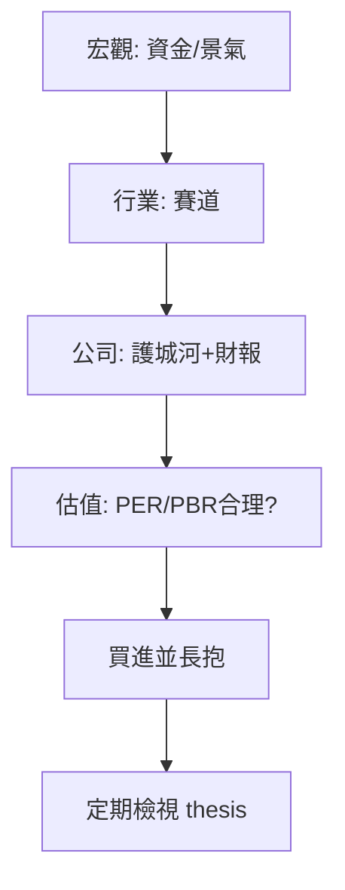

# 長期價值投資

## 本篇你會學到

- 長期投資的選股框架
- 與中線、存股的差異
- 何時賣出（基本面失效）

[← 投資模式總覽](index.md)

---

## 什麼是長期價值投資

| 項目 | 說明 |
|------|------|
| **持倉** | **數月～數年** |
| **目的** | 分享公司長期獲利與成長，非賺短差 |
| **核心** | [基本面框架](../05-analysis/fundamental-framework.md) 三層次 |

---

## 分析路徑

| 層次 | 工具 |
|------|------|
| 宏觀 | [資金行情](../02-glossary/market-terms.md#資金行情)、[跨市場](../05-analysis/cross-market.md) |
| 行業 | [類股](../02-glossary/trading-terms.md#類股)、同業 [營收](../03-tables/revenue.md) |
| 公司 | [財報](../03-tables/financials.md)、[法說](../05-analysis/conference.md) |
| 估值 | [估值表](../03-tables/valuation.md)、[PER](../02-glossary/fundamentals.md#per本益比) |

技術面用 **週 K / 月 K** 找進場區間即可，見 [K 線週期](../04-charts/kline-basics.md#時間週期)。

---

## 與存股除權息的差異

| 項目 | 長期價值 | 存股除權息 |
|------|----------|------------|
| 首要目標 | 資本利得 + 成長 | 穩定 [現金股利](../01-basics/dividend.md) |
| 估值 | 成長 PER 可較高 | 偏重殖利率、填息 |
| 專章 | 本篇 | [存股除權息](dividend-investing.md) |

兩者可重疊（穩健成長 + 穩定配息）。

---

## 買進與賣出

| 買進 | 賣出（ thesis 失效） |
|------|----------------------|
| 護城河清晰、財報穩健 | 連續營收/獲利不如預期 |
| 估值在歷史合理區間 | 產業結構性衰退 |
| 市場尚未 [priced in](../05-analysis/fundamental-framework.md#好公司好股票) 全部利多 | 找到更好資金運用 |

**不是**只因為「跌 10%」就賣——長線看**基本面理由**是否改變。

案例：[估值陷阱](../07-cases/valuation-trap.md)

---

## 散戶務實建議

[小Lin说 影片](../appendix/video-resources.md#小lin说-分析框架) 觀點：散戶不宜與量化基金比短線技術；長線應把時間花在**讀懂公司與產業**。

若不想深度選股 → [ETF 投資](etf-investing.md)。

---

## 心態與建議

| 面向 | 長期價值 |
|------|----------|
| 心理關鍵 | 賣看 thesis 失效，非只看短期跌幅 |
| 常見陷阱 | 每天盯報價、錨定成本不認賠 |
| 盯盤 | 季報、法說為主；月 K 看趨勢 |
| 延伸 | [長期心態詳解](mode-psychology.md#長期心態) |

---

## 重點回顧

- 長線賣的是**耐心與研究深度**。
- 進場問：好公司是否已是好價格？
- 搭配：[紀律](../06-risk/discipline.md) · [資金配置](../06-risk/capital.md)
