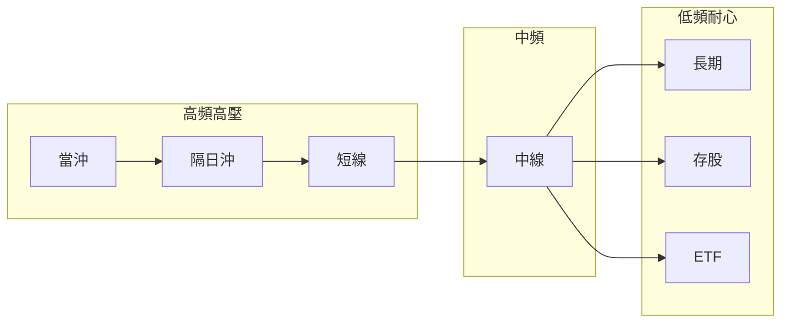

# 投資模式與心態

## 本篇你會學到

- 七種模式在**心理壓力、決策節奏、情緒陷阱**上的差異
- 為什麼「方法對、心態錯」仍會虧
- 各模式建議的盯盤頻率、資訊飲食與紀律重點
- 如何辨識並修正**心態錯配**

[← 如何選模式](choose-style.md) · [對號入座](../10-persona/index.md) · [投資模式總覽](index.md)

!!! warning "免責聲明"
    以下為教學整理，協助你對照**自己**能否執行，不構成模式優劣或獲利保證。

---

## 心態為什麼比「會不會看 K 線」重要

同一套技術，在不同持倉尺度下**心理需求完全不同**：

| 若你用… | 卻用…的心態 | 典型後果 |
|---------|-------------|----------|
| 當沖方法 | 長線「等它回來」 | 違規留倉、隔夜大賠 |
| 長線配置 | 短線「每天看漲跌」 | 恐慌賣低、追高加碼 |
| 存股除權息 | 分 K 追價 | 除息前追高、情緒疲勞 |
| ETF 定期定額 | 短線停損% | 定額做幾次就放棄 |

**模式**決定你看什麼圖、持有多久；**心態**決定你能不能照計畫執行。選模式時請以 [你能執行的紀律](choose-style.md#五個自問) 為準，不是以「哪種聽起來最賺」為準。

---

## 七種模式心態總表

| 模式 | 決策節奏 | 心理壓力來源 | 需要的能力 | 常見情緒陷阱 | 建議 |
|------|----------|--------------|------------|--------------|------|
| **當沖** | 分鐘～小時 | 連續輸贏、收盤倒數 | 極快決策、嚴格停損 | FOMO 追價、報復性加碼 | 每日風險上限；收盤前必平倉 |
| **隔日沖** | 日～隔日 | 隔夜跳空、開盤未知 | 接受隔夜、隔日果斷出場 | 賭開高不走、變短線死抱 | 進場前想好隔日三情境（高開/平開/低開） |
| **短線** | 數日 | 趨勢突然反轉 | 技術+籌碼同步、快砍 | 小賺就跑、小虧不砍 | 停損寫在進場前；勿用「等營收」當理由 |
| **中線** | 週～月 | 營收空窗、洗盤震盪 | 耐心等投資論點（thesis）驗證 | 被洗出後又追、頻繁換股 | **每週固定檢視**，平日少看分 K |
| **長期價值** | 季～年 | 估值回撤、市場不理基本面 | 深度研究、忍受寂寞 | 錨定成本、基本面已變仍不賣 | 季報檢視 thesis；賣出看理由不看% |
| **存股除權息** | 年 | 除息下修、填息等待 | 重視現金流與配息品質 | 搶息追高、把殖利率當保證 | 除息是流程不是賭局；用週 K 以上 |
| **ETF 配置** | 月～年 | 大盤長期低迷 | 紀律定額、閒錢配置 | 把 ETF 當短線、大跌恐慌全賣 | [閒錢](etf-passive-dca.md#為什麼強調閒錢)+定額；少預測短期 |

越靠左：**盯盤越久、決策越密、情緒波動越頻繁**。越靠右：**研究與耐心越重要、對閒錢與現金流要求越高**。

---

## 各模式心理建議（詳解）

### 當沖 {#當沖心態}

| 面向 | 建議 |
|------|------|
| **適合心理** | 能接受「今天結束就歸零重新開始」；輸贏不帶回家 |
| **不適合心理** | 一筆虧損就非要當日扳回；無法在 13:20 前果斷平倉 |
| **盯盤** | **09:00–10:30 集中觀望走向**；尾盤平倉（見 [盤中時間熱點](../04-charts/intraday-charts.md#盤中時間熱點早盤宜集中觀望)） |
| **資訊飲食** | 分 K、量能、大盤氛圍；**少看**月營收、本益比 |
| **紀律底線** | [不留倉](../06-risk/discipline.md)、[每日風險上限](../06-risk/capital.md#每日風險預算) |

專章：[當沖](day-trade.md)

### 隔日沖 {#隔日沖心態}

| 面向 | 建議 |
|------|------|
| **適合心理** | 能睡著但仍接受「醒來可能跳空」 |
| **不適合心理** | 持股過夜就焦慮到影響睡眠；開盤只想「再等一下」 |
| **盯盤** | 收盤前決策是否留倉；隔日開盤 30 分鐘是關鍵 |
| **資訊飲食** | 日 K、夜盤、[跳空](../02-glossary/market-terms.md#跳空) |
| **紀律底線** | 隔日走勢不符計畫 → **當天處理**，勿無限延長持有 |

專章：[隔日沖](overnight.md)

### 短線 {#短線心態}

| 面向 | 建議 |
|------|------|
| **適合心理** | 願意「錯了就小賠出場」，不戀戰 |
| **不適合心理** | 停損像認輸、贏一點就想落袋為安導致賺小虧大 |
| **盯盤** | 每日 1～2 次檢視即可，不必盤中全時 |
| **資訊飲食** | 日 K + 法人連續買超；基本面僅作背景 |
| **紀律底線** | 淨利停損約 -3%～-5%；勿變成「套牢等營收」 |

專章：[短線](swing-short.md)

### 中線波段 {#中線心態}

| 面向 | 建議 |
|------|------|
| **適合心理** | 能接受數週橫盤；相信 thesis 需要時間驗證 |
| **不適合心理** | 持股三天沒漲就焦躁換股；被一根長黑K 洗出 |
| **盯盤** | **每週固定 1 次**（例如週末）看營收、法人、週 K |
| **資訊飲食** | [月營收](../03-tables/revenue.md)、[法人](../03-tables/institutional.md)、週 K |
| **紀律底線** | 結構停損或 -8%～-10%；勿用當沖級停損 |

本站建議多數上班族從此中線心態入門，再視時間與紀律調整。

專章：[中線波段](swing-mid.md)

### 長期價值 {#長期心態}

| 面向 | 建議 |
|------|------|
| **適合心理** | 願意讀財報、法說；接受「好公司也會跌半年」 |
| **不適合心理** | 每天看報價找存在感；跌 10% 就懷疑人生 |
| **盯盤** | 季報、法說、產業新聞為主；月 K 看趨勢即可 |
| **資訊飲食** | [基本面框架](../05-analysis/fundamental-framework.md)、[財報](../03-tables/financials.md) |
| **紀律底線** | 賣出因 **thesis 失效**，非只因短期跌幅 |

專章：[長期投資](long-term.md)

### 存股除權息 {#存股心態}

| 面向 | 建議 |
|------|------|
| **適合心理** | 重視穩定現金流；除息下修視為正常流程 |
| **不適合心理** | 把殖利率當定存利率；除息前 FOMO 搶息 |
| **盯盤** | 除權息日程 + 季報；日常少看盤 |
| **資訊飲食** | [除權息入門](../01-basics/dividend.md)、填息歷史、現金流 |
| **紀律底線** | 配息品質 > 殖利率數字；[殖利率陷阱](../02-glossary/fundamentals.md#殖利率) |

專章：[存股除權息](dividend-investing.md)

### ETF 配置 {#etf心態}

| 面向 | 建議 |
|------|------|
| **適合心理** | 不想選股、接受大盤起伏；有 [閒錢](../06-risk/capital.md#閒錢與生活費) |
| **不適合心理** | 把 0050 當當沖標的；大跌就全賣換現金 |
| **盯盤** | 定額日執行即可；檢視以**季～年**為單位 |
| **資訊飲食** | 大盤景氣、配置比例；少盯分 K |
| **紀律底線** | 定期定額 + 長抱；大跌加碼僅用預留閒錢 |

專章：[ETF 投資](etf-investing.md) · [0050 與定期定額](etf-passive-dca.md)

---

## 心態錯配：症狀、後果、改正 {#心態錯配}

| 錯配類型 | 症狀（你可能這樣想） | 後果 | 改正 |
|----------|----------------------|------|------|
| **長線進、短線出** | 「才跌 5% 一定會彈，先賣好了」 | 賣在洗盤低點 | 進場前寫持有週期與賣出條件 |
| **短線進、長線扛** | 「等營收轉好再賣」 | 小虧變套牢 | 短線只用技術停損，不講故事 |
| **存股卻當沖看** | 每天看分 K 心煩意亂 | 亂加減碼、除息前追高 | 改週 K + 除息日程表 |
| **ETF 當短線** | 0050 跌 3% 就砍 | 定額紀律崩潰 | 改 [閒錢定額](etf-passive-dca.md) 心態 |
| **沒時間卻當沖** | 開會錯過出場 | 違規留倉、隔夜風險 | 改中線或 ETF |
| **生活費進場** | 急需用錢只能賣股 | [認賠殺出](../06-risk/capital.md#閒錢與生活費) | 只用閒錢；見 [為什麼強調閒錢](etf-passive-dca.md#為什麼強調閒錢) |

更多錯配見 [如何選模式：常見錯配](choose-style.md#常見錯配)。

---

## 閒錢、時間與心理承受度

三項常一起決定你能選哪種模式：

| 條件 | 較能支撐的模式 | 較難支撐的模式 |
|------|----------------|----------------|
| **只有閒錢** | 長期、存股、ETF | 全部（但短線虧損較不傷生活） |
| **生活費混入** | 不建議任何模式 | 被迫低點賣出風險極高 |
| **每天 &lt; 30 分鐘** | 中線、長期、ETF、存股 | 當沖、隔日沖 |
| **盤中全時** | 當沖、隔日沖、短線 | — |
| **停損常猶豫** | ETF 定額、中線（先練紀律） | 當沖、隔日沖 |

心理承受度不是固定值，可透過 [交易日誌](../06-risk/discipline.md#交易日誌建議) 與小部位練習逐步建立。

---

## 選定模式後：心態紀律三條 {#選定模式後心態紀律三條}

1. **至少 30 天不換主模式** — 避免「哪種今天賺就換哪種」。
2. **資訊頻率對齊持倉** — 長線少看分 K；當沖少看季報。
3. **進場前寫下「何時賣」** — 依模式不同，賣點可以是停損%、結構破線、或 thesis 失效。

| 模式 | 進場前建議寫下的三行 |
|------|----------------------|
| 當沖 | 停損價、目標價、最遲平倉時間 |
| 隔日沖 | 隔日高/平/低開各自怎麼做 |
| 短線 | 停損%、持有上限天數 |
| 中線 | thesis 一句話、結構停損位 |
| 長期/存股 | 買進理由、何種財報訊號會賣 |
| ETF | 定額金額、閒錢來源、大跌加碼規則 |

---

## 與風控章節的關係

| 主題 | 延伸 |
|------|------|
| 情緒與報復性交易 | [交易紀律](../06-risk/discipline.md) |
| 資金與閒錢 | [資金配置](../06-risk/capital.md) |
| 停損怎麼設 | [停損三層](../06-risk/stop-loss.md) |
| 老手常見心理陷阱 | [老手誤區](../09-advanced/veteran-pitfalls.md) |

---

## 重點回顧

- **模式**選工具與時間尺度；**心態**決定能否執行計畫。
- 虧損常來自「用 A 模式進場、用 B 模式心態出場」。
- 選定後：對齊盯盤頻率、用閒錢、寫好賣出條件。
- 下一步：[如何選模式](choose-style.md) 或各模式專章。

相關：[投資模式總覽](index.md) · [交易紀律](../06-risk/discipline.md) · [老手專區](../09-advanced/index.md)
