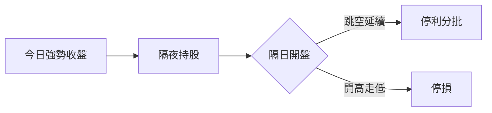

# 隔日沖

## 本篇你會學到

- 隔日沖與當沖、短線的差異
- 常見進場邏輯（強勢收盤、跳空延續）
- 隔夜風險與夜盤連動

[← 投資模式總覽](index.md)

---

## 什麼是隔日沖

| 項目 | 說明 |
|------|------|
| **持倉** | 通常 **1～3 個交易日**，賭隔日或短幾日動能 |
| **核心** | 今日強勢布局，明日（或後日）開盤／盤中獲利了結 |
| **別名** | 口語常與「短打」混用，本站以 1～3 日為隔日沖範圍 |

---

## 常見進場條件（教學用）

| 訊號 | 說明 | 延伸閱讀 |
|------|------|----------|
| 放量長紅收盤 | 多方當日完勝 | [K 線基礎](../04-charts/kline-basics.md) |
| 法人連續買超 | 籌碼配合（T+1 資料） | [法人表](../03-tables/institutional.md) |
| 突破整理 | 隔日跳空機會 | [跳空](../02-glossary/market-terms.md#跳空) |
| 題材發酵 | 須防 [利多出盡](../02-glossary/market-terms.md#利多利空出盡) | [基本面框架](../05-analysis/fundamental-framework.md#好公司好股票) |

---

## 隔夜風險

| 風險 | 來源 | 因應 |
|------|------|------|
| 跳空開低 | 美股、ADR、突發利空 | [跨市場](../05-analysis/cross-market.md) |
| 無法停損 | 跌停鎖死 | 控管部位、避開過熱標的 |
| 假突破 | 隔日回補缺口 | [案例：假突破](../07-cases/gap-breakout.md) |

隔日沖**必須**接受：收盤後到隔日開盤之間無法交易台股現股（僅能透過期貨等避險，進階議題）。

---

## 出場紀律

| 情境 | 參考做法 |
|------|----------|
| 隔日跳空高開 | [分批停利](../02-glossary/trading-terms.md#分批)，不貪最後一段 |
| 開高走低 | 依計畫停損，不變 [短線死抱](../05-analysis/timeframes.md) |
| 第三日仍橫盤 | 檢討是否已變 [短線](swing-short.md) 或應出場 |

---

## 與其他模式

| 對比 | 隔日沖 | 當沖 | 短線 |
|------|--------|------|------|
| 留倉 | 是 | 否 | 是 |
| 主圖 | 日 K | 分 K | 日 K + 週邊 |
| 持有天數 | 1～3 | 0 | 數日～2 週 |

---

## 心態與建議

| 面向 | 隔日沖 |
|------|--------|
| 心理關鍵 | 接受隔夜跳空；隔日走勢不符計畫就處理 |
| 常見陷阱 | 開高不走變短線死抱、睡前過度焦慮 |
| 盯盤 | 收盤決策 + 隔日開盤 30 分鐘 |
| 延伸 | [隔日沖心態詳解](mode-psychology.md#隔日沖心態) |

---

## 重點回顧

- 隔日沖賭的是**收盤強度能否延續**，不是長期價值。
- 必看夜盤與跳空，案例：[突破缺口](../07-cases/gap-breakout.md)。
- 下一步：[短線](swing-short.md) 或 [如何選模式](choose-style.md)
