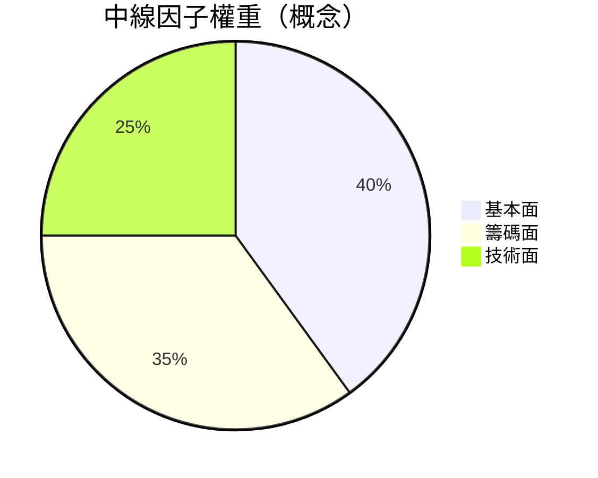

# 中線波段

## 本篇你會學到

- 中線波段的選股與持有邏輯
- 基本面、籌碼、技術的權重配置
- 適合多數上班族的「主戰場」

[← 投資模式總覽](index.md)

---

## 什麼是中線波段

| 項目 | 說明 |
|------|------|
| **持倉** | 約 **數週～數月** |
| **目的** | 跟著營收、產業或籌碼趨勢吃一段波段 |
| **特色** | 不需盤中全時盯盤，但需每週檢視 |

本站建議：**多數學員若只選一種主模式，可從中線開始**，再依經驗調整。

---

## 三支柱權重

| 支柱 | 中線怎麼用 |
|------|------------|
| **基本面** | [月營收](../03-tables/revenue.md) 趨勢、[估值](../03-tables/valuation.md) 是否合理 |
| **籌碼面** | 法人 **連續** 買超、[集保](../02-glossary/chips.md) 大戶 |
| **技術面** | 週 K 趨勢、月線支撐、[回檔](../02-glossary/trading-terms.md#回檔) 進場 |

[深入分析分頁](../03-tables/deep-dive-tabs.md) 建議閱讀順序：評分 → 基本面 → 籌碼 → 技術。

---

## 進出場流程（學員版）

| 階段 | 檢查項 |
|------|--------|
| **篩選** | [評分表](../03-tables/scoring.md) 中線分 + [類股](../02-glossary/trading-terms.md#類股) 景氣 |
| **驗證** | 營收 MoM/YoY、[法說](../05-analysis/conference.md) 敘事 |
| **進場** | [分批](../02-glossary/trading-terms.md#分批) 於均線或 [打底](../02-glossary/market-terms.md#打底) 區 |
| **持有** | 營收、法人趨勢未壞則續抱 |
| **出場** | 結構停損、估值過高、投資論點（thesis）被否定 |

[基本面框架](../05-analysis/fundamental-framework.md)：**好公司 ≠ 好股票**，買貴仍會虧。

---

## 停損與停利

| 類型 | 中線參考 |
|------|----------|
| 停損 | 跌破月線 + 營收轉弱；或淨利 -8%～-10% |
| 停利 | [分批停利](../02-glossary/trading-terms.md#分批) + 移動停利 |
| 勿用 | 當沖級 -1% 停損（易被洗出） |

見 [停損三層](../06-risk/stop-loss.md)。

---

## 融會貫通範例

**營收轉折中線布局**（完整拆解）：

1. 名詞：[MoM/YoY](../02-glossary/fundamentals.md)
2. 看表：[月營收表](../03-tables/revenue.md)
3. 分析：[三大支柱](../05-analysis/three-pillars.md)
4. 案例：[營收轉折](../07-cases/revenue-turn.md)
5. 風控：[資金配置](../06-risk/capital.md)

---

## 心態與建議

| 面向 | 中線 |
|------|------|
| 心理關鍵 | 每週固定檢視；忍受數週橫盤與洗盤 |
| 常見陷阱 | 三天沒漲就換股、被長黑K 洗出又追 |
| 盯盤 | **週末 1 次**看營收、法人、週 K |
| 延伸 | [中線心態詳解](mode-psychology.md#中線心態) |

---

## 重點回顧

- 中線是基本面與籌碼的**黃金交叉區**。
- 每週固定檢視即可，不必沉迷分 K。
- 下一步：[長期投資](long-term.md) 或 [存股](dividend-investing.md)
