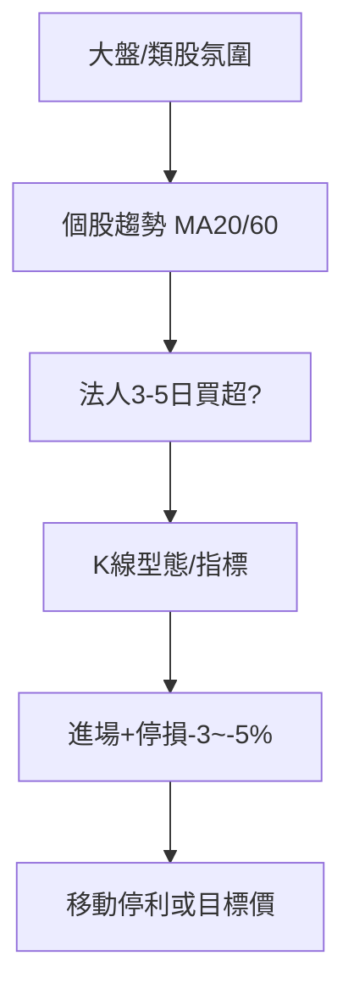

# 短線交易

## 本篇你會學到

- 短線的持倉尺度與核心方法
- 技術面與籌碼面如何搭配
- 與中線的停損與選股差異

[← 投資模式總覽](index.md)

---

## 什麼是短線

| 項目 | 說明 |
|------|------|
| **持倉** | 約 **數日～2 週** |
| **目的** | 抓趨勢波段或事件驅動的一小段 |
| **分析主軸** | 技術面為主，籌碼面確認，基本面為背景 |

見 [四種時間框架](../05-analysis/timeframes.md) 之「短線」欄。

---

## 方法框架

| 工具 | 用途 |
|------|------|
| [均線 MA20/60](../04-charts/ma.md) | 趨勢與 [回檔](../02-glossary/trading-terms.md#回檔) 買點 |
| [MACD/RSI/KD](../04-charts/indicator-quickref.md) | 動能與 [超買超賣](../02-glossary/technical.md#超買超賣) |
| [16 種型態](../04-charts/candle-patterns.md) | 進場觸發 |
| [法人表](../03-tables/institutional.md) | 連續買超確認 |
| [融資融券](../03-tables/margin.md) | 避開過熱槓桿 |

[評分表](../03-tables/scoring.md)：**短線刻度**分數作粗篩。

---

## 與中線的差異

| 項目 | 短線 | 中線 |
|------|------|------|
| 停損 | 淨利約 -3%～-5% | 結構或 -8%～-10% |
| 月營收 | 輔助 | 核心 |
| 均線 | 日 K MA20 為主 | 月線、季線 |
| 案例 | [鎚子+均線](../07-cases/hammer-ma.md) | [營收轉折](../07-cases/revenue-turn.md) |

!!! warning "勿混框架"
    短線進場卻用「等營收轉好」當不出場理由 → 小虧變 [套牢](../02-glossary/trading-terms.md#套牢解套)。

---

## 常見策略類型（教學分類）

| 類型 | 說明 |
|------|------|
| 趨勢跟隨 | 站上均線、量增、法人買 |
| 事件短打 | 法說、營收公布後 1～2 週 |
| 反轉短打 | 低檔型態 + 停損明確 |

事件短打須防 [利多出盡](../02-glossary/market-terms.md#利多利空出盡)。

---

## 心態與建議

| 面向 | 短線 |
|------|------|
| 心理關鍵 | 小賠快砍；不戀戰、不講長線故事 |
| 常見陷阱 | 小賺就跑、小虧不砍、等營收當理由 |
| 盯盤 | 每日 1～2 次；不必盤中全時 |
| 延伸 | [短線心態詳解](mode-psychology.md#短線心態) |

---

## 重點回顧

- 短線 = 技術 + 籌碼，停損要緊。
- 影片中的 [回測支撐](../02-glossary/technical.md#回測支撐)、[頭肩頂](../02-glossary/technical.md#頭肩頂) 在本模式最常用。
- 案例：[MACD 背離](../07-cases/macd-divergence.md) · [軋空](../07-cases/short-squeeze.md)（高波動短線）
